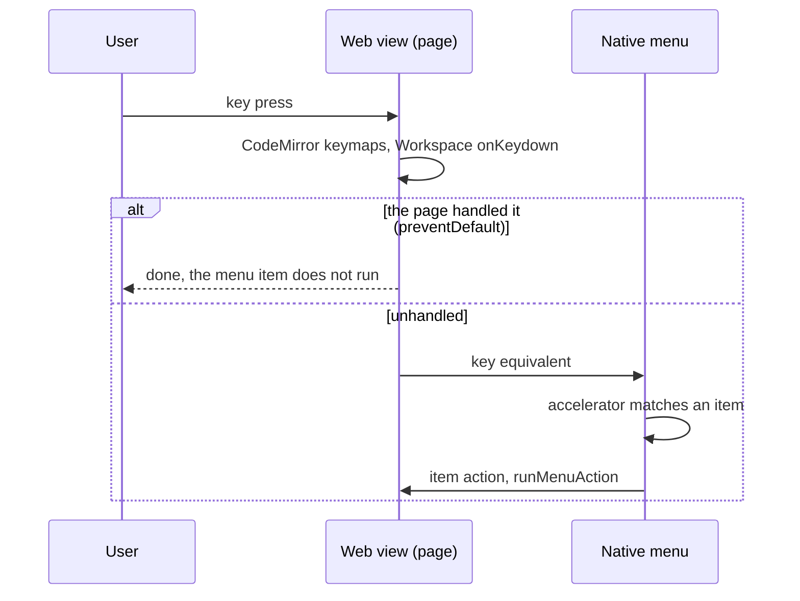

# Menu Keys and Routing

Most keys in Git Manager exist twice: as a handler in the page (the editor's keymaps, the window shortcuts) and as an accelerator on a native menu item. This page explains how one key press ends up running exactly one of them. The menu bar itself is in [How the menus work](How-the-Menus-Work.md).

## The page first, the menu second

On macOS the web view sees a key equivalent first and passes it to the menu only when the page leaves it unhandled. That gives three simple rules:

- **A key the page handles calls `preventDefault`.** `onKeydown` in `Workspace.svelte` does that for every shortcut `workspaceShortcut` recognizes, and CodeMirror does it for its keymaps. The menu item with the same accelerator then never runs as well.
- **An accelerator only the menu knows still works everywhere.** Cmd+W, Option+Cmd+S and Cmd+= reach the menu from the editor, the terminal or a text field, because nothing in the page claims them.
- **Both routes call the same function.** The View and Edit items call `runWorkspaceShortcut`, the Code items call `runEditorCommand`, File > Save calls `fileCommands.save`. So it does not matter which route fires.

This is also why one key can mean different things by place. Cmd+K is Git > Commit..., but the Markdown editor makes a link with it and the terminal clears its screen; they see it first.

## Editor keys in one table

`EDITOR_SHORTCUTS` in `src/lib/editor/editorShortcuts.ts` lists the key of every Find and Code item in CodeMirror notation, with a macOS variant where it differs and the keymap that binds it (`default`, `find` or `code`). The editor binds those keys itself, so they work in every editor, the merge tool included. `acceleratorFor` turns the same key into the menu's accelerator (`Mod-Shift-d` becomes `CmdOrCtrl+Shift+D`), so the menu always shows a key that really works.

`editorFocus.svelte.ts` follows `focusin` and `focusout` and records whether an editor has the keyboard, whether the caret is in its text, and whether it is writable. The menu uses it to grey the Code items; only focus changes update it, so typing costs nothing.

## Undo, Redo and the other text items

Edit's Undo, Redo, Delete and Select All are custom items, not the system's. `textEdit` in `menuActions.ts`:

1. runs CodeMirror's command when an editor has the caret in its text, since the editor keeps its own history;
2. leaves the terminal alone (it handles Cmd+A itself);
3. otherwise runs the web view's `document.execCommand`, so text fields behave as usual. Delete only acts when something is selected.

## Other platforms

The Windows and Linux builds are not out yet, so the order of page and menu there is not verified. Two choices keep it safe either way:

- Undo, Redo and Select All get no accelerator outside macOS, so Ctrl+Z and Ctrl+A stay with the page and the shell in the terminal.
- The Git menu keys (Cmd+K, Cmd+T, Cmd+9, Option+Cmd+A) are macOS only, because Ctrl+K and Ctrl+T belong to the shell. Next Tab and Previous Tab use Ctrl+PageDown and Ctrl+PageUp there, since Ctrl+Shift+] and [ fold code.

## Design decisions

**Cmd+W never closes the main window.** It is Close Tab and does nothing without a tab. In the mergetool window, Window > Close Window (Cmd+W) asks before it drops the merge result.

**Push has no key.** Shift+Cmd+K is Delete Line in the Code menu.

**Double Shift is not a menu key.** Menus cannot show it, so the label reads "Search Everywhere (Double Shift)".

**Left out on purpose.** JetBrains keys that clash with macOS or the editor, such as Cmd+Backspace for Delete Line (it deletes to the line start on macOS) and Cmd+- and Cmd+= for folding (they zoom the editor font).

**One list for the shortcuts window.** Help > Keyboard Shortcuts builds its menu sections from `menuSpec`, so a menu key is always listed as the menu has it. The keys no menu shows are written by hand in `src/lib/help/shortcuts.ts` and must be kept in step with their handlers.

## Tests

- `src/lib/editor/editorShortcuts.test.ts`: accelerators from CodeMirror keys, each key used once, and that each menu key is really bound to the item's command.
- `src/lib/menu/menuSpec.test.ts`: each key on one item, Cmd+W never closing the main window, the app's editing keys, and Ctrl+Z and Ctrl+A left to the page outside macOS.
- `src/lib/views/workspaceShortcuts.test.ts`: which window shortcut a key press means.
- `src/lib/help/shortcuts.test.ts`: the shortcuts window's list and filter.

Whether a key reaches the page or the menu needs a manual check in the real app. See [Testing](Testing.md).

## Keeping this page in sync

- A new key goes in one place: `EDITOR_SHORTCUTS` for editor commands, `workspaceShortcuts.ts` plus a menu accelerator for window commands. Run the tests above.
- Update [Keyboard Shortcuts](../usage/Keyboard-Shortcuts.md) and [Menus](../usage/Menus.md).
