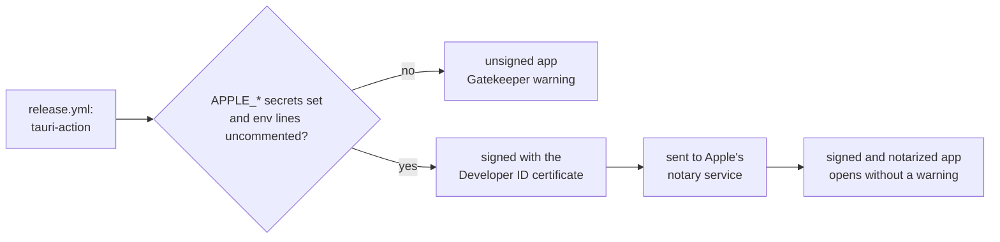
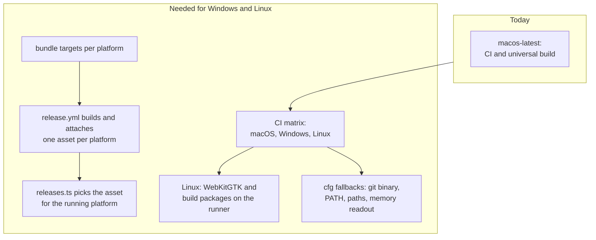

# Platforms and Signing

Git Manager ships for macOS today, as one universal app for Apple Silicon and Intel. This page explains how that app is built, how to turn on code signing and notarization, what is macOS only in the code, and what has to change to support Windows and Linux.

## The universal macOS build

`release.yml` builds the app on `macos-latest`. It installs the Rust targets `aarch64-apple-darwin` and `x86_64-apple-darwin`, then runs `tauri-action` with `--target universal-apple-darwin`. Tauri builds the app once for each architecture and joins them into one binary, so a single download runs natively on every Mac. The `.dmg` and a compressed `.app` are attached to the GitHub release. The bundle targets (`app` and `dmg`) come from `src-tauri/tauri.conf.json`.

To build it yourself:

```sh
rustup target add aarch64-apple-darwin x86_64-apple-darwin
bun tauri build --target universal-apple-darwin
```

For everyday testing, `bun tauri build --bundles app` is faster: it builds only for your own Mac.

## Signing and notarization

Builds are unsigned by default. macOS then warns that the app is from an unidentified developer, and people have to allow it once (right-click the app and choose Open, or on recent macOS versions use System Settings, Privacy and Security, Open Anyway). Signing proves who built the app, and notarization means Apple has scanned it, so the warning goes away.



### Turning it on

1. Join the Apple Developer Program and create a **Developer ID Application** certificate. Export it with its private key as a `.p12` file with a password.
2. Create an app-specific password for your Apple ID, and note your Team ID.
3. In the repository, go to Settings, Secrets and variables, Actions, and add these six secrets (the same list is at the top of `release.yml`):

| Secret | Value |
| --- | --- |
| `APPLE_CERTIFICATE` | the `.p12` file, base64 encoded (`base64 -i cert.p12`) |
| `APPLE_CERTIFICATE_PASSWORD` | the password of the `.p12` |
| `APPLE_SIGNING_IDENTITY` | the certificate name, like `Developer ID Application: Name (TEAMID)` |
| `APPLE_ID` | the Apple ID email used for notarization |
| `APPLE_PASSWORD` | the app-specific password, not your real one |
| `APPLE_TEAM_ID` | your team ID |

4. In `release.yml`, uncomment the six matching `env` lines of the "Build and upload" step.

`tauri-action` reads these variables, signs the app and notarizes it. `beta-publish.yml` and `stable-publish.yml` pass `secrets: inherit` when they call `release.yml`, because a called workflow sees no secrets unless the caller hands them over.

**Never commit a certificate, a `.p12` file or a password**, not even in a branch you plan to delete: git history keeps it. Secrets live only in GitHub's secret store. Delete the local `.p12` once it is uploaded.

## What is macOS only today

| Where | What | On other platforms |
| --- | --- | --- |
| `src-tauri/src/memory.rs` | the memory readout, using macOS process APIs (`proc_pid_rusage`, the "responsible" process) behind `#[cfg(target_os = "macos")]` | a stub returns zero bytes (marked approximate), so the status bar hides the item |
| `src-tauri/src/git/cli.rs` | the git binary search (`/opt/homebrew/bin/git`, `/usr/local/bin/git`, `/usr/bin/git`) and the login shell `PATH` (`$SHELL -l -c`, default `/bin/zsh`) | `git` on the app's own `PATH`, which Explorer fills, with no shell asked |
| `src/lib/stores/workspacePaths.ts` and `src-tauri/src/paths.rs` | paths use `/` separators | Windows paths leave Rust as `C:/...` (`to_ui`) and the page converts dialog paths (`fromNativePath`); comparisons are still case-sensitive |
| `src/lib/update/releases.ts` | `parseReleases` takes the first `.dmg` asset as the download | needs a per-platform asset |
| `src-tauri/tauri.conf.json` | bundle targets `app` and `dmg` | `tauri.windows.conf.json` builds an NSIS installer; Linux needs targets |
| `.github/workflows/ci.yml`, `release.yml` | the release build runs on `macos-latest`; CI also runs every check in a `windows` job | `build-windows` in `release.yml`; Linux needs CI jobs |
| `scripts/*.sh` | bash demo scripts | need Git Bash or WSL on Windows |
| Keyboard shortcuts | Cmd (`metaKey`), usually with Ctrl too | check each shortcut |

A few pieces are already ready: `main.rs` hides the console window on Windows release builds, `child_process::hide_console` starts git, gh and the clipboard reader without one (`CREATE_NO_WINDOW`), `config::home_dir` reads `USERPROFILE` first on Windows, `os_info` in `commands/config.rs` names the OS for bug reports on macOS, Linux and Windows (with `platformName` in `releases.ts` as the fallback), and `tauri.conf.json` already lists an `icon.ico`.

Windows-only code, the path rules and the console windows are covered in [Windows Support](Windows-Support.md).

For Linux, the Linuxbrew prefix is checked for Node and added to the fallback `PATH` of script runs.

## The plan for Windows and Linux

Cross-platform builds are planned, not started. The rules until then, from `CLAUDE.md`, keep the door open:

- **Keep platform-specific code behind `cfg` or runtime checks.** Use `#[cfg(target_os = "macos")]` with a working fallback for other systems, like `memory.rs` does. Never let macOS-only code break the build elsewhere.
- **Pick download assets per platform in `src/lib/update/releases.ts`.** The update check must offer a `.dmg` on macOS, a Windows installer on Windows and a Linux package on Linux.
- **Keep the web view in mind.** Windows uses WebView2 (Chromium) and Linux uses WebKitGTK, so CSS and memory use will differ from WKWebView.



Concretely, the work is:

1. **Backend:** a Windows way to find git and its `PATH`, path handling that accepts `\` and drive letters (and the `\\?\` form that `canonicalize` returns on Windows), and memory readouts per platform or an honest "not available".
2. **Frontend:** separator-aware path helpers with tests, a review of shortcuts (most accept Cmd or Ctrl already, but Ctrl+Minus for Back is a macOS habit), and per-platform assets in `releases.ts`.
3. **CI:** the `windows` job in `ci.yml` runs every check on `windows-latest` and must pass like the macOS jobs. Linux needs the same on `ubuntu-latest`. The Linux runner needs the WebKitGTK and build packages that Tauri lists as prerequisites. The one `#[cfg(unix)]` symlink in `commands/tests.rs` already skips itself on Windows.
4. **Releases:** `build-windows` in `release.yml` runs when the repository variable `WINDOWS_RELEASES` is `true`. Still to add: signing for Windows, and a Linux job.

## Where to go next

- [Releases and CI](Releases-and-CI.md) for how `release.yml` is called.
- [How Updates Work](How-Updates-Work.md) for the update check that picks the download.
- [How the Status Bar Works](How-the-Status-Bar-Works.md) for the memory readout.
