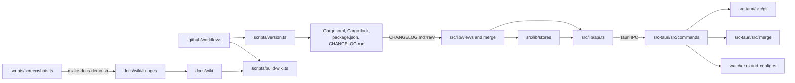

# Project Layout

This is a map of the repository. It lists the folders and files you will touch most, with one line each. Build output (`node_modules`, `build`, `.svelte-kit`, `src-tauri/target`, `src-tauri/gen`) is left out, and it is never committed.

## The top level

```text
.
├── src/                    Svelte 5 + TypeScript UI
├── src-tauri/              Rust backend (Tauri 2)
├── scripts/                demo repositories, version and wiki tools
├── docs/wiki/              source of the GitHub wiki (this page lives here)
├── static/                 files served as they are (favicon.png)
├── .github/                workflows, issue forms, pull request template
├── .vscode/                recommended extensions (Svelte, Tauri, rust-analyzer) and settings
├── .gitignore              keeps node_modules, build and .svelte-kit out of git
├── CHANGELOG.md            release notes and What's New (Keep a Changelog)
├── CLAUDE.md               the project rules in one page
├── README.md               overview, build and release summary
├── package.json            Bun scripts and JS dependencies (version mirror)
├── bun.lock                locked JS dependencies (always committed)
├── vite.config.js          Vite, Vitest and the dev-only IPC bridge plugin
├── svelte.config.js        adapter-static with an index.html fallback (SPA)
└── tsconfig.json           strict TypeScript
```

## The UI: `src/`

```text
src/
├── app.css                 CSS tokens for light and dark themes, global styles
├── app.html                the HTML shell
├── hooks.client.ts         starts the dev IPC bridge in dev builds only
├── routes/                 +layout.ts (ssr = false), +layout.svelte, +page.svelte
└── lib/
    ├── App.svelte          the shell: Welcome, Workspace or the mergetool window
    ├── api.ts              one typed wrapper per Tauri command, plus event listeners
    ├── types.ts            TypeScript mirrors of the Rust DTOs (camelCase)
    ├── stores/             app state: repo, settings, tabs, navigation, paths
    │   ├── commitTabs.ts   pseudo tab paths for commits opened in a tab
    │   └── settingsData.ts pure settings validation, what may be saved, session steps
    ├── views/              the main window: header, sidebars, Changes, Log, Files, Settings
    │   ├── workspaceShortcuts.ts   which window shortcut a key means
    │   ├── changes/        Changes sidebar: sections, selection, commit box, drafts
    │   ├── files/          Files panel (FileExplorer) and the file editor (FileView)
    │   └── sidebar/        branches, tags and stashes tree and its actions
    ├── merge/              3-way merge tool: model.ts, extensions.ts, MergeEditor.svelte
    ├── diff/               2-way diff view on @codemirror/merge
    ├── editor/             shared CodeMirror setup, blame, conflict markers, change markers
    ├── log/                commit graph layout (graph.ts), commit details, CommitTab, lineMatch.ts
    ├── update/             update check, changelog parser, What's New
    ├── ui/                 dialogs, toasts, context menu, icons, resize handle
    └── dev/ipcBridge.ts    dev-only relay used by the screenshot script
```

Pure logic lives in plain `.ts` files next to the component that uses it, with a `*.test.ts` beside it. Files named `*.svelte.ts` use runes (`$state`) and hold shared state.

## The backend: `src-tauri/`

```text
src-tauri/
├── Cargo.toml              the version (source of truth), dependencies, release profile
├── Cargo.lock              locked Rust dependencies (always committed)
├── tauri.conf.json         window, CSP, bundle settings (no version of its own)
├── capabilities/default.json   what the main window may call
├── build.rs                tauri_build::build()
├── .gitignore              keeps target/ and gen/schemas out of git
├── icons/                  app icons
└── src/
    ├── main.rs             calls git_manager_lib::run()
    ├── lib.rs              plugins, AppState and the list of registered commands
    ├── state.rs            AppState and LaunchMode (app or mergetool)
    ├── error.rs            AppError, serialized as { kind, message }
    ├── commands/           Tauri commands by area: status, merge, branch, remote, history, ...
    │   ├── mod.rs          blocking(), OpOutcome, safe_join(), with_paths()
    │   └── tests.rs        command tests against real repositories
    ├── git/                git2 readers and the git CLI runner
    │   ├── mod.rs          the module list
    │   ├── repo.rs         open() one work tree, discover() the repository around a path
    │   ├── cli.rs          runs your git binary with a safe environment
    │   ├── status.rs, diff.rs, log.rs, refs.rs, stash.rs, blame.rs, files.rs
    │   ├── conflicts.rs    conflict sides and mergetool paths
    │   ├── opstate.rs      detects a merge, rebase, cherry-pick or revert in progress
    │   ├── workspace.rs    finds repositories inside a folder (bounded scan)
    │   └── tests.rs        git integration tests, including the demo script
    ├── merge/              mod.rs, engine.rs (3-way chunking with imara-diff), model.rs (DTOs)
    ├── watcher.rs          debounced file watching, repo-changed and workspace-changed
    ├── config.rs           ~/.gitmanager/settings.json and state.json, atomic writes
    ├── workspace_file.rs   .gitmanager-workspace and .code-workspace files
    ├── memory.rs           memory readout for the status bar (macOS)
    └── test_support.rs     temporary repositories with an isolated git config
```

## Scripts: `scripts/`

```text
scripts/
├── make-conflict-repo.sh   repo stopped in a merge or rebase with every conflict type
├── make-workspace-demo.sh  folder with nested, conflicted and clean repositories
├── make-docs-demo.sh       the workspace used for wiki screenshots
├── version.ts              show, check, set, notes, pending, bump, untried, next-ticket
├── versioning.ts           pure helpers behind version.ts (tested)
├── versioning.test.ts      tests for versioning.ts
├── build-wiki.ts           checks docs/wiki (--check) or writes the wiki pages to a folder
├── wiki.ts                 pure helpers behind build-wiki.ts, including MAX_WORDS
├── wiki.test.ts            tests for wiki.ts
└── screenshots.ts          retakes the wiki screenshots through the dev IPC bridge
```

The shell scripts refuse a folder that is not empty. `version.ts` is explained in [Versioning and Changelog](Versioning-and-Changelog.md), the wiki and screenshot scripts in [Docs and Screenshots](Docs-and-Screenshots.md).

## Docs: `docs/wiki/`

```text
docs/wiki/
├── features.json           the map: every page, every feature and its screenshots
├── usage/                  pages for people who use the app
├── developer/              pages for people who work on it (this folder)
└── images/                 screenshots, referenced by the usage pages
```

## GitHub: `.github/`

```text
.github/
├── workflows/
│   ├── ci.yml              checks every push and pull request
│   ├── beta.yml            opens a beta release pull request
│   ├── beta-publish.yml    publishes the beta once CI passes on develop
│   ├── stable.yml          opens a stable release pull request
│   ├── stable-promote.yml  opens the develop to master pull request
│   ├── stable-publish.yml  publishes the stable release from master
│   ├── release.yml         builds the macOS app and attaches it
│   └── wiki.yml            publishes docs/wiki to the GitHub wiki
├── ISSUE_TEMPLATE/
│   ├── bug_report.yml      the bug form (the app fills in version and platform)
│   ├── feature_request.yml the feature request form
│   └── config.yml          blank issues allowed, plus a link to the releases
└── pull_request_template.md   what and why, test plan, docs checklist
```

The workflows are explained in [Releases and CI](Releases-and-CI.md).

## How the folders connect



The UI only reaches Rust through `api.ts`, and Rust only reaches git through `src-tauri/src/git`. The workflows never contain release logic of their own: they call the scripts, so you can run the same steps on your machine.

## Generated folders

These appear after an install or a build and are never committed. You can delete any of them safely; the next build brings them back.

- `node_modules/`: JS dependencies from `bun install`.
- `.svelte-kit/`: SvelteKit's generated types and config (`bun run check` runs `svelte-kit sync` to refresh it).
- `build/`: the built UI. Tauri embeds it in the app, and the Rust tests need it too, which is why CI builds the frontend before `cargo test`.
- `src-tauri/target/`: Rust build output, including the release `.app`.
- `src-tauri/gen/`: schemas Tauri generates for the capability files.

## Where do I put...

- **A new Tauri command?** In the matching `src-tauri/src/commands/*.rs`, registered in `lib.rs`, with a wrapper in `api.ts` and DTOs in `types.ts`. See [Backend](Backend.md).
- **A new setting?** In `src/lib/stores/settings.svelte.ts`, validated on load by `parsePreferences` in `settingsData.ts`. See [How Settings Work](How-Settings-Work.md).
- **Tricky logic for a component?** In a pure `.ts` file beside it, with a test. See [Testing](Testing.md).
- **A new color?** As a token in `src/app.css`, for both themes. See [Frontend](Frontend.md).
