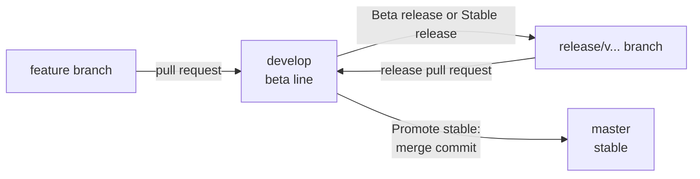
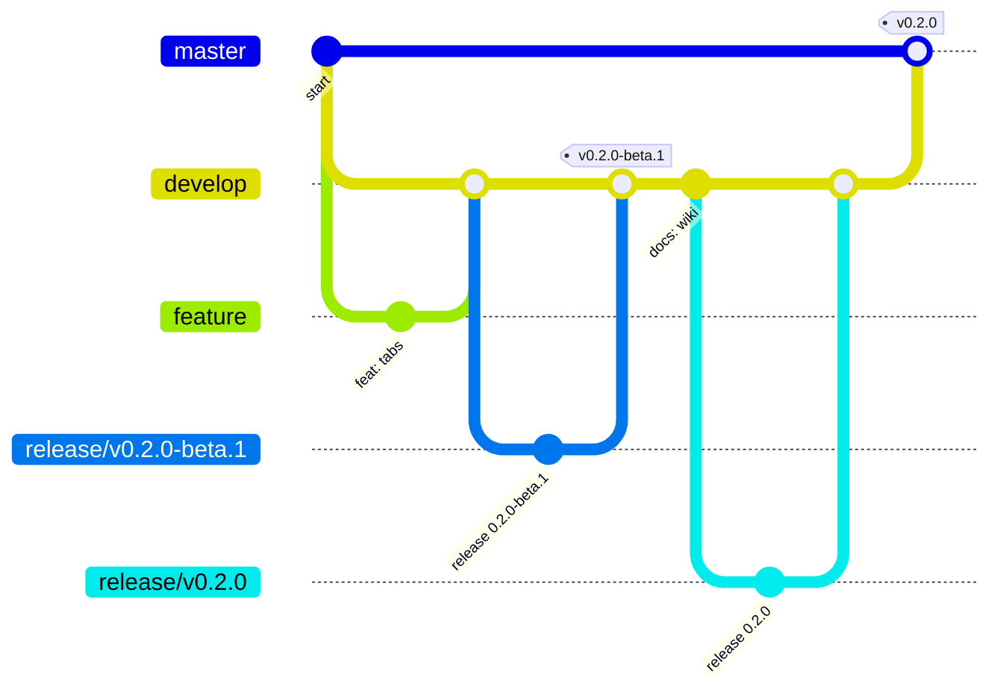
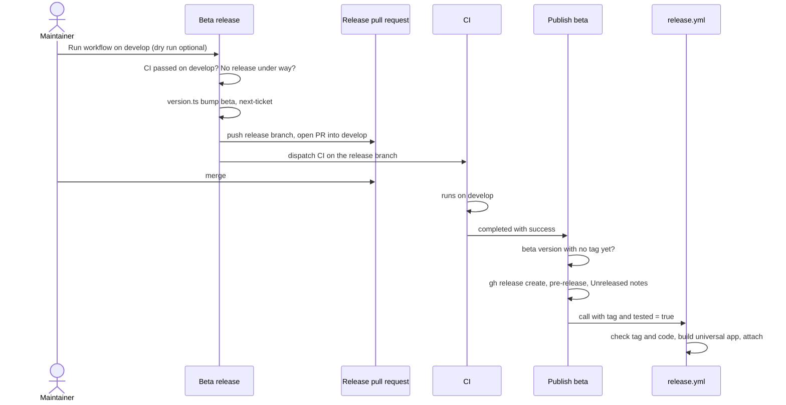
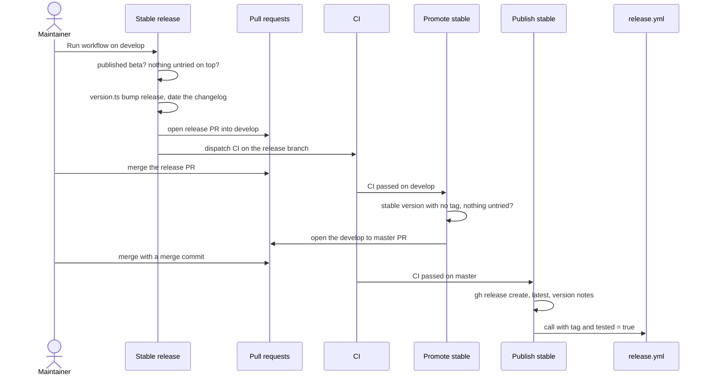

# Releases and CI

Releases are cut by GitHub workflows, not by hand. A person decides two things: start a release, and merge its pull request. The workflows do the rest and refuse anything unsafe.

## Branches

- **`develop`** is the default branch and the beta line. All work lands here by pull request.
- **`master`** is stable. It only moves when a stable release is promoted.
- **`release/v<version>`** branches are made by the release workflows and merged into `develop` by pull request.

## The workflows

| Workflow | Started by | What it does |
| --- | --- | --- |
| `ci.yml` (CI) | push to `develop` or `master`, any pull request, a call, or a manual run | the checks below |
| `beta.yml` (Beta release) | Run workflow on `develop` | bumps to the next beta and opens a release pull request |
| `beta-publish.yml` (Publish beta) | CI finishing on `develop` | publishes an unpublished beta as a GitHub pre-release |
| `stable.yml` (Stable release) | Run workflow on `develop` | finishes the beta, dates the changelog, opens a release pull request |
| `stable-promote.yml` (Promote stable) | CI finishing on `develop` | opens the `develop` to `master` pull request |
| `stable-publish.yml` (Publish stable) | CI finishing on `master` | publishes the stable release as the latest one |
| `release.yml` (Release) | a call, a release published by hand, or a manual run | builds the macOS app and attaches it |
| `wiki.yml` (Wiki) | push to `master` that touches the docs, or a manual run | publishes `docs/wiki` to the GitHub wiki |

## CI

`ci.yml` runs two jobs on `macos-latest`, because the app targets macOS and some backend code is macOS only.

- **Frontend:** `bun install --frozen-lockfile`, `bun scripts/version.ts check`, `bun run check`, `bun run test` and, in the step "Wiki docs are complete", `bun scripts/build-wiki.ts --check`.
- **Rust:** builds the frontend first (`tauri::generate_context!` embeds it, so it must exist), then `cargo test --locked` and `cargo clippy --locked --all-targets -- -D warnings`.

`--frozen-lockfile` and `--locked` fail when `bun.lock` or `Cargo.lock` is out of date, so always commit them.

## A beta release

The version is worked out, never typed. See [Versioning and Changelog](Versioning-and-Changelog.md).

## A stable release

## Building: `release.yml`

It checks that every file agrees on the version, that the tag is exactly `v` plus the version in `src-tauri/Cargo.toml`, and that the pre-release flag matches (betas must be pre-releases, stable versions must not). Empty or GitHub-generated notes are replaced with the changelog section. Unless the caller says CI already passed, it runs `ci.yml` first. Then `tauri-action` builds a universal app (Apple Silicon and Intel) and attaches the `.dmg` and zipped `.app`. Run workflow with a tag rebuilds an existing release. Signing is optional: add the `APPLE_*` secrets named at the top of the file and uncomment the matching lines.

## Publishing the wiki: `wiki.yml`

A GitHub wiki is its own git repository (`<repo>.wiki.git`), so merging `docs/wiki` does not update it. `wiki.yml` runs on a push to `master` that touches `docs/wiki/**`, `scripts/build-wiki.ts`, `scripts/wiki.ts`, `src/lib/update/releases.ts` (it names the repository) or the workflow itself, and on Run workflow from any branch (for example `develop`, to seed the wiki). It:

1. builds the pages with `bun scripts/build-wiki.ts "$RUNNER_TEMP/wiki-pages"`, which checks everything first;
2. clones the wiki, and fails with a hint if it does not exist yet;
3. mirrors the files, so a page deleted from `docs/wiki` disappears from the wiki too;
4. commits as `github-actions[bot]` and pushes, or stops when nothing changed.

The build turns our folders into the flat wiki GitHub expects: the `# Title` line is dropped (the wiki prints the page name), links between pages become page names, images go to `images/`, links to other repository files become GitHub URLs on `develop`, and `Home`, `_Sidebar` and `_Footer` are generated from `features.json`. Every page starts with a comment saying it is generated, so nobody edits it in the wiki. See [Docs and Screenshots](Docs-and-Screenshots.md).

## One-time repository setup

- Push `develop` and `master` and make `develop` the default branch. `workflow_run` workflows only run from the default branch, and Run workflow starts there.
- Settings, Actions, General, Workflow permissions: **Read and write permissions** and **Allow GitHub Actions to create and approve pull requests**. Without the second, no release pull request can be opened.
- Optionally protect `develop` and `master`: pull requests only, CI required.
- Keep the repository public, so the in-app update check can see releases.
- Open the Wiki tab and save any page once, so the wiki repository exists.

## Why it is built this way

- **Betas never reach stable users.** A beta is a GitHub pre-release, and the in-app update check, which only notifies and stays quiet when offline, offers it only to installs on the beta channel. See [How Updates Work](How-Updates-Work.md).
- **Merging is the decision.** A release pull request shows the version and notes before anything is published, and closing it cancels the release.
- **Publish only after CI passes on the exact commit.** The publish workflows check out the commit the CI run tested, so a merge landing meanwhile cannot slip into the release.
- **The untried rule.** A stable release only finishes a published beta with no `feat`, `fix` or other program change on top. Only `docs`, `test` and `chore` commits may ride along, because nobody has run anything else yet.
- **Every change enters through `develop`, releases too.** A version bump only on `master` would make `develop` number its next beta from the old version.
- **Merge commit, not squash, into `master`.** A squash creates a new commit that `develop` never had, so the branches drift apart and the next promotion conflicts. A merge commit keeps `master` an ancestor of `develop`.
- **One release at a time.** Beta and Stable release share one concurrency group, and each refuses to start while a release pull request is open or a beta is merged but unpublished.
- **GitHub's built-in token starts no workflows.** Anything done with `GITHUB_TOKEN`, such as publishing a release or opening a pull request, triggers nothing. So the publish workflows call `release.yml` directly, and the release workflows dispatch CI on their branch so the pull request gets checks.

## Lessons learned

**The first `release.yml` wrote a "v" into the app version.** It copied the tag into `tauri.conf.json`, so the app would have reported `v1.2.3`, which is not valid semver. Now the code is the source of truth, and the build only checks that the tag agrees.

**`ci.yml` cannot have a `concurrency` block.** It is also a reusable workflow, called by `release.yml`. A called workflow evaluates `github.workflow` and `github.ref` in the caller's context, so a group like `ci-${{ github.workflow }}-${{ github.ref }}` could clash with the caller's group and cancel or block it. We removed the block.

**Release pull requests had no checks.** Opened with the built-in token, they started no CI, so a required check would wait forever. Dispatching `ci.yml` with `gh workflow run` is the one start GitHub allows, and its result shows on the pull request's commit.
