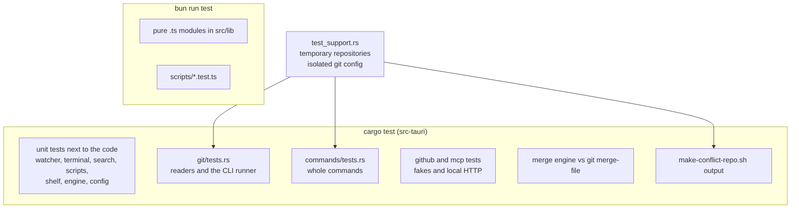

# Testing

Git Manager changes people's repositories, so its tests use real git, not mocks. This page explains the two test suites, the helpers behind them, and what you must run before a change counts as done. The full list of test files is on [Test Suites](Test-Suites.md).



## Rust tests

Run them with `cd src-tauri && cargo test`. Add a filter to run a few, for example `cargo test watcher`.

### Real repositories, isolated from your config

`src-tauri/src/test_support.rs` builds repositories in temporary folders that vanish after the test. Before any test touches git, it points git at a sandbox:

- `HOME` and `XDG_CONFIG_HOME` move to a temporary folder;
- `GIT_CONFIG_GLOBAL` points at an empty file and `GIT_CONFIG_NOSYSTEM=1` skips the system config;
- `LC_ALL=C` and `LANG=C`, so git messages are always in English.

Why so strict? Your own `~/.gitconfig` might sign commits, rebase on pull, use a different conflict style or run hooks. Any of those would make a test pass on one machine and fail on another. Each repository also gets a local config: a test identity, signing off, an empty hooks folder, `merge.conflictstyle = merge` and `pull.rebase = false`. Commit dates come from a fixed clock, so hashes and the log order are stable.

The git processes come from `cli::command`, the same builder the app uses. The tests therefore exercise the real environment the app sets up.

### Helpers you will use

| Helper | What it gives you |
| --- | --- |
| `TestRepo::new()` | an empty repository on `main` with the local config above |
| `repo.write`, `repo.commit_all`, `repo.branch`, `repo.checkout` | build history in a few lines |
| `repo.git(&[...])`, `repo.porcelain()`, `repo.unmerged()` | run git and inspect the result |
| `merge_conflict_repo()` | a repository stopped in a merge with a both-modified file, both added, deleted by us and by them, a binary and a CRLF file |
| `diverged_repo()` | two branches that edit the same file |
| `BareRemote::new()`, `TestRepo::clone_from` | a local "remote" for fetch, pull and push tests |
| `TestDir` | a plain folder for workspace tests, with `init_repo` for nested repositories |
| `block_on` | runs an async Tauri command in a test |

`commands/tests.rs` calls the command functions directly, for example `block_on(merge::save_resolution(...))`, and then checks the repository with git itself. `git/tests.rs` covers the readers and the CLI runner. Most other modules test themselves next to the code; [Test Suites](Test-Suites.md) lists them.

### Nothing talks to the outside world

- **GitHub.** The network, the keychain and the `gh` CLI sit behind traits in `src-tauri/src/github/`, so `github/tests.rs` runs every path against fakes. The one real-transport test uses a local listener.
- **MCP.** `mcp/tests.rs` starts the real server on an ephemeral port on `127.0.0.1` and calls it over HTTP, also through the `git-manager cli` client, against temporary repositories.
- **Terminals.** `terminal.rs` starts real shells in pseudo terminals and checks that closing hangs up and then kills them.

### The demo script is tested too

`git/tests.rs` runs `scripts/make-conflict-repo.sh` (with and without `--rebase`) and asserts the exact list of conflicts it creates, and that it refuses a folder that is not empty. The demo is what people use to try the merge tool, so it must not rot. If you change the script, update these tests.

### The merge engine and its oracle

`src-tauri/src/merge/engine.rs` has hand-written cases (one-sided changes, overlaps, touching changes, insertions, missing final newlines, ignore-whitespace) and a property test that uses git as an oracle. The test builds 300 random base, ours and theirs files, merges them with our engine and with `git merge-file -p`, and:

- when both say "clean", requires the merged text to be identical;
- requires more than 50 clean cases, so the test cannot pass by comparing nothing;
- allows fewer than 5% clean or conflict disagreements, because our diff heuristics differ slightly from git's.

It skips itself when git is not installed. The random generator is seeded, so a failure repeats every time.

## Vitest suites

Run them with `bun run test`, one file with `bun run test src/lib/stores/tabs.test.ts`, or `bun run test:watch` to rerun on every save. Vitest picks up `src/**/*.test.ts` and `scripts/**/*.test.ts` (see `vite.config.js`). Vitest blanks CSS by default, but `vite.config.js` keeps `src/app.css`, so the theme tests can read its real tokens (`?raw`) and check the contrast of every color theme.

The suites test pure modules only: the merge model, editor helpers, stores, the menu definition, terminal and search models, the Markdown renderer, themes, MCP tool definitions and the view models of every dialog. Each folder's files are listed on [Test Suites](Test-Suites.md).

## What to test

- **Put non-trivial logic in a pure `.ts` module** next to its component and test it there. Components are hard to test; pure functions are easy. `merge/model.ts`, `editor/lineDiff.ts`, `stores/tabs.ts` and `stores/navHistory.ts` are good examples.
- **Every backend change gets a Rust test** with a real temporary repository.
- **Every bug fix gets a test** that fails without the fix, and a "Bugs we fixed" entry in the feature's chapter (see [Docs and Screenshots](Docs-and-Screenshots.md)).

## What "done" means

A change is done when all of these pass on your machine:

```sh
bun run check                                  # 0 errors and 0 warnings
bun run test
cd src-tauri && cargo test
cd src-tauri && cargo clippy --all-targets -- -D warnings
bun scripts/build-wiki.ts --check              # when docs changed
bun scripts/version.ts check                   # when versions changed
```

CI runs the same commands (with `--locked` for cargo), so this also keeps the pull request green. Some things no test sees, such as how a view looks or feels. When you could not check something, say so plainly in the pull request instead of calling it done.

## Lessons learned

**The oracle test compared too few cases.** The first version of the property test changed lines so often that almost every random case conflicted. Its guard (at least 20 clean cases) caught this: only 8 of 150 cases were clean, so the test failed instead of passing while comparing almost nothing. We made mutations rarer, doubled the cases to 300, raised the bar to 50 clean cases and added the disagreement limit. The lesson: a property test needs a check that it really tested something.
