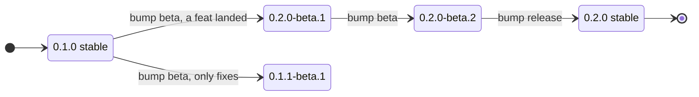
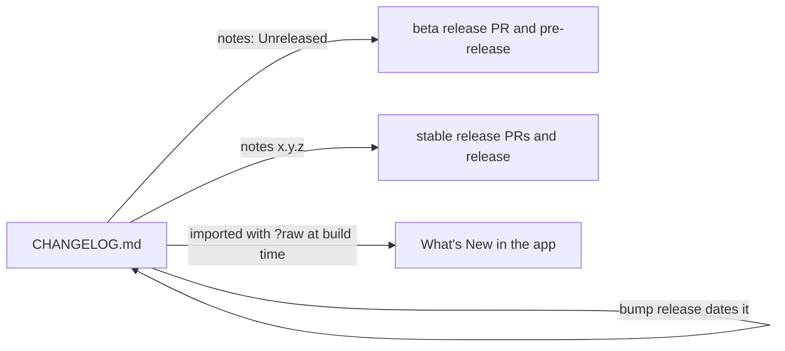

# Versioning and Changelog

Git Manager has one version number and one changelog. Both are moved by tools, not by hand, so they can never disagree. This page explains where they live, every command of `scripts/version.ts`, and the rules for writing the changelog.

## One version, three files

- **`src-tauri/Cargo.toml` is the source of truth.** Tauri builds the app with this version (`tauri.conf.json` has none of its own), the About screen shows it, and the update check compares against it.
- **`package.json`** and the crate's entry in **`src-tauri/Cargo.lock`** carry the same number, so nothing drifts.

Never edit these by hand. Use `bun scripts/version.ts set x.y.z`, or better, let the release workflows move the version (see [Releases and CI](Releases-and-CI.md)). CI runs `bun scripts/version.ts check` on every push and pull request.

Versions follow [Semantic Versioning](https://semver.org/). Betas are `x.y.z-beta.N`.

## The commands

All of them run from the repository root with `bun scripts/version.ts <command>`.

| Command | What it does |
| --- | --- |
| `show` | prints the version from `Cargo.toml` |
| `check` | lists the version in all three files, marks any that disagree, exits 1 if one does |
| `set x.y.z` | writes the version into all three files, then runs `check` |
| `notes [x.y.z]` | prints a changelog section: Unreleased by default, or the given version |
| `pending` | says whether a release is due and what it would be |
| `bump <level>` | moves to the next version: `beta`, `release`, `patch`, `minor`, `major` or an exact `x.y.z` |
| `untried` | lists unreleased commits that change the program (not `docs`, `test` or `chore`) |
| `next-ticket` | prints the next free `GM` ticket number |

Some examples:

```sh
$ bun scripts/version.ts show
0.1.0-beta.1

$ bun scripts/version.ts check
  src-tauri/Cargo.toml  0.1.0-beta.1
  src-tauri/Cargo.lock  0.1.0-beta.1
  package.json          0.1.0-beta.1

all files agree on 0.1.0-beta.1

$ bun scripts/version.ts notes 0.2.0     # the [0.2.0] section, for release notes
$ bun scripts/version.ts bump beta       # 0.2.0-beta.1 -> 0.2.0-beta.2
$ bun scripts/version.ts untried         # "a1b2c3d fix:[GM-14] ..." lines, or nothing
$ bun scripts/version.ts next-ticket     # 15
```

"Unreleased commits" means commits that no `v*` tag contains yet, leaving out merge commits (`git log HEAD --no-merges --not --tags=v*`). `next-ticket` looks at every commit subject on every branch for `[GM-N]` and prints one more than the highest.

## How the next version is worked out

`bump` looks at the unreleased commit subjects to suggest a level:

- a breaking change, marked with `!` before the colon (`feat!:[GM-9] ...`), suggests **major**;
- any `feat` suggests **minor**;
- anything else (`fix`, `docs`, `chore`, ...) suggests **patch**.



The rules, from `nextVersion` in `scripts/versioning.ts`:

- **From a stable version:** `beta` starts the first beta of the suggested next version (`0.1.0` becomes `0.2.0-beta.1` after a `feat`). `patch`, `minor` and `major` skip the beta and jump straight to the next patch, minor or major version. `release` is refused, because there is no beta to finish.
- **From a beta:** `beta` moves to the next beta (`-beta.2`), and `release` finishes it (`0.2.0-beta.2` becomes `0.2.0`). `patch`, `minor` and `major` are refused.
- **An exact `x.y.z`** is used as given.

`bump` also protects you:

- When nothing has landed since the last release, it changes nothing and says so. The workflows read an unchanged version as "nothing to release". Finishing a beta is the exception: a stable release usually ships exactly what was tried.
- A beta needs something under `## [Unreleased]`, because those notes are published with it as they are.
- A stable version is refused when the changelog already has a section for it.
- For a stable version, it dates the changelog: `## [Unreleased]` becomes `## [x.y.z] - YYYY-MM-DD`, with a fresh empty Unreleased section above it.

At the end, `bump` prints the commit message to use, like `chore:[GM-15] release 0.2.0`.

## Writing the changelog

`CHANGELOG.md` follows [Keep a Changelog](https://keepachangelog.com/en/1.1.0/). The rules for this project:

- **Every user-visible change adds a line under `## [Unreleased]` in the same pull request.** Waiting until release time means the notes get written from memory, and things get lost.
- **Group lines under the standard headings:** `### Added`, `### Changed`, `### Fixed`, `### Removed` (and `### Deprecated` or `### Security` when needed).
- **Write for users, not developers.** Say what they can now do or what no longer goes wrong, in plain words. "Blame no longer shows the wrong author after an undo" is good. "Fix off-by-one in mapBlame" is not.
- **One line per change**, starting with a capital letter.
- **Leave out internal work**: refactors, tests, CI and docs that users never see.
- **Never write a version heading yourself.** `bump release` dates the section.

## Where the changelog goes

The changelog is the only source of release text. Nobody writes release notes anywhere else.



- **GitHub release notes.** A beta is published with the Unreleased section, and a stable release with its dated section. If someone publishes a release by hand with empty or GitHub-generated notes, `release.yml` replaces them with the changelog, but it keeps notes that a person wrote.
- **What's New.** `src/lib/update/WhatsNewDialog.svelte` imports `CHANGELOG.md?raw`, so the changelog is built into the app and works offline. After an update, the dialog shows the current version's section once (the Unreleased section on a beta build) and up to ten older ones. See [How Updates Work](How-Updates-Work.md).

## Lessons learned

**`Cargo.lock` is rewritten as text.** The first `set` ran `cargo update --package git-manager --offline` after editing `Cargo.toml`. That meant the release runners needed Rust just to change a number. Now `setCargoLockVersion` replaces only the version line of our own crate's entry in `Cargo.lock`. That entry has no checksum, so nothing else needs to change, and CI's `--locked` builds would catch a broken lockfile at once.

**Dating the changelog twice would duplicate a section.** If `bump release` ran again for a version that was already dated, it would add a second `## [x.y.z]` heading and the notes would be split or repeated. So `bump` refuses when the changelog already has a section for the target version: that version looks released already.

**A version with a "v" is not a version.** Tags are `v0.2.0`, but versions in files are `0.2.0`. The tools strip a leading `v` when they read a tag, and `release.yml` checks that the tag equals `v` plus the version in `Cargo.toml`.
