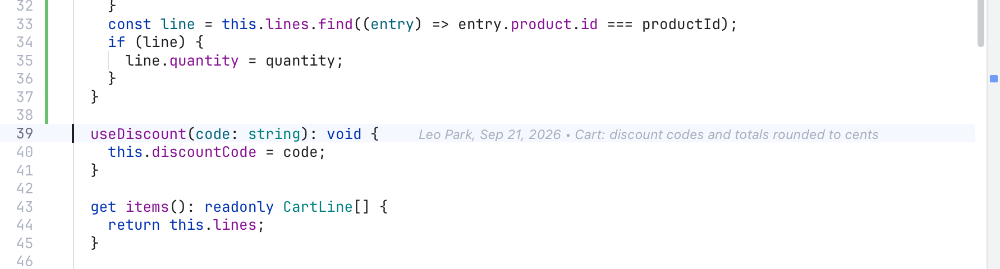

# Blame

Blame tells you who last changed a line, when, and in which commit. It is handy when you wonder why a line looks the way it does: one click takes you to the commit and its message.

Blame works for files inside a git repository, in the editor, in the diffs of [Changes](Changes-and-Commits.md) and in commit diffs in the [Log](History-and-Log.md).

## Current line blame

*The author, age and commit message of the cursor line, at the end of the line. This commit is older than a week, so the age is a date.*

Put the cursor on a line. A faint note appears at the end of it, for example:

> Leo Park, Sep 19, 2026 • Cart: discount codes and totals rounded to cents

- The age reads "just now", "12 min ago", "5 h ago", "yesterday", "3 d ago", or a date for anything older than a week.
- Lines you changed but did not commit yet read **You, Uncommitted changes**. That includes unsaved edits in the editor.
- Hover the note to see the full message, the author's email, the exact date and the full commit hash.

This note is on by default. Turn it off with **Current line blame** in Settings, Editor.

## Blame gutter

*The blame column: short hash, author and age for every block of lines, and Uncommitted for lines not committed yet.*

The blame gutter is a column beside the line numbers. For each block of lines that came from the same commit, it shows the short commit hash, the author and the age (the same "3 d ago" or date as above). Lines that are not committed yet say **Uncommitted**, with an orange bar. Hover the first line of a block for the same details as the inline note.

The colored bar on the left of each block hints at its age: newer commits are stronger, older ones fade. So you can spot the fresh parts of a file at a glance.

Turn the gutter on or off in any of these ways:

- Click **Blame** (the clock button) in the editor's path bar.
- Click **Blame** in the diff toolbar.
- Use **Blame gutter** in Settings, Editor.

All three are the same switch, so the gutter stays on for every file until you turn it off. It is off by default.

## Jump to the commit

Click a blame note, or a block in the gutter:

- On a committed line, the [Log](History-and-Log.md) opens with that commit selected and the same file's diff shown, scrolled to the line you clicked as it was in that commit.
- On an uncommitted line, the Changes sidebar opens, where your change is waiting.

Option-click instead copies the full commit hash to the clipboard.

The Back button (or Ctrl+-) returns you to the exact line you clicked from. See [Navigation](Navigation.md).

If the commit is far back in history, the Log loads more pages to find it. When it still is not there, you get a note, and turning on **All branches** in the Log may help.

## Blame in diffs and in the Log

- In a diff from Changes, blame covers the right side (your current version).
- In a commit's diff in the Log, blame shows the file as it was at that commit. That lets you keep digging: click a line to jump to the commit that changed it, then do the same there, further back in history.

## Example

In `src/cart.ts` the `useDiscount` method looks odd. With the cursor on it, the note says "Leo Park, Sep 19, 2026 • Cart: discount codes and totals rounded to cents". Click the note: the Log opens the diff on `useDiscount`. Read the full commit, and press Ctrl+- to come back to the line.

## Related

- [Editor and Tabs](Editor-and-Tabs.md)
- [History and Log](History-and-Log.md)
- [Navigation](Navigation.md)
- [Settings](Settings.md)
- [How blame works (developer)](../developer/How-Blame-Works.md)
