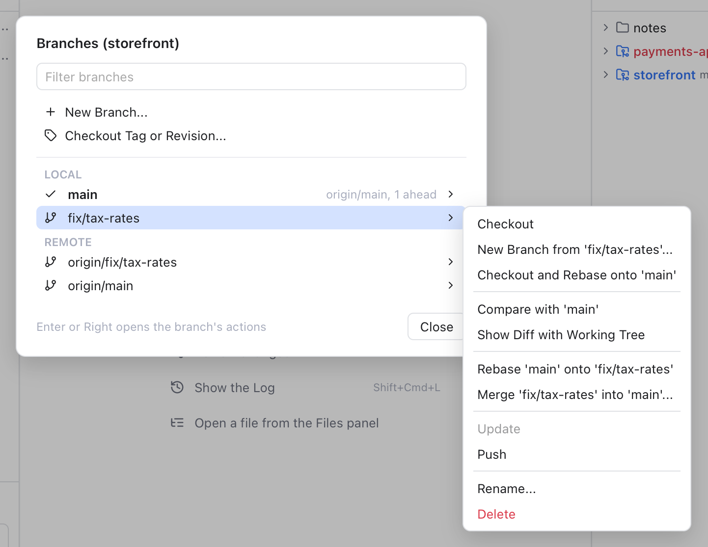
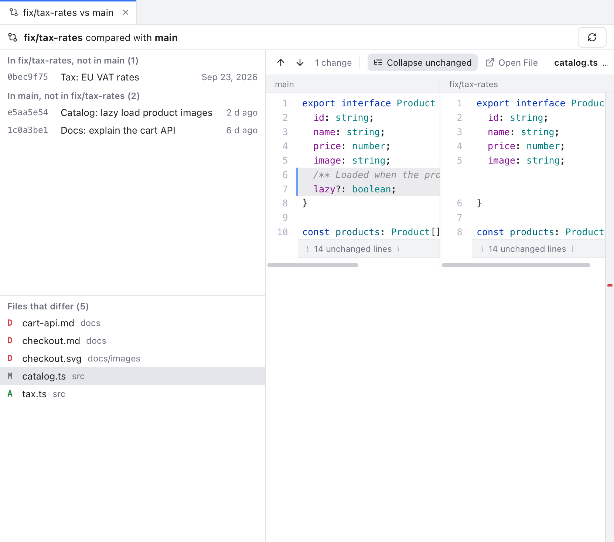

# Branches Popup

The Branches popup is the quick way to work with the branches of one repository, as in JetBrains IDEs. Pick a branch, and a submenu shows everything you can do with it: check it out, compare it, merge it, update or push it, and more.

## Open it

- Click the branch button of a repository in [Changes](Changes-and-Commits.md) (see [Repository Actions](Repository-Actions.md)). The popup opens for that repository.
- Or choose **Git > Branches...** in the menu bar, for the active repository. See [Git Menu](Git-Menu.md).
- Or click the branch name in the status bar, for the repository it shows. See [Status Bar and Help](Status-Bar-and-Help.md).

*Branches (storefront) with the submenu of fix/tax-rates open.*

The title names the repository, for example **Branches (storefront)**. From the top:

- **Filter branches**: type to narrow the list. Every word you type must appear in the name, so `tax fix` finds `fix/tax-rates`.
- **New Branch...** starts a branch at HEAD, the commit you are on now.
- **Checkout Tag or Revision...** opens a list of every branch, remote branch and tag to check out, with **+ Create Branch...** and **+ Create Branch From...** at the top.
- **Local**: your branches, the current one first with a check mark. Each shows its upstream (the server branch it follows) and how far it is ahead or behind, for example **origin/main, 1 ahead**.
- **Remote**: branches on the server, such as `origin/fix/tax-rates`.

Click a branch, or move to it with Up and Down and press Enter or Right, to open its submenu. Esc or **Close** closes the popup. Picking an action closes it too.

## Another branch

For a branch you are not on, for example `fix/tax-rates` while you are on `main`:

- **Checkout** switches to it. For a remote branch, it switches to your local branch of the same name, or creates one that tracks it.
- **New Branch from 'fix/tax-rates'...** starts a new branch there.
- **Checkout and Rebase onto 'main'** switches to the branch and replays its commits on top of `main`, so it is up to date with your work.
- **Compare with 'main'** opens a tab with the commits each branch has that the other lacks, and the files that differ.
- **Show Diff with Working Tree** opens a tab with the files that differ between that branch and your files on disk, uncommitted changes included.
- **Rebase 'main' onto 'fix/tax-rates'** replays your current branch on top of it.
- **Merge 'fix/tax-rates' into 'main'...** opens the Merge dialog, where you can pick options such as no fast-forward or squash. See [Git Dialogs](Git-Dialogs.md#merge).
- **Update** fast-forwards the branch from its upstream without checking it out: the branch simply moves forward to the newer commits, with no merge commit. Git refuses when the two have both moved on, which keeps your commits safe.
- **Push** pushes that branch, or publishes it when it has no upstream yet.
- **Rename...** and **Delete** (asks first, and again with **Force Delete** for unmerged work).

Remote branches get Checkout, New Branch from, and the compare, rebase and merge items.

## The branch you are on

For the current branch the submenu is shorter:

- **New Branch from 'main'...**
- **Update** pulls from the upstream, with merge or rebase as chosen last in the [Update Project](Git-Dialogs.md#update-project) dialog.
- **Push...** opens the [Push dialog](Git-Dialogs.md#push), where you see the commits that will go out.
- **Track Remote Branch...** picks a remote branch to follow, for example after the server branch was renamed.
- **Unset Upstream** stops following it. The hint shows which branch it follows now.
- **Rename...**

## Compare tabs

*fix/tax-rates compared with main: the commits only on each side, the files that differ and the diff of one file.*

**Compare with** opens a tab named, for example, **fix/tax-rates vs main**. On the left it lists **In fix/tax-rates, not in main** and **In main, not in fix/tax-rates**, then **Files that differ**. Click a file to see its diff, with the current branch on the left. Click a commit to open it in its own tab. Only the first 1000 commits of each side are listed.

**Show Diff with Working Tree** opens **fix/tax-rates vs Working Tree** with the files that differ and their diffs. It updates when your files change. Both tabs have a Refresh button and close like any other tab.

## Good to know

- Checkout, rebase and merge items are greyed out while a merge, rebase, cherry-pick or revert is in progress.
- If a rebase or merge stops on conflicts, the Conflicts dialog opens. See [Resolving Conflicts](Resolving-Conflicts.md).
- The popup works on the repository it was opened for, even when that is not the active one.

## Related

- [Branches and Tags](Branches-and-Tags.md)
- [Repository Actions](Repository-Actions.md)
- [Git Menu](Git-Menu.md)
- [How the Branches popup works (developer)](../developer/How-the-Branches-Popup-Works.md)
