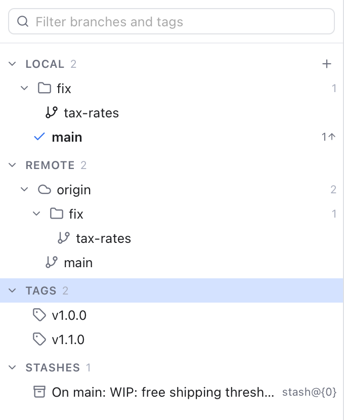
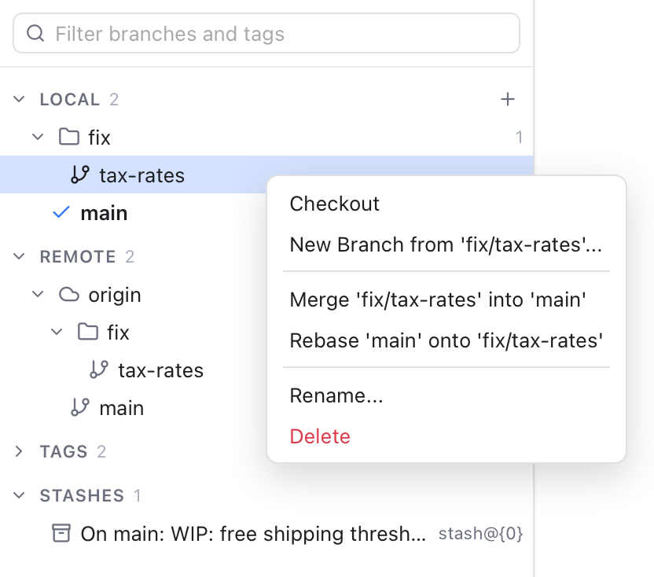

# Branches and Tags

A branch is a separate line of work, so you can try something without touching `main`. A tag is a fixed name for one commit, usually a release like `v1.1.0`. This page shows how to switch, create, merge, rebase, rename and delete branches, and how to use tags.

## The Branches sidebar

- Click the branch icon in the left activity bar (**Branches and Stashes**).
- Or press Shift+Cmd+E.

*Local and remote branches, tags and stashes of the active repository.*

The sidebar shows the **active repository** in four sections: **Local**, **Remote**, **Tags** and **Stashes** (see [Stashes](Stashes.md)). Each section and folder shows how many items it holds. Click a section or folder to fold it. **Tags** starts folded, and Git Manager remembers what you folded.

- Branch names with slashes are grouped into folders. `fix/tax-rates` sits in a **fix** folder.
- Remote branches are grouped per remote, such as **origin**.
- The branch you are on has a check mark and bold text.
- A local branch shows how many commits it is **ahead** (up arrow: yours, not pushed yet) and **behind** (down arrow: on the server, not pulled yet) its upstream, the remote branch it follows. Hover the name for details, such as "main, at 1058a1c, tracking origin/main, 1 ahead".
- An empty section says so, for example **No tags** or **No stashes**.

Type in **Filter branches and tags** at the top to narrow the list. It matches branch and tag names and stash messages, and opens every folder with a match. Press Esc or click the x to clear it.

## Switch branches

- Double-click a local branch, or select it and press Enter.
- Or click the branch name in the header and pick one from the list. The branch you are on is marked **(current)**.

Double-clicking a **remote** branch such as `origin/fix/tax-rates` switches to your local branch of the same name, or creates one that tracks it. A note tells you which, for example **Created fix/tax-rates tracking origin/fix/tax-rates**.

If you have uncommitted changes that would be overwritten, git refuses to switch and the message tells you why. Commit or [stash](Stashes.md) them first.

## Create a branch

1. Click the **+** on the **Local** section (a new branch from HEAD, the commit you are on now). You can also right-click **Local**, or open the header's branch menu, and choose **New Branch...**.
2. Type a name, for example `feature/free-shipping`.
3. Leave **Checkout branch** ticked to switch to it right away.
4. Click **Create**.

The dialog tells you when a name is not valid (spaces, `..` or characters such as `~ ^ : ? *`) or already taken. To start a branch somewhere else, right-click a branch or tag and choose **New Branch from '...'...**, or use **New Branch Here...** on a commit in the [Log](History-and-Log.md). From a remote branch, the name is filled in for you, such as `fix/tax-rates`.

## Right-click a branch

*The actions for a local branch.*

On a local branch:

- **Checkout** switches to it (greyed out for the branch you are on).
- **New Branch from 'name'...** starts a new branch at the same commit.
- **Merge 'name' into 'main'** brings that branch's commits into the branch you are on (a merge joins two lines of work into one).
- **Rebase 'main' onto 'name'** replays your current branch's commits on top of that branch, for a straight history.
- **Rename...** gives it a new name, checked the same way as a new one.
- **Delete** removes it.

Merge, Rebase and Delete are greyed out for the branch you are on. On a remote branch you get **Checkout**, **New Branch from...**, **Merge** and **Rebase**. On a tag: **Checkout**, **New Branch from...** and **Merge**.

Merge and Rebase are greyed out while a merge, rebase, cherry-pick or revert is still in progress, and every action waits while another operation runs. If either stops on conflicts, Git Manager opens the Conflicts dialog. See [Resolving Conflicts](Resolving-Conflicts.md).

## Delete a branch

1. Right-click the branch and choose **Delete** (or select it and press Delete).
2. Confirm.

You cannot delete the branch you are on. If the branch has commits that are not merged into its upstream or your current branch, git refuses at first, and Git Manager asks again (**Branch Not Fully Merged**) with **Force Delete**. Only say yes if you are sure you no longer need those commits.

This deletes only your local branch, not the one on the server.

## Tags

Tags are listed under **Tags**, such as `v1.0.0` and `v1.1.0`. You can:

- **Checkout** a tag to look at the code as it was at that release. This leaves you on no branch (a "detached HEAD"), so create a branch if you want to keep new commits. You are asked first, and the header then shows **HEAD detached at** and the short hash.
- Start a branch from it, for example to fix a bug in an old release.
- Merge it into your current branch.

Git Manager does not create or delete tags yet. Use `git tag` in the Terminal for that; the list updates by itself.

## Keyboard

Click in the list, then:

- Up, Down, Home and End move the selection.
- Right and Left open and close sections and folders. Left on a branch jumps to its folder.
- Enter checks out the selected branch or tag. On a section or folder, Enter or Space folds it.
- Delete or Backspace deletes the selected local branch (after asking).
- Shift+F10 (or the menu key) opens the right-click menu.
- In the filter box, Down or Enter jumps to the first match.

## Related

- [Remotes](Remotes.md)
- [Stashes](Stashes.md)
- [History and Log](History-and-Log.md)
- [Resolving Conflicts](Resolving-Conflicts.md)
- [How branches and tags work (developer)](../developer/How-Branches-and-Tags-Work.md)
