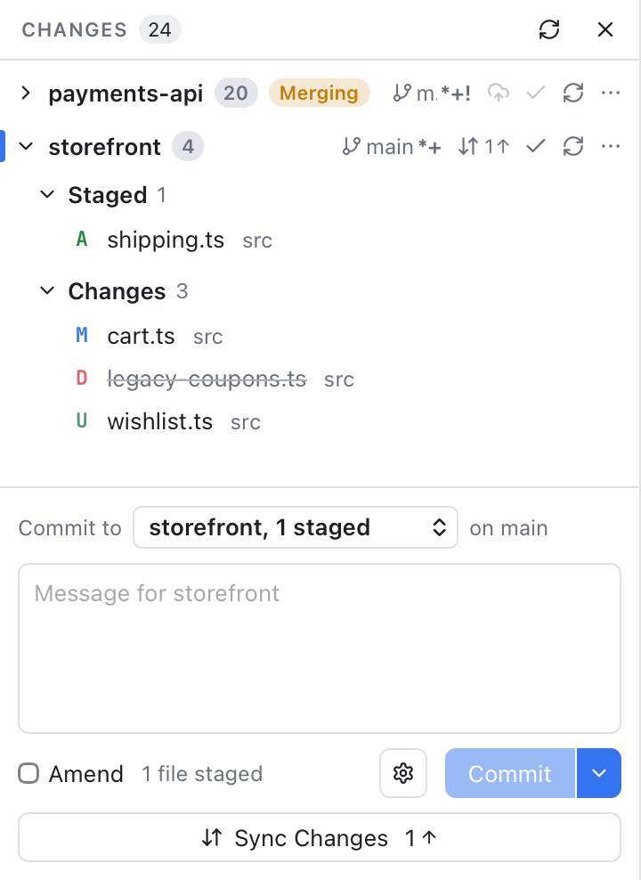
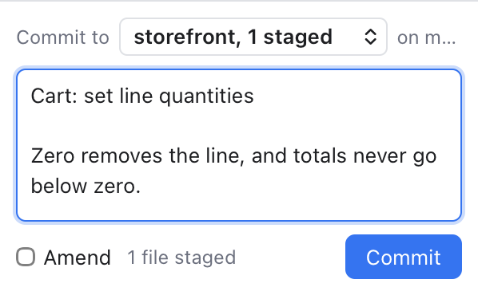

# Changes and Commits

The Changes sidebar lists every file you changed, in every repository of the workspace. From here you pick what goes into the next commit, write a message and commit.

A few words first. **Staging** a file means putting it on the list for the next commit. The **index** (or staging area) is that list. A **commit** is a saved snapshot of the staged files with a message.

## Open Changes

- Click the Changes icon at the top of the left activity bar.
- Or choose **View > Changes**, or press Shift+Cmd+G while you are not typing in an editor (there it is Find Previous).
- Press Option+Cmd+B to hide or show the left sidebar.

The Changes icon shows the number of changed files, in red while any file has a conflict. The x in the sidebar title hides the sidebar.

*Changes grouped by repository: payments-api is folded and merging, storefront shows its actions, its Staged and Changes groups.*

## How the list is grouped

Each repository has up to three groups:

- **Conflicts**: files a merge, rebase or similar left in conflict. Click one to open the [Merge Tool](Merge-Tool.md), or click **Resolve...** on the group for the [Conflicts dialog](Resolving-Conflicts.md).
- **Staged**: files that will go into the next commit.
- **Changes**: files changed on disk but not staged yet, including new untracked files.

A file can be in both Staged and Changes when you changed it again after staging.

Every row shows a status letter (M modified, A added, D deleted, R renamed, U untracked, T type changed, C conflicted), the file name and its folder. Hover a row for its full path. A small **LFS** or **submodule** tag marks files kept in [Git LFS](Git-LFS.md) and [submodules](Submodules.md). Click a group header to fold it.

With several repositories, each one gets a header. It shows the repository's name (tagged **submodule** or **worktree** when it is one) and its number of changed files. While an operation runs, a badge such as **Merging** or **Rebasing** shows too. On the right sit its own buttons (branch, Sync, Commit, Refresh and **...**), explained in [Repository Actions](Repository-Actions.md). Click the header to fold the repository. The active repository has a colored bar on the left. With one repository, those buttons sit in the sidebar title instead; with several, the title has **Refresh All**.

Repositories with nothing to commit are collected under **No Changes** at the bottom, folded when there are more than three. Each row has a folder icon to make it the active repository, and the same buttons without Commit.

With nothing to commit at all, the list says **Working tree clean**. The list updates by itself when files change, wherever you edit them.

## Stage and unstage

Hover a row to see its buttons:

- **+** stages the file.
- **-** (on a staged file) unstages it.
- The curved arrow discards the changes.
- On a conflicted file, the merge icon opens the [Merge Tool](Merge-Tool.md).

Group headers have the same buttons for all their files (**Stage all**, **Unstage all**, **Discard all**). For the whole repository, use **...** > **Changes**.

Shortcuts on the selected row:

- Double-click, Space or Enter stages a file in Changes, or unstages a file in Staged.
- Delete (or Backspace) discards the changes of a file in Changes.
- Up and Down arrows move through the list.

When you stage or unstage the selected file, the selection follows it to its new group, so the diff stays on screen. To stage only part of a file, open its diff and use the per-change buttons. See [Diffs](Diffs.md).

## Discard changes

Discarding throws your edits away and puts the file back as it was in the index. For an untracked file it deletes the file. Git Manager always asks first, and says how many files will be lost. This cannot be undone.

## Right-click menus

On a file in Changes: **Stage** and **Discard Changes...**; on a staged file: **Unstage**. Both also have **Add to .gitignore** (see [Ignoring Files](Ignoring-Files.md)), **Shelve Changes...** (see [Shelf](Shelf.md)) and **Copy Path**, which copies the path inside the repository. On a conflicted file: **Resolve in Merge Tool**, **Show All Conflicts...** and **Copy Path**.

On a repository header you get the full **...** menu, then **Resolve Conflicts...** (when there are conflicts), **Set as Active Repository** and **Copy Repository Path**.

## Commit

*The commit box at the bottom of Changes: the repository picker, a message, Commit Options, the Commit button with its arrow, and Sync Changes.*

1. Stage the files you want.
2. Type a message in the box at the bottom. **Git > Commit...** (Cmd+K) jumps here too.
3. Click **Commit**, or press Cmd+Enter in the message box.

The line next to the button says what will happen, for example **1 file staged** or **2 conflicted files**. The button stays disabled until there is something to commit, and its tooltip says why, such as "Enter a commit message". After a commit the message box is cleared.

Commits run through your own git, so commit hooks and commit signing work as usual. If a hook fails, its message is shown.

### Several repositories

With more than one repository, the box starts with **Commit to**, a list of the repositories that have changes (with their staged count, such as **storefront, 1 staged**), and the branch. It follows the repository you last worked in (for example where you last selected or staged a file), or the active one. The message box says **Message for storefront** so you know where the commit goes. Each repository keeps its own draft message.

### Amend the last commit

Amending replaces the last commit with a new one, for example to fix a typo in its message or add a forgotten file.

1. Tick **Amend**. If the message box is empty, it fills in the last commit's message. Untick it and that message goes away again, unless you edited it.
2. Change the message, and stage more files if you like.
3. Click **Amend Commit**.

With nothing staged, amend changes only the message ("Amend message only"). Amend is not available in a repository that has no commits yet.

### Commit and push, and commit options

The arrow next to **Commit** offers **Commit & Push**, **Commit & Sync** and **Commit (Amend)**. The gear left of it opens **Commit Options**: sign-off, another author, GPG signing and skipping hooks. Both are explained in [Commit Options](Commit-Options.md).

## Sync Changes

When your branch is ahead of or behind its upstream (the server branch it follows), a **Sync Changes** button under the commit box shows the counts, for example **Sync Changes 1** with an up arrow. It pulls, then pushes. A branch that was never pushed shows **Publish Branch** instead. See [Repository Actions](Repository-Actions.md) for details.

## Related

- [Repository Actions](Repository-Actions.md)
- [Commit Options](Commit-Options.md)
- [Diffs](Diffs.md)
- [Resolving Conflicts](Resolving-Conflicts.md)
- [Remotes](Remotes.md)
- [Stashes](Stashes.md)
- [How changes and commits work (developer)](../developer/How-Changes-and-Commits-Work.md)
