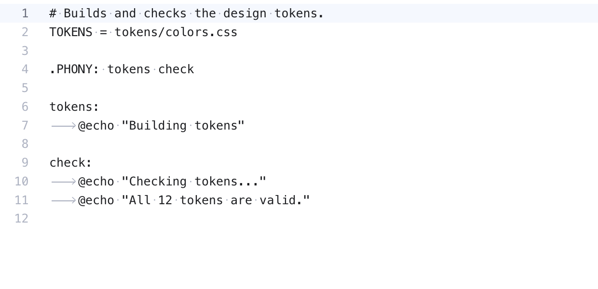

# Code Appearance

These settings are in [Settings](Settings.md#editor), **Editor**. They apply to editors, diffs and the merge tool alike, and open editors change at once. The default font is JetBrains Mono at 13 px and Regular weight when it is installed, else Menlo.

## Font weight

**Editor font weight** sets how thick code is drawn. Drag the slider from **Thin** (100) to **Black** (900), in steps of 100. The default is **Regular** (400). Double-click the slider to go back to it. The preview above the slider shows the result before you close Settings.

For a soft, calm look like JetBrains IDEs on a dark theme, try **Light** (300) with JetBrains Mono. Bold text in code, such as Markdown headings, stays a little heavier than the weight you pick.

The weight needs a font that has it. JetBrains Mono, SF Mono and most variable fonts have every weight. A font with only Regular and Bold, such as Menlo, uses the closest one it has.

## Line spacing

**Line spacing** sets the space between lines of code, as a multiple of the font size. Drag the slider from 1.00 (tight) to 2.50 (airy), in steps of 0.05. The default is 1.25. Double-click the slider to go back to it.

## Render whitespace

*Render whitespace set to All: a dot for each space and an arrow for each tab.*

**Render whitespace** draws spaces as dots and tabs as arrows. Pick one:

- **None**: nothing is drawn.
- **Boundary**: all spaces and tabs except single spaces between words.
- **Selection** (the default): only inside the text you select.
- **Trailing**: only the spaces and tabs at the end of lines.
- **All**: every space and tab.

## The cursor

The cursor settings work like VS Code's, plus Sublime Text's caret height:

- **Cursor style**: **Line** (the default), **Line thin**, **Block**, **Block outline**, **Underline** or **Underline thin**. A block is see-through.
- **Cursor width**: how thick the Line cursor is, 1 to 6 pixels (2 by default).
- **Cursor blinking**: **Blink**, **Smooth** (fades), **Phase** (fades slowly), **Expand** (shrinks and grows back) or **Solid**. The cursor stays visible while you type.
- **Smooth caret animation**: the cursor glides instead of jumping.
- **Caret extra top** and **Caret extra bottom**: make the cursor up to 10 pixels taller above and below. Double-click a slider to set it back to 0.

## The current line

The line with the cursor has a soft background. While you select text, the highlight steps aside, so a selection inside one line is always easy to see.

## Word wrap

**Word wrap** breaks long lines at the edge of the editor. Turn it on or off with **View > Word Wrap** or **Option+Z**, like VS Code, or in Settings. The top line stays where it is. Diffs and the merge tool never wrap, so their sides stay lined up.

## Indentation

Each file keeps the indentation it already has. With **Detect indentation** on (the default), the editor reads the file when it opens: tabs or spaces, and how many spaces make one level. A file indented with 2 spaces gets 2 when you press Tab or Enter, even when **Tab size** is 4. The status bar shows what it found, such as **Spaces: 2** or **Tab Size: 4**.

**Tab size** is used for files with no indentation to follow, such as a new empty file, and sets how wide a tab looks. Turn detection off with **View > Detect Indentation** or in Settings > Editor, and every file uses **Tab size**. Open files follow both settings at once.

## Zoom

**View > Zoom In** (Cmd+=) and **Zoom Out** (Cmd+-) make the code font one pixel bigger or smaller everywhere. **Reset Zoom** (Cmd+0) goes back to the default size.

With **Change font size with Ctrl + mouse wheel** on in Settings, hold Control (or Command) and scroll over an editor, diff or merge pane to resize the code. A trackpad pinch works too.

## Related

- [Editing Code](Editing-Code.md)
- [Settings](Settings.md)
- [Diffs](Diffs.md)
- [How code appearance works (developer)](../developer/How-Code-Appearance-Works.md)
