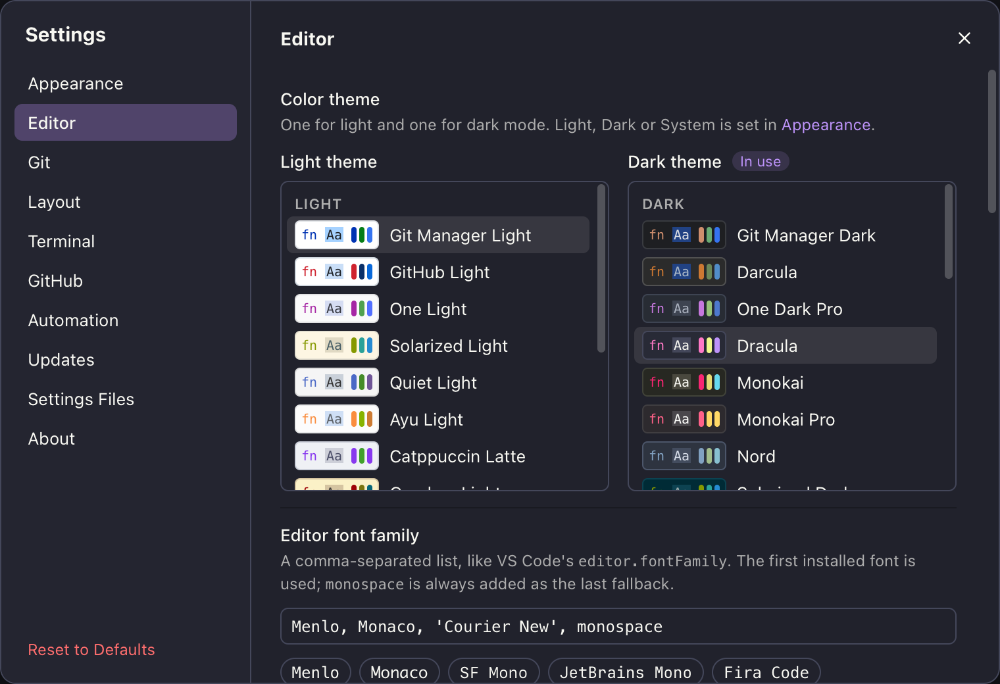
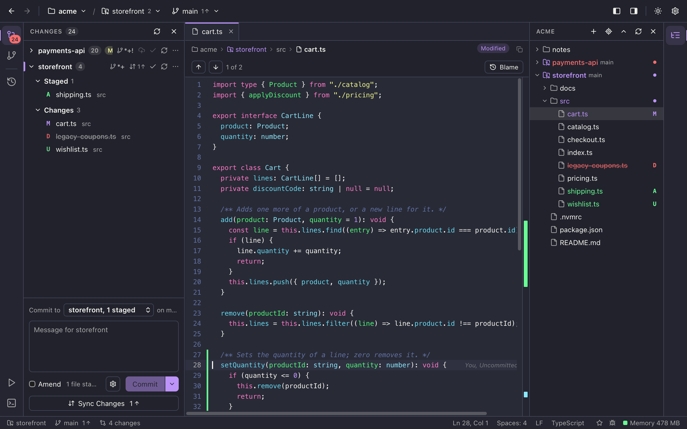
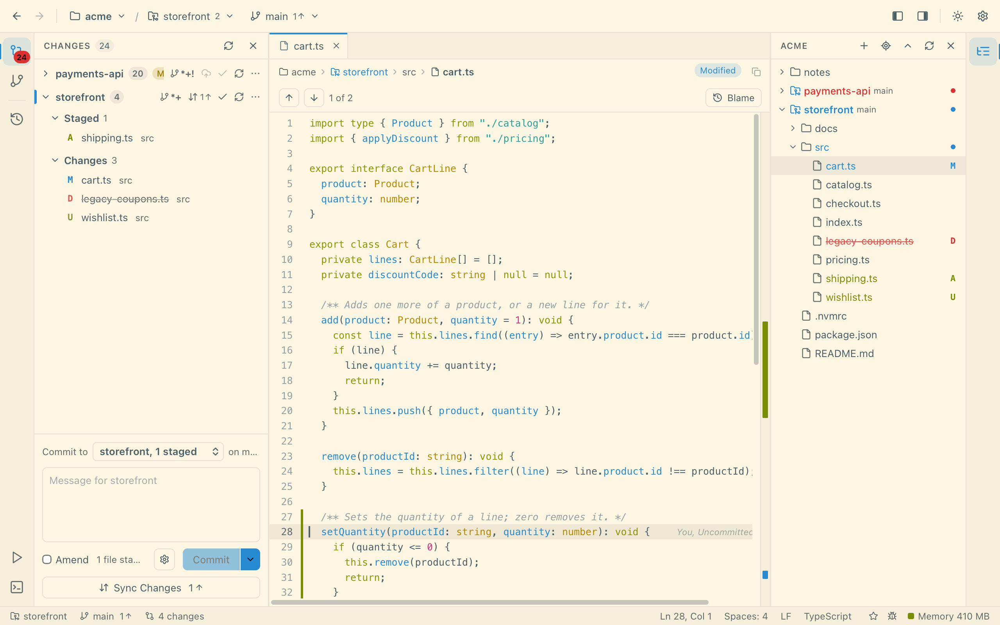
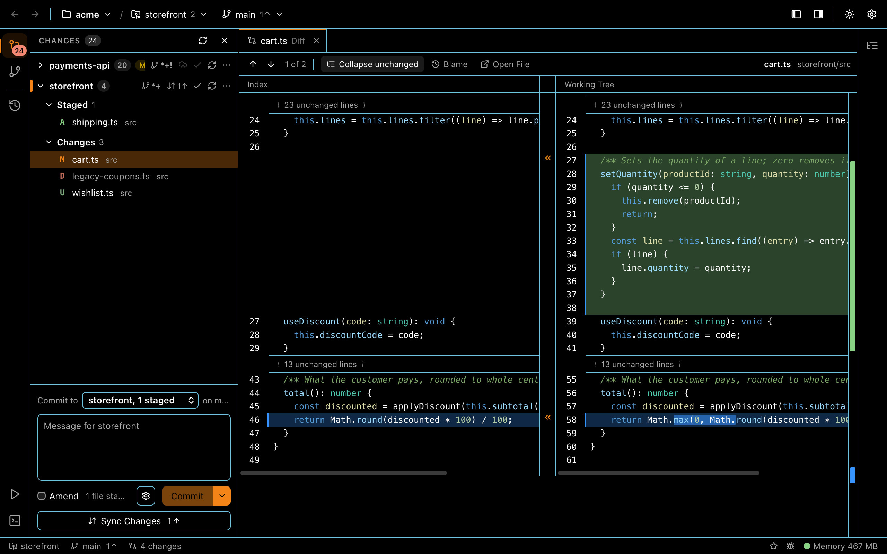

# Color Themes

A color theme sets every color in Git Manager: panels, text, the editor and its syntax colors, diffs, the merge tool and the terminal. You pick one theme for light mode and one for dark mode, so the app keeps looking the way you like when macOS switches between day and night.

There are 37 themes, including the two built-in ones, **Git Manager Light** and **Git Manager Dark**, which are the defaults.

*Settings > Editor: one list for light mode and one for dark mode. "In use" marks the one shown right now.*

## Pick a theme

1. Open **Settings** (Cmd+,) and choose **Editor**.
2. At the top, under **Color theme**, there are two lists: **Light theme** and **Dark theme**.
3. Click a theme. It applies at once and is saved; there is no OK button.

Each theme shows a small swatch with its background, text, a keyword, a string and its accent color, so you can compare them before you click.

The list for the mode you see right now has an **In use** badge. You can change the other list too. Its theme shows once the appearance switches to that mode.

You can also move through a list with the keyboard: click it (or Tab to it), then use the Up and Down arrows, Home and End, or Page Up and Page Down. Every move applies the theme, like a radio group.

## Light, dark or System

Which list is used is set by the **Theme** in **Settings > Appearance**:

- **System** follows macOS: the Light theme in light mode, the Dark theme in dark mode.
- **Light** or **Dark** always uses that list.

The same three choices are in the menu bar under **View > Appearance**, and the sun button in the header (**Toggle light/dark theme**) switches between Light and Dark in one click. See [Settings](Settings.md).

## The themes

Light themes:

- Git Manager Light, GitHub Light, One Light, Solarized Light, Quiet Light, Ayu Light, Catppuccin Latte, Gruvbox Light, Tokyo Night Day, Rosé Pine Dawn, IntelliJ Light.

Dark themes:

- Git Manager Dark, Darcula, One Dark Pro, Dracula, Monokai, Monokai Pro, Nord, Solarized Dark, GitHub Dark, GitHub Dark Dimmed, Gruvbox Dark, Tokyo Night, Catppuccin Mocha, Catppuccin Macchiato, Ayu Dark, Ayu Mirage, Material Palenight, Night Owl, Cobalt2, Rosé Pine, Kanagawa.

High contrast themes have their own group at the end of each list:

- In the Dark theme list: High Contrast Dark, GitHub Dark High Contrast, Amber High Contrast.
- In the Light theme list: High Contrast Light, GitHub Light High Contrast.

*Dracula, a dark theme, with a file open and the Changes sidebar.*

*Solarized Light, a light theme.*

*High Contrast Dark: stronger text, borders and diff colors.*

## What a theme changes

- **The whole window:** backgrounds, panels, borders, text, buttons, selection and hover.
- **The editor:** background, line numbers, current line, selection, cursor and syntax colors. Diffs and the merge tool use the same colors.
- **Change colors:** added, changed, deleted and conflict lines in diffs and the merge tool.
- **The terminal:** its 16 colors, background, cursor and selection, also in terminals that are already open.
- **Mermaid diagrams** in the Markdown preview. See [Markdown Editor](Markdown-Editor.md).

Every theme is checked for readable text. Text on the editor and on panels has a contrast of at least 4.5 to 1 (7 to 1 in high contrast themes), selected text stays readable, and diff colors stand out from the background. Where a theme's own colors would fail, Git Manager adjusts them a little.

## Known gaps

The themes are new, and a few things do not follow them yet:

- **The commit graph** in the Log keeps its own lane colors.
- **Switches** in Settings keep a white knob.
- **Diagrams in Preview Only** (the rich Markdown editor) keep their old colors until they are drawn again, for example after you scroll away and back.
- **At startup** you may see the default colors for a moment before your theme is applied.

## Saved where

The two choices are saved in `~/.gitmanager/settings.json` as `lightColorTheme` and `darkColorTheme`, for example `"darkColorTheme": "dracula"`. An unknown name, or a dark theme in the light list, falls back to the default. See [Settings Files](Settings-Files.md).

## Related

- [Settings](Settings.md)
- [Markdown Editor](Markdown-Editor.md)
- [How color themes work (developer)](../developer/How-Color-Themes-Work.md)
