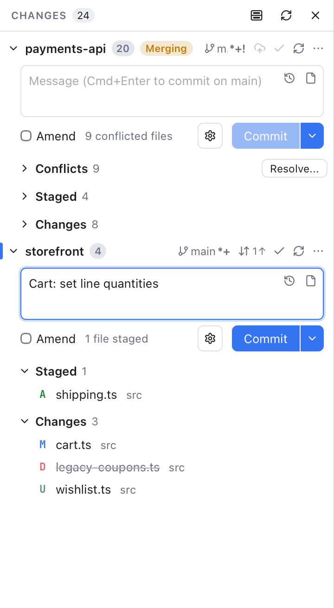

# Commit Box Layout

The commit box is where you write a commit message and click **Commit**. Git Manager can place it in two ways, and you can switch at any time:

- **Single** (the default), like JetBrains IDEs: one commit box at the bottom of **Changes**. With several repositories, **Commit to** picks the repository the commit goes to.
- **Per repository**, like VS Code: every repository in **Changes** has its own commit box at the top of its section, right under its name.

*Per repository: each repository has its own message box and Commit button above its files.*

## Switch the layout

- Click the layout button in the **Changes** title bar, left of Refresh. It shows a panel with one box at the bottom, or a box in each half. Point at it to see what a click does.
- Or open **Settings** (Cmd+,), go to **Git**, and set **Commit box** to **Single** or **Per repository**.

Both change the same setting, and it applies to every window. The Changes tab ([Status Bar](Status-Bar-and-Help.md), click **N changes**) follows it too: with **Per repository** its commit box moves above the file list, and its toolbar has the same layout button.

## Working with a box per repository

Each box works like the single one, for its own repository:

- Type a message and press **Cmd+Enter**, or click **Commit**. The arrow next to it has **Commit & Push**, **Commit & Sync** and **Commit (Amend)**. The placeholder names the branch, such as **Message (Cmd+Enter to commit on main)**.
- **Amend**, the message history (the clock, or Up in an empty box), templates (the page icon) and [Commit Options](Commit-Options.md) are all there.
- Push, pull and publish use the buttons in the repository's header, or in the Changes title bar with one repository ([Repository Actions](Repository-Actions.md)), so the box itself has no Sync Changes button.

Every repository keeps its own message, in both layouts. Switching the layout never loses what you typed: the same text shows in the new box.

A repository you collapse hides its box too. Repositories with no changes are listed under **No Changes** without a box. With only one repository open and nothing changed, its box stays at the top, so you can still amend the last commit.

## Which one to pick

- **Single** keeps the list long and the box in one place. It suits one repository, or several where you commit one at a time.
- **Per repository** shows every message at once. It suits a workspace where you often commit to several repositories in a row, as in VS Code.

On Windows, use Ctrl instead of Cmd.

## Related

- [Changes and Commits](Changes-and-Commits.md)
- [Commit Options](Commit-Options.md)
- [Settings](Settings.md)
