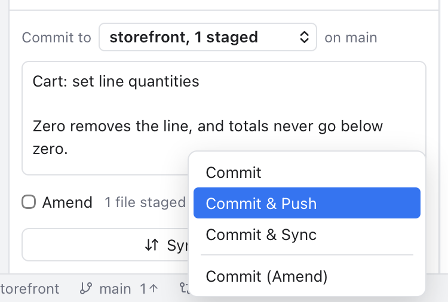
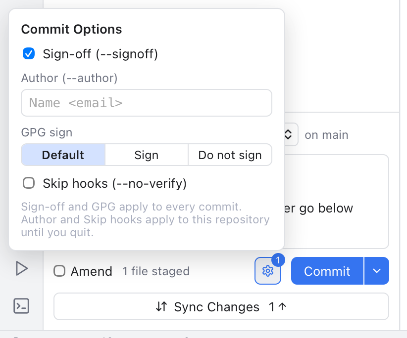

# Commit Options

The commit box in [Changes](Changes-and-Commits.md) has two small controls next to the **Commit** button: an arrow with more ways to commit, and a gear with options for the commit itself. This page explains both.

## Commit, then push or sync

*The arrow next to Commit: commit, then push or sync, or amend.*

Click the arrow on the right of **Commit**:

- **Commit** does the same as the button. While **Amend** is ticked it reads **Amend Commit**.
- **Commit & Push** commits, then pushes the branch to its upstream (the server branch it follows). A branch without an upstream is published to `origin` (or to the first remote when there is no `origin`).
- **Commit & Sync** commits, then runs Sync Changes: it pulls what the server has, then pushes. See [Repository Actions](Repository-Actions.md).
- **Commit (Amend)** replaces the last commit with one that has the staged changes and the message in the box. With an empty box, the last commit keeps its message.

The first three need a message and staged changes, like the button. **Commit & Push** and **Commit & Sync** are greyed out in two cases:

- On a detached HEAD, when you are on no branch.
- While **Amend** is ticked. Pushing a rewritten commit needs a force push, and that should always be a choice you make on purpose.

If the commit fails, for example because a hook refused it, nothing is pushed. If the push or pull fails after a good commit, the commit stays and the note says what went wrong.

The check mark on each repository row and the **...** > **Commit** submenu commit too. See [Repository Actions](Repository-Actions.md).

## Commit Options

*The gear next to Commit, with Sign-off turned on.*

Click the gear left of the Commit button. A small panel opens above it:

- **Sign-off (--signoff)** adds a `Signed-off-by: Your Name <you@example.com>` line at the end of the message. Some projects, such as the Linux kernel, ask for it to show you agree to their contribution rules.
- **Author (--author)** commits in someone else's name, written as `Name <email>`, for example `Ann Lee <ann@example.com>`. Use it when you commit work someone sent you. You stay the committer. Leave it empty to commit as yourself.
- **GPG sign** decides whether the commit is signed with your key, which proves it came from you:
  - **Default**: your git setting `commit.gpgSign` decides, as in the Terminal.
  - **Sign** always signs (`-S`).
  - **Do not sign** never signs (`--no-gpg-sign`), for example when your key is not at hand.
- **Skip hooks (--no-verify)** skips the pre-commit and commit-msg hooks (scripts your project runs before each commit, such as a linter). Handy for a quick work-in-progress commit, but the checks are there for a reason.

Press Esc or click outside to close the panel.

### What is remembered

- **Sign-off** and **GPG sign** are saved settings and apply to every commit in every repository. They are also in **Settings > Git**, as **Sign off commits** and **GPG sign commits**.
- **Author** and **Skip hooks** belong to one repository and last until you quit Git Manager. Then they reset, so you never commit under another name by accident days later.

A badge on the gear counts the options that change the commit, and the gear turns the accent color. Its tooltip lists them, for example **Commit Options: --signoff --no-verify**.

The options apply to every way of committing: the Commit button, its arrow, the check mark on a repository row and the **...** > **Commit** items.

### When the author is not right

The author must look like `Name <email>`, with a name and an email that has an `@`. While it does not, the panel says what is wrong, such as **Write the author as Name <email>**, and a commit stops with a note **Check the commit author**. Fix the text, or clear it, and commit again.

## Example

You apply a patch that Ann mailed you, and your project wants sign-offs:

1. Stage the files and write the message.
2. Open the gear, tick **Sign-off**, and type `Ann Lee <ann@example.com>` in **Author**.
3. Choose **Commit & Push** from the arrow.

The commit shows Ann as the author, you as the committer, ends with your sign-off line, and is on the server a moment later.

## Related

- [Changes and Commits](Changes-and-Commits.md)
- [Repository Actions](Repository-Actions.md)
- [Settings](Settings.md)
- [How commit options work (developer)](../developer/How-Commit-Options-Work.md)
