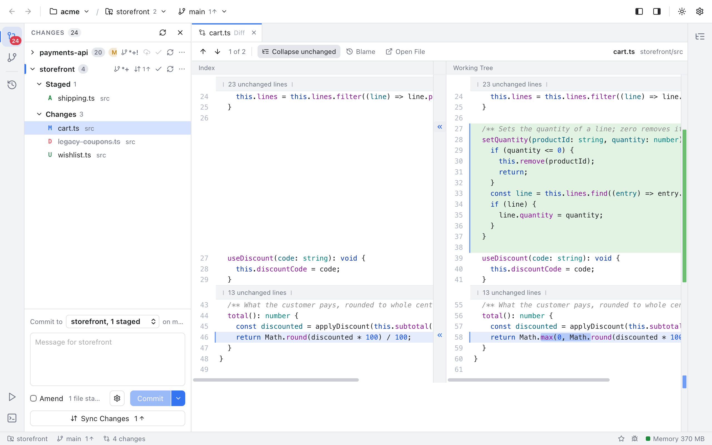
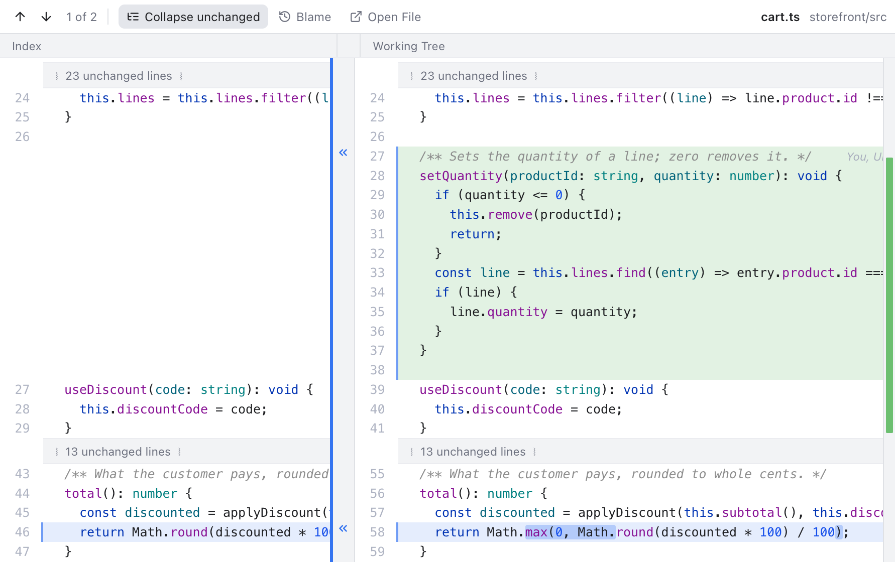
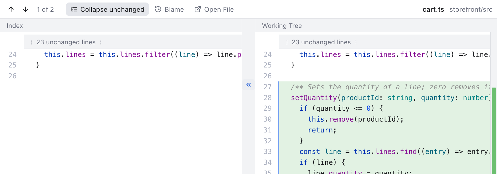

# Diffs

A diff shows two versions of a file side by side, with the differences highlighted. Use it to check your work before you commit, and to stage only some of the changes in a file.

*A side-by-side diff of cart.ts: the toolbar, the Index and Working Tree labels, folded unchanged lines and the per-change stage buttons.*

## Open a diff

1. Open [Changes](Changes-and-Commits.md) (Shift+Cmd+G).
2. Click a file.

The diff opens in the **Diff** tab in the editor area. Use the Up and Down arrow keys in the Changes list to step through files; the diff follows. The right end of the toolbar shows the file name and its folder (with the repository in front when there are several).

The diff updates by itself when the file changes, and keeps its scroll position. With no file selected, the area says **Select a file in Changes to see its diff** (with a **Show Changes** button when the sidebar is hidden), or **Resolve conflicts to continue** while any file has a conflict.

Which two versions you see depends on the group you clicked:

- A file under **Changes**: the left side is the **Index** (what is staged, or the last commit when nothing is staged) and the right side is the **Working Tree** (the file on disk now).
- A file under **Staged**: the left side is **HEAD** (the last commit) and the right side is **Index (staged)**.

Commits in the [Log](History-and-Log.md) use the same view, read-only, comparing the commit with its parent. So do commit tabs, the compare tabs of the Git menu and the Branches popup, and shelved changes.

## Reading the diff

- New lines are green on the right, changed lines are blue on both sides, and lines that were only removed are grey on the left.
- Inside a changed line, the exact words that changed are highlighted.
- The strip next to the scrollbar has a tick for every change. Click a tick to jump there.

## Move between changes

The toolbar above the diff has:

- **Up** and **Down** arrows for the previous and next change. F7 and Shift+F7 do the same while the diff has focus. After the last change they wrap to the first.
- A counter such as **1 of 2**, or **2 changes** when none is picked, or **No changes**.

When you open a diff it jumps to the first change.

## Resize the two sides

*The line between the sides, highlighted under the pointer, with the left side made narrower.*

The two sides start equally wide. To give one side more room, drag the line between them (the pointer turns into a resize arrow when you are on it). The labels above the sides and the find bars follow.

- **Double-click** the line to make the sides equal again.
- With the line focused, the **Left** and **Right** arrow keys move it in small steps, and Shift with an arrow in bigger steps.
- Each side keeps at least 15% of the width.

The split is remembered and used for every diff, in Changes, the Log and diff tabs alike. The column of change buttons between the sides keeps its width.

## Find text in a diff

Click into one side and press Cmd+F. That side's find bar opens above the diff, so the two sides stay lined up while you search. The sides are read-only, so there is no Replace row. See [Find and Replace](Find-and-Replace.md).

## Collapse unchanged lines

**Collapse unchanged** (on by default) folds long runs of lines that are the same on both sides, keeping three lines of context around each change. A folded run shows as a bar such as **23 unchanged lines**. Click it to expand it, or turn the button off to see the whole file. Git Manager remembers your choice for every diff.

## Stage or unstage one change

You do not have to stage a whole file. Each change (a "hunk", one block of changed lines) has its own button in the gap between the two sides.

*The diff toolbar at 1 of 2, and the first change with its « button between the sides.*

- In a diff from **Changes**, the button is **«** with the tooltip **Stage this change**. It copies that one change into the index.
- In a diff from **Staged**, the button is **»**, **Unstage this change**. It takes that one change out of the index again.

Example: in `src/cart.ts` you fixed a bug and also added a debug log. Stage only the fix, commit it, and keep the log for later.

After each click the lists in Changes update, so the file may appear in both Staged and Changes until every part is staged.

## Blame in a diff

The **Blame** button in the diff toolbar shows who last changed each line on the right side, and when. See [Blame](Blame.md). It uses the same setting as the Blame button in the editor.

## Open the file itself

**Open File**, after Blame in the toolbar, opens the real file from your working tree in an editor tab, so you can edit it. When the right side is the working tree (unstaged changes, Compare with Working Copy, Show Diff with Working Tree), the file opens at the line your cursor is on, or at the top line you were looking at. In other diffs, such as a commit in the Log or a branch comparison, it opens at the top. If the file no longer exists in the working tree, a message says so.

## Special cases

- **No content changes**: the file changed in a way that is not text, for example only its permissions.
- **Binary file, no text diff**: images and other binary files are not compared.
- **File too large to diff**: very large files are skipped to keep the app fast.
- **Stored in Git LFS**: for a file kept in Git LFS, the diff shows the old and new sizes instead of text. See [Git LFS](Git-LFS.md).

Diffs and the merge tool never wrap long lines, so both sides stay aligned. Scroll sideways for long lines. The **Line spacing** and **Render whitespace** settings apply here too (see [Editing Code](Editing-Code.md#how-text-looks)).

## Related

- [Changes and Commits](Changes-and-Commits.md)
- [Editor and Tabs](Editor-and-Tabs.md)
- [History and Log](History-and-Log.md)
- [Blame](Blame.md)
- [How diffs work (developer)](../developer/How-Diffs-Work.md)
