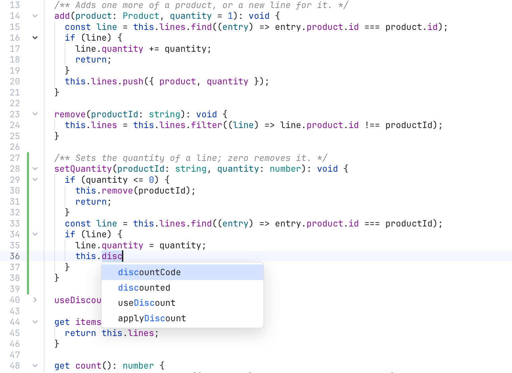

# Editing Code

The editor has the everyday tools of an IDE editor: syntax colors, code completion, multiple cursors, line commands in a **Code** menu, folding, and settings for how text looks. Tabs, saving and change markers are on [Editor and Tabs](Editor-and-Tabs.md).

## The basics

The editor has line numbers, bracket matching, Tab to indent, and syntax colors for JavaScript, TypeScript, JSX, Rust, PHP, HTML, Vue, Svelte, Blade, CSS, SCSS, Less, JSON, Markdown, Python, YAML, SQL, Go, Java, Kotlin, Swift, Ruby, shell scripts, TOML, XML, Dockerfile, C, C++ and C#. A language loads the first time you open one of its files.

**Edit > Undo** (Cmd+Z) and **Redo** (Shift+Cmd+Z) work on the editor that has the focus, with its own history per tab.

To find text in the file, press Cmd+F. See [Find and Replace](Find-and-Replace.md).

## Multiple cursors

You can type in several places at once:

- **Option+Shift+click** adds a cursor where you click.
- **Cmd+D** (Select Next Occurrence) selects the word at the cursor, then adds the next place where it appears, one at a time.
- **Ctrl+Cmd+G** (Edit > Select All Occurrences) selects every place at once.

Press Esc to go back to one cursor.

## IDE features

*Completion for `this.disc`, indent guides, and fold arrows with one folded block.*

Each one has a switch in [Settings](Settings.md#editor), **Editor**, **Editing features**. Turning one off removes it from open editors and frees its memory.

### Auto-close brackets and quotes

Typing `(`, `[`, `{` or a quote adds the closing one. Typing the closer steps over it; Backspace deletes both.

### Code completion

A list of suggestions opens while you type: words from the file plus the language's own keywords and names. **Ctrl+Space** opens it by hand. Up and Down pick, **Enter** or **Tab** accepts, Esc closes. Turn off **Show completion while typing** to open it only with Ctrl+Space. In Markdown and plain text it always waits for Ctrl+Space, so writing prose stays quiet.

### Fold arrows

Arrows beside the line numbers fold and unfold blocks. They show while the pointer is over the gutter; a folded block keeps its arrow.

### Indent guides

Faint vertical lines mark each indent level, showing which block a line belongs to.

### Highlight the word at the cursor

Other uses of the word at the cursor get a soft background.

### Scroll past the end

The last line can scroll up to the top of the editor.

### Column selection

Hold **Option** and drag to select a rectangle: one cursor per line, at the same columns. Option+Shift+click still adds a cursor.

### Right margin line

A thin line at a column, like VS Code's rulers. It is off by default; turn it on and pick the column (JetBrains uses 120).

Diffs and the merge tool get indent guides, word highlights, column selection and the margin line. Folding and scrolling past the end stay in the file editor, so the panes keep lining up.

## The Code menu

The **Code** menu in the menu bar acts on the editor that has the focus. Its keys work without the menu, too.

| Item | Key | What it does |
| --- | --- | --- |
| Comment with Line Comment | Cmd+/ | Comments the lines out, or back in |
| Comment with Block Comment | Option+Cmd+/ (or Ctrl+Shift+A) | Wraps the selection in a block comment |
| Duplicate Line or Selection | Shift+Cmd+D | Copies the selection right after itself, or the line below |
| Delete Line | Shift+Cmd+K | Deletes the line |
| Join Lines | Ctrl+Shift+J | Joins the line with the next one, with one space between |
| Move Line Up / Down | Option+Up / Option+Down | Moves the line, or the selected lines |
| Indent Line / Unindent Line | Cmd+] / Cmd+[ | Moves the lines one indent level right or left |
| Toggle Case | Shift+Cmd+U | Upper case, or lower case if it already is |
| Sort Lines | | Sorts the selected lines, or the whole file |
| Folding > Expand / Collapse | Option+Cmd+] / Option+Cmd+[ | Opens or folds the block at the cursor |
| Folding > Expand All / Collapse All | Ctrl+Option+] / Ctrl+Option+[ | Opens or folds every block |
| Go to Line... | Cmd+L | Jumps to a line |
| Select Next Occurrence | Cmd+D | Adds the next match to the selection |

Items that change the text are greyed out in a read-only pane (such as a diff) or while no editor has the focus.

Duplicate takes Shift+Cmd+D because Cmd+D adds the next occurrence, as in VS Code. Option+Shift+Up and Down copy the line up or down.

### Go to Line

**Code > Go to Line...** (Cmd+L) asks for a line number. Type `42`, or `42:7` for line 42 at column 7, and press **Go**. The field starts with where the cursor is now. The older key Option+Cmd+G still opens a small line field too.

## How text looks

These settings are in [Settings](Settings.md#editor), **Editor**. They apply to editors, diffs and the merge tool alike, and open editors change at once. The default font is JetBrains Mono at 13 px when it is installed, else Menlo.

### Line spacing

**Line spacing** sets the space between lines of code, as a multiple of the font size. Drag the slider from 1.00 (tight) to 2.50 (airy), in steps of 0.05. The default is 1.25. Double-click the slider to go back to it.

### Render whitespace

*Render whitespace set to All: a dot for each space and an arrow for each tab.*

**Render whitespace** draws spaces as dots and tabs as arrows. Pick one:

- **None**: nothing is drawn.
- **Boundary**: all spaces and tabs except single spaces between words.
- **Selection** (the default): only inside the text you select.
- **Trailing**: only the spaces and tabs at the end of lines.
- **All**: every space and tab.

### The cursor

The cursor settings work like VS Code's, plus Sublime Text's caret height:

- **Cursor style**: **Line** (the default), **Line thin**, **Block**, **Block outline**, **Underline** or **Underline thin**. A block is see-through.
- **Cursor width**: how thick the Line cursor is, 1 to 6 pixels (2 by default).
- **Cursor blinking**: **Blink**, **Smooth** (fades), **Phase** (fades slowly), **Expand** (shrinks and grows back) or **Solid**. The cursor stays visible while you type.
- **Smooth caret animation**: the cursor glides instead of jumping.
- **Caret extra top** and **Caret extra bottom**: make the cursor up to 10 pixels taller above and below. Double-click a slider to set it back to 0.

### The current line

The line with the cursor has a soft background. While you select text, the highlight steps aside, so a selection inside one line is always easy to see.

### Word wrap

**Word wrap** breaks long lines at the edge of the editor. Turn it on or off with **View > Word Wrap** or **Option+Z**, like VS Code, or in Settings. The top line stays where it is. Diffs and the merge tool never wrap, so their sides stay lined up.

### Tab size

**Tab size** sets the spaces per indent level. It applies to files you open afterwards.

## Zoom

**View > Zoom In** (Cmd+=) and **Zoom Out** (Cmd+-) make the code font one pixel bigger or smaller everywhere. **Reset Zoom** (Cmd+0) goes back to the default size.

With **Change font size with Ctrl + mouse wheel** on in Settings, hold Control (or Command) and scroll over an editor, diff or merge pane to resize the code. A trackpad pinch works too.

## Related

- [Editor and Tabs](Editor-and-Tabs.md)
- [Find and Replace](Find-and-Replace.md)
- [Menus](Menus.md)
- [Keyboard Shortcuts](Keyboard-Shortcuts.md)
- [How editing code works (developer)](../developer/How-Editing-Code-Works.md)
