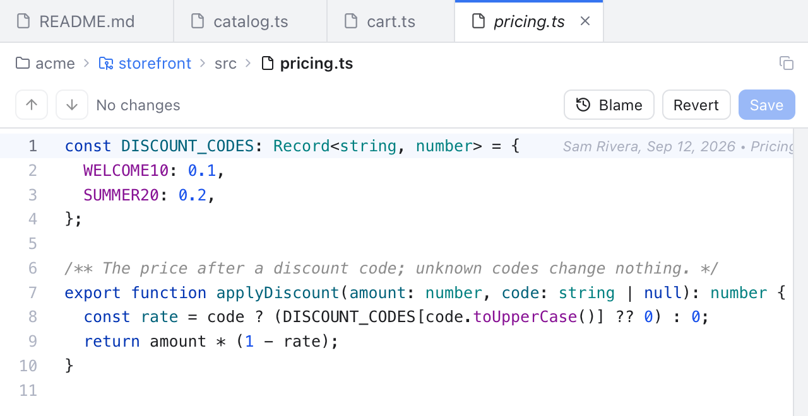
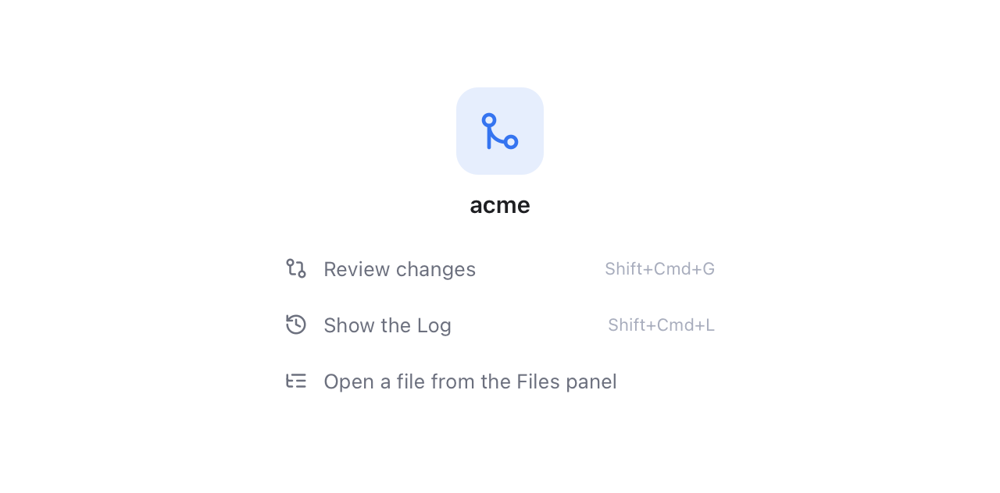
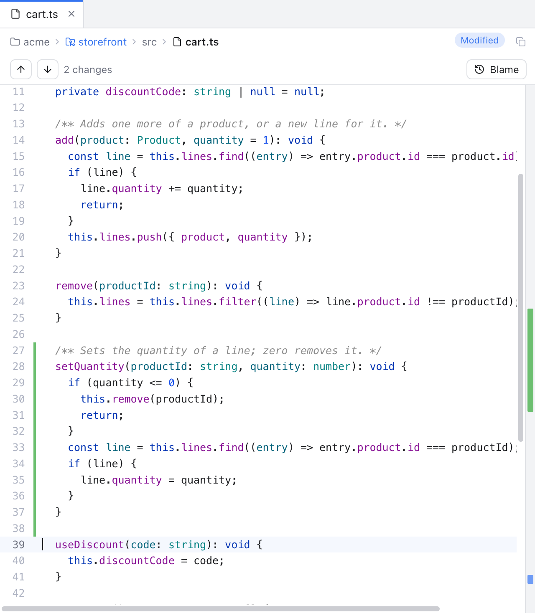

# Editor and Tabs

Git Manager has a light code editor. Open files in tabs, edit and save them, and jump to the lines you changed since the last commit.

*Tabs with an italic preview tab, and the slim path bar right above the code.*

## Open a file

- Click a file in the [Files panel](Files-Panel.md) to open it in a **preview tab**. Its name is shown in italics, and the next file you click replaces it.
- Double-click a file to open it in a normal tab that stays open.
- Press Cmd+P (or Shift twice) to find a file by name. See [Search Everywhere](Search-Everywhere.md).

A preview tab becomes a normal tab when you double-click the tab, start editing, or choose **Keep Open** in its right-click menu.

Markdown files open with a formatting toolbar and a live preview; see [Markdown Editor](Markdown-Editor.md). Images and PDFs open in a preview; see [Image and PDF Preview](Image-and-PDF-Preview.md).

Files over 4 MB and binary files are not opened; the tab shows a note instead. If a file is deleted on disk while its tab is open, the tab says **This file no longer exists on disk.** and offers **Close**.

## When nothing is open

*The empty editor area: the Navigation Bar, the workspace name and six ways to start.*

With no file, diff or Log open, the editor area shows the [Navigation Bar](Navigation-Bar.md), the workspace name and six shortcuts:

- **Review changes** (Shift+Cmd+G) opens the Changes sidebar.
- **Show the Log** (Shift+Cmd+L) opens the commit history. It is greyed out when there is no repository.
- **Open a file from the Files panel** shows the Files panel.
- **Go to File** (Cmd+P) finds a file by name.
- **Search Everywhere** (press Shift twice) searches the whole workspace.
- **Navigation Bar** (Cmd+Up) opens the bar's list.

## Tabs

- Click a tab to show it. Every tab keeps its own cursor, scroll position and unsaved edits (see also [Unload Hidden Tabs](Unload-Hidden-Tabs.md)).
- **Shift+Cmd+]** and **Shift+Cmd+[** show the next and previous tab (also **Window > Next Tab** and **Previous Tab**).
- **Cmd+W** closes the tab on screen (**File > Close Tab**).
- New tabs open after the current one.
- A dot on the tab means unsaved changes; hover it for the close button. Middle-click a tab to close it.
- Scroll the mouse wheel over the tab strip to move through many tabs.
- When two tabs have the same file name, the folder name is shown next to each.
- Drag a tab to move it, and pin the tabs you always need. See [Pin, Reorder and Wrap Tabs](Pin-Reorder-and-Wrap-Tabs.md).

Right-click a tab for **Pin Tab**, **Close**, **Close Others**, **Close to the Right**, **Close All**, **Copy Path** and **Copy Relative Path** (a preview tab also has **Keep Open**). If a tab you close has unsaved changes, you are asked before they are thrown away. Closing the window or folder keeps them instead ([New File and Unsaved Changes](New-File-and-Unsaved-Changes.md)).

There is also a **Diff** tab, always first, with the file name and the word Diff. It appears when you select a file in Changes and shows that file's [diff](Diffs.md). Its close button clears the selection.

### Tabs that are not files

Some tabs show other things, each with its own icon:

- a **commit** from the Log ([History and Log](History-and-Log.md#open-a-commit-in-a-tab));
- a **terminal** ([Terminal](Terminal.md));
- a file's **History**, or a comparison, from the Git menu's **Current File** submenu ([Git Menu](Git-Menu.md));
- two branches compared, or a branch against your files on disk, from the Branches popup ([Branches Popup](Branches-Popup.md));
- a shelved file ([Shelf](Shelf.md)).

They close like any other tab; closing a terminal tab stops its shell.

## The path bar

One slim bar sits between the tabs and the code, like in JetBrains editors.

On the left are the **breadcrumbs**: the workspace folder, then each folder down to the file. Repository folders are marked with a git icon. Hover it to see it in full; click it, or press Cmd+Up, to browse: see [Navigation Bar](Navigation-Bar.md).

Badges next to the path tell you about the file:

- **Unsaved**: you have edits that are not saved yet.
- **Modified**, **New file** or **Conflicted**: what git thinks of the file.
- **2 conflicts** (or similar): how many conflict blocks are in the text.

On the right are small icon buttons. Hover one to see what it does:

- **Up** and **Down** arrows jump to the previous or next change (Shift+F7 and F7), wrapping around at the end of the file. The label next to them reads **2 of 5** while the cursor is in a change, **5 changes** when it is not, or **No changes**. In a file with conflicts it counts **sections**: changes and conflict blocks together.
- **Blame** (the clock) shows who last changed each line. It looks pressed while it is on. See [Blame](Blame.md).
- **Copy relative path** copies the file's path inside the workspace folder.
- In a Markdown file, the three view buttons. See [Markdown Editor](Markdown-Editor.md).

The arrows and Blame only appear for files inside a git repository.

When the editor gets narrow, the **2 of 5** label hides first, then the badges shrink to colored dots (hover them for the text) and the folders shorten to "..." from the left. The file name stays readable the longest.

A file with conflicts gets a second, tinted strip with **Accept All Current**, **Accept All Incoming**, **Resolve in Merge Tool** and **Mark as Resolved**. See [Resolving Conflicts](Resolving-Conflicts.md).

## Save and revert

Saving is in the **File** menu:

- **Save** (Cmd+S) writes the file. It is greyed out until you edit. Line endings (LF or CRLF) are kept as they were.
- **Save All** (Option+Cmd+S) saves every tab with unsaved edits.
- **Revert File** reloads the file from disk and drops your unsaved edits. You are asked first.

## Change markers

*A green bar beside the new lines, ticks beside the scrollbar, and 2 changes in the path bar.*

While you edit, Git Manager compares the text with the last commit:

- A thin colored bar next to the line numbers marks added and modified lines. A small mark shows where lines were deleted.
- The strip beside the scrollbar has a tick for every change and conflict, placed along the whole file. Click a tick to jump there. Hover it to see the kind of change and the line.
- Conflict blocks are marked in their own color and win over plain changes.

F7 and Shift+F7 (or the arrows in the path bar) move between these changes and conflicts.

Files that change on disk (for example after a checkout, or an edit in another app) reload on their own, as long as you have no unsaved edits in that tab.

## Editing

Syntax colors, multiple cursors, the **Code** menu, line spacing and zoom are on [Editing Code](Editing-Code.md). To find and replace text, see [Find and Replace](Find-and-Replace.md).

## Status bar

While a file is shown, the right side of the status bar shows the cursor position (Ln and Col, plus the selection size), the indentation (**Spaces: 4**, detected from the file), the line endings and the language. Click **Spaces** to open Settings on the **Editor** section. See [Status Bar and Help](Status-Bar-and-Help.md).

## Related

- [Editing Code](Editing-Code.md)
- [Files Panel](Files-Panel.md)
- [Diffs](Diffs.md)
- [Blame](Blame.md)
- [Navigation](Navigation.md)
- [How the editor works (developer)](../developer/How-the-Editor-Works.md)
- [How the path bar works (developer)](../developer/How-the-Path-Bar-Works.md)
