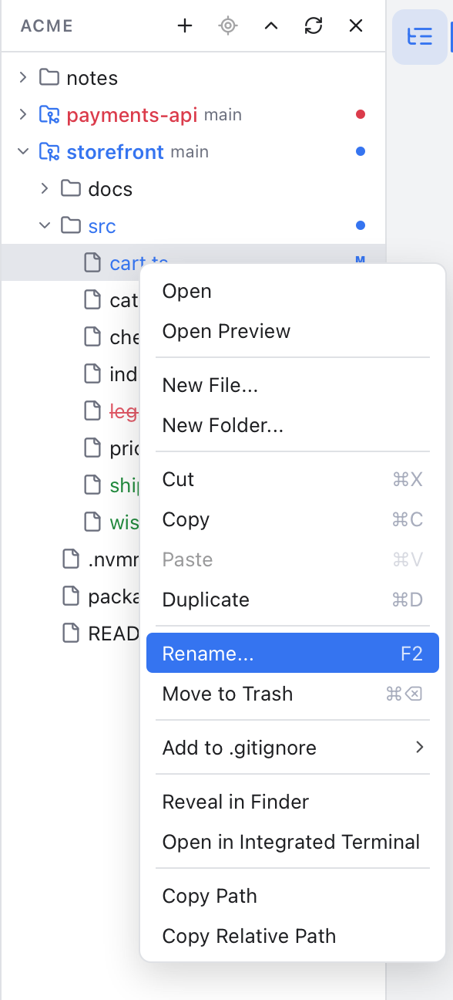
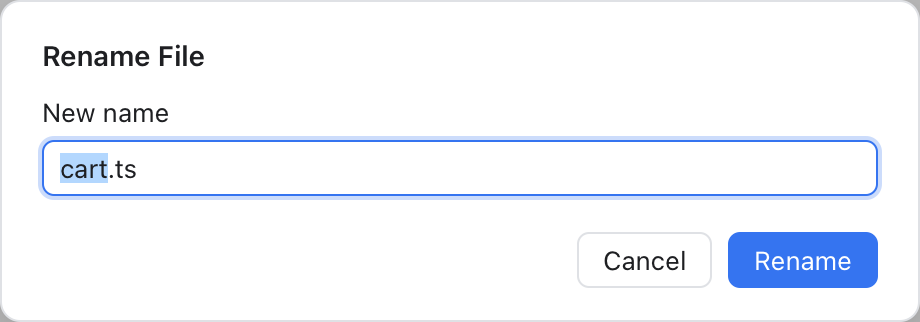

# File Operations

You can create, rename, copy, move and delete files and folders right in the [Files panel](Files-Panel.md), like in VS Code or a JetBrains IDE. These are plain file changes on your disk. Git notices them by itself, so a moved file shows up in [Changes](Changes-and-Commits.md) as deleted in one place and new in the other (or as renamed, once you stage both sides).



*Right-click a file for New File..., New Folder..., Cut, Copy, Paste, Duplicate, Rename... and Move to Trash, each with its key.*

## Select files

- **Click** a row to select it (a file also opens in the preview tab, as before).
- **Cmd-click** adds a row to the selection, or takes it out again.
- **Shift-click** selects every row from the last clicked one to this one.
- **Shift+Up** and **Shift+Down** grow or shrink the selection with the keyboard.

Right-click inside the selection to act on all selected rows. Right-click any other row and only that row is selected.

## The right-click menu

On one file or folder:

- **New File...** and **New Folder...** ask for a name and create it inside the folder, or next to the file. Type `lib/money.ts` to create the `lib` folder on the way. A new file opens in a tab; a new folder opens and is selected.
- **Cut** and **Copy** remember the selected rows. Cut rows look dimmed until you paste.
- **Paste** puts them into the folder you right-clicked, or into the folder of the file. A cut moves the rows; a copy copies them, and you can paste a copy again.
- **Duplicate** makes a copy next to the original.
- **Rename...** asks for the new name. The name is already selected without its extension, so typing replaces `cart` and keeps `.ts`.
- **Move to Trash** asks first, then moves the rows to the system Trash. You can put them back from the Trash in the Finder (the Recycle Bin on Windows).

With several rows selected, the menu has **Cut**, **Copy**, **Paste**, **Move to Trash** and **Copy Paths** (every full path, one per line).

A top-level workspace folder (see [Workspaces](Workspaces.md)) offers only **New File...**, **New Folder...** and **Paste**: it cannot be renamed, moved or trashed from here. Right-click the empty space below the rows, or an empty folder, to create or paste into the workspace folder itself.

When a name is taken, a copy gets a new one, as in VS Code: `cart copy.ts`, then `cart copy 2.ts`. A move or a new name never replaces a file that is already there: you see a message such as "cart.ts already exists in src" and nothing changes.



*Rename selects the name without its extension. The dialog tells you when the name is taken or not valid.*

## Keys

Click in the tree first, then:

| Keys | Action |
| --- | --- |
| Cmd+C, Cmd+X, Cmd+V | Copy, Cut, Paste |
| Cmd+D | Duplicate |
| F2 or Shift+F6 | Rename the row with the keyboard focus |
| Cmd+Backspace or Delete | Move to Trash (asks first) |
| Esc | Forget a pending cut |
| Enter | Open the file or toggle the folder, as before |

While the tree has the keyboard, these keys act on files, not on text: the Edit menu's Cut, Copy and Paste do not run as well. On Windows and Linux, use Ctrl in place of Cmd.

## Drag and drop

- **Drag** rows onto a folder to move them into it. Dropping on a file moves them into that file's folder.
- Hold **Option** while you drop to copy instead of move. The label next to the pointer says **Move** or **Copy**.
- Hover over a closed folder for a moment and it opens, so you can drop deeper.
- Drag near the top or bottom edge of the list to scroll it.
- The folder that would take the drop is highlighted. Press Esc to cancel the drag.

A move asks first ("Move cart.ts into src/lib?"). When the folder already has a file or folder of that name, you see the message at once, without the question. To skip that question, turn off **Confirm drag and drop** in Settings, Layout (see [Settings](Settings.md)). Copies never ask.

**Files from the Finder:** drag files or folders from the Finder (File Explorer on Windows) onto a folder in the panel, and they are copied there. The originals stay where they were.

## Open tabs follow along

- Rename or move a file and its tab follows it to the new name. Moving a folder takes the tabs of the files inside it along.
- Moving a file to the Trash closes its tab.
- A file with unsaved edits cannot be renamed, moved or trashed. You see "Save or revert cart.ts first"; save it (Cmd+S) or undo your edits, then try again.
- Open folders and the selection follow a rename or a move too.

## AI agents and the CLI

AI tools connected through the [MCP server](MCP-and-CLI.md), and the `git-manager cli` command, can do the same with `create_file`, `create_folder`, `copy_paths`, `rename_path`, `move_paths` and `trash_paths`. They follow the same rules as the panel: only your workspace folders, no replaced files, tabs follow along and files with unsaved edits are refused. Rename, move and trash start off; turn them on in **Help > Available MCP Tools...**. For example:

```sh
git-manager cli call rename_path entryPath=/Users/me/shop/src/cart.ts newName=basket.ts
```

## Good to know

- Nothing here runs git. To keep the history of a renamed file, commit the deletion and the new file together; git pairs them up as a rename.
- The `.git` folder and anything outside your workspace folders are never touched.
- On Windows the Trash is called the Recycle Bin.

## Related

- [Files Panel](Files-Panel.md)
- [Editor and Tabs](Editor-and-Tabs.md)
- [Keyboard Shortcuts](Keyboard-Shortcuts.md)
- [How file operations work (developer)](../developer/How-File-Operations-Work.md)
