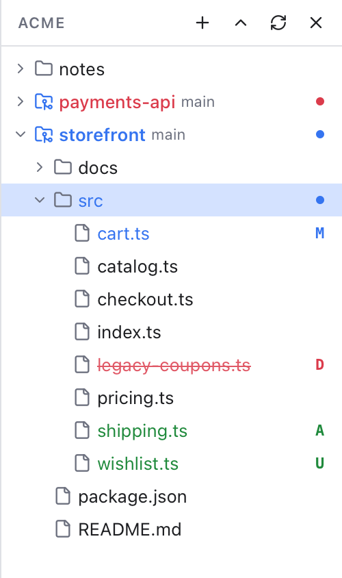
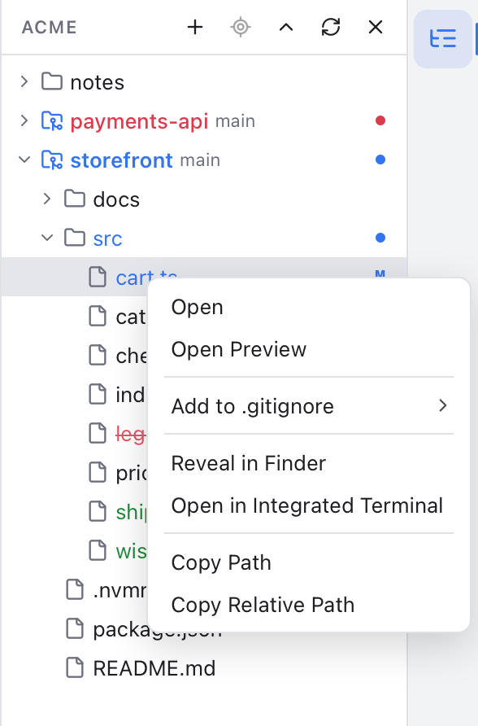

# Files Panel

The Files panel on the right is a tree of every file in your workspace. Use it to open files, and to see at a glance which ones git thinks are new, changed or in conflict.

*Status letters and colors in the Files panel: M, A, U and D.*

## Show or hide it

- Click the tree icon in the thin bar on the right edge of the window.
- Or press Option+Cmd+B.
- Or click the x at the top of the panel.

Settings, Layout also has a **Files panel** switch. Drag the panel's left edge to make it wider, and double-click that edge to reset its width.

## What the tree shows

Folders come first, then files, both sorted by name. Folders load only when you open them, so even very large projects stay quick. A folder with more than 5000 entries shows the first 5000 in this order and a **5000+** note.

With one workspace folder, its contents are the top level. With several folders, each folder is a top-level row (see [Workspaces](Workspaces.md)). An empty folder says **This folder is empty.**

Repository folders get a git folder icon and show their current branch next to the name. The `.git` folder itself is never listed.

Files show one plain icon by default. To see an icon for each file type, pick **Minimal** or **Material Icons** in **View > File Icons**; see [File Icons](File-Icons.md).

## Status letters and colors

Each changed file has a letter on the right and a matching color, like in VS Code: blue for changed, green for new, red for deleted or conflicted. Hover the letter to read the full state, for example "Modified (staged), modified (not staged)".

| Letter | Meaning |
| --- | --- |
| M | Modified: the file changed since the last commit. |
| A | Added: a new file that is staged (put into the next commit). |
| U | Untracked: a new file git is not tracking yet. |
| D | Deleted: the file is gone from disk but git still knows it. |
| R | Renamed. |
| T | Type changed, for example a file became a link. |
| C | Conflicted: a merge left this file with conflicts to fix. |

More details:

- The letter follows what the file looks like on disk now. A staged file that you changed again still shows its staged letter unless it was deleted or is untracked.
- A folder gets a small colored dot, and its name the same color, when something inside it changed. It takes the strongest color inside, so a conflict anywhere below turns it red.
- Deleted files stay in the tree, struck through, so you can still see what went away. Clicking one only reminds you that you can restore or stage the deletion from [Changes](Changes-and-Commits.md).
- Files that your `.gitignore` ignores are shown dimmed.
- Files stored in Git LFS (large files kept outside the repository) have a small **LFS** tag. See [Git LFS](Git-LFS.md).

The tree refreshes on its own when files change on disk or in git, so you rarely need the Refresh button.

## Open files

- **Click** a file to open it in a preview tab. A preview tab (its name is in italics) is reused by the next file you click, so browsing does not pile up tabs.
- **Double-click** a file to open it in a tab that stays open.
- **Click** a folder to expand or collapse it.
- **Cmd-click** and **Shift-click** select several rows, for the [file operations](File-Operations.md).

The file shown in the editor is highlighted in the tree, so you always know where you are. See [Editor and Tabs](Editor-and-Tabs.md) for editing and saving.

## Keyboard

Click in the tree first, then:

- Up and Down arrows move the selection.
- Right arrow opens a folder. Left arrow closes it, or jumps to the parent folder.
- Enter opens the selected file or toggles the selected folder.
- Shift+Up and Shift+Down select more rows.
- Cmd+C, Cmd+X, Cmd+V, Cmd+D, F2 and Cmd+Backspace copy, cut, paste, duplicate, rename and trash files. See [File Operations](File-Operations.md).

## Right-click menu

*Right-click a file for more actions: open it, create, rename, copy or trash files, ignore it, reveal it in the Finder, open a terminal there or copy its path.*

**New File...**, **New Folder...**, **Cut**, **Copy**, **Paste**, **Duplicate**, **Rename...** and **Move to Trash** are explained in [File Operations](File-Operations.md), with drag and drop.

On a file:

- **Open** opens it in a tab that stays open.
- **Open Preview** opens it in the preview tab.
- **Resolve Conflict...** appears for a conflicted file and opens the [Merge Tool](Merge-Tool.md).

On a folder:

- **Expand** or **Collapse**.
- **Set as Active Repository** on a repository folder (it reads **Active Repository** when it already is).
- **Initialize Repository Here** on a plain folder that is not inside any repository.
- **Add Folder to Workspace...** and **Remove Folder from Workspace** on a top-level workspace folder.

On files and folders inside a repository:

- **Add to .gitignore** offers patterns: this file, its folder, or every file with the same extension. Pick one to add it to the repository's `.gitignore`, or use **Add to .git/info/exclude** to ignore it only on your Mac. **Edit .gitignore** opens the file. See [Ignoring Files](Ignoring-Files.md).

On everything:

- **Reveal in Finder** shows the file or folder in the Finder.
- **Open in Integrated Terminal** opens a new terminal in that folder, or for a file in the folder that holds it. See [Terminal](Terminal.md).
- **Copy Path** copies the full path.
- **Copy Relative Path** copies the path inside the workspace folder.

A deleted file offers only **Show in Changes** and the copy items. Copy Relative Path is greyed out on a workspace folder itself. On Windows and Linux, Reveal in Finder is called **Reveal in File Explorer** and **Open Containing Folder**.

## The panel's buttons

At the top of the panel, next to the workspace name (hover it to see the full folder paths):

- **+** adds a folder to the workspace.
- The crosshair (**Select Opened File**) finds the file you are editing in the tree. It opens every folder down to it, selects it and scrolls to it, so a file you opened with [Search Everywhere](Search-Everywhere.md) is easy to place. It is greyed out while no file is open, or while the tab is not a file, such as a commit tab.
- The up chevron collapses every folder.
- The circular arrow refreshes the open folders.
- **x** hides the panel.

## Related

- [Workspaces](Workspaces.md)
- [File Operations](File-Operations.md)
- [Editor and Tabs](Editor-and-Tabs.md)
- [Changes and Commits](Changes-and-Commits.md)
- [How the Files panel works (developer)](../developer/How-the-Files-Panel-Works.md)
