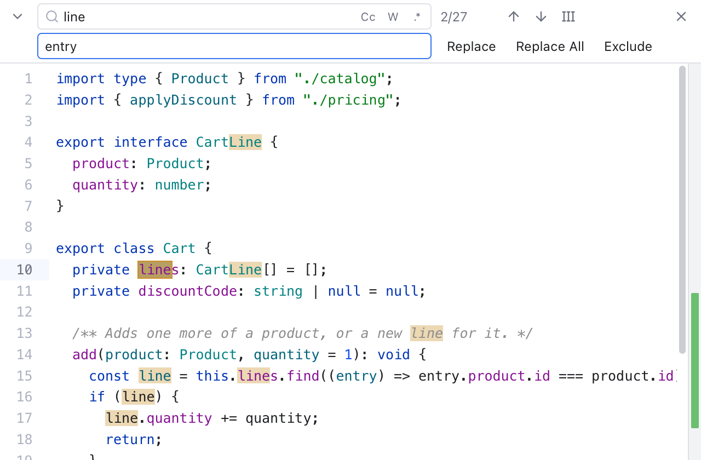
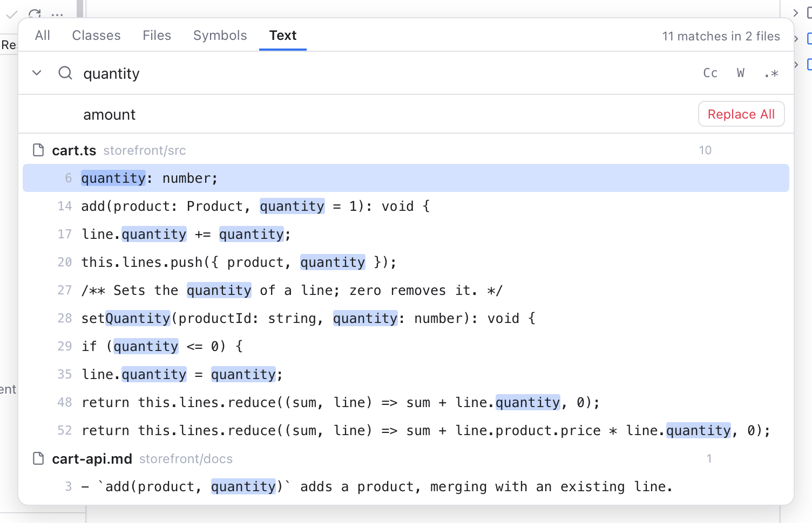

# Find and Replace

Git Manager has two ways to find and replace text: a find bar inside one file, and **Replace in Files** for the whole workspace. Both work like their JetBrains counterparts.

## The find bar

*The find bar over cart.ts with the Replace row open: the search "line", the match counter, the Cc, W and .\* toggles, and the Replace, Replace All and Exclude buttons.*

Press **Cmd+F** in an editor to open the find bar at the top of it. Press **Cmd+R** to open it with the Replace row too. The same items are in the **Edit** menu: **Find...** and **Replace...**.

If you selected a short piece of text on one line, the find field starts with it. Otherwise it keeps your last search. Pressing Cmd+F again while the bar is open selects the field's text, so you can type a new search.

As you type, the editor jumps to the first match after the cursor and highlights every match. The selected match is brighter than the others.

### The counter

Next to the field, a counter tells you where you are:

- **3/12**: the third of twelve matches is selected.
- **12 results**: twelve matches, none selected.
- **0 results** in red: nothing matches.
- **Invalid regex** in red: the regular expression has a mistake. Hover the field to see what is wrong.

Very many matches show as **10000+**.

### Options

The three buttons inside the field change how text matches. The keys work while the Find or Replace field has focus.

- **Cc** (Option+C): Match Case, upper and lower case must match exactly.
- **W** (Option+W): Words, whole words only.
- **.\*** (Option+X): Regex, the text is a regular expression (a search pattern, such as `set\w+`).

### Keys in the find bar

| Key | What it does |
| --- | --- |
| Enter, or Cmd+G | Next match |
| Shift+Enter, or Shift+Cmd+G | Previous match |
| F3 and Shift+F3 | Next and previous match |
| Option+Enter | Select all matches |
| Ctrl+Cmd+G | Select all matches (also **Edit > Select All Occurrences**) |
| Tab | Move between the Find and Replace fields |
| Esc | Close the bar and go back to the text |

The up and down arrow buttons next to the counter also move between matches.

### Select All Occurrences

**Select All Occurrences** (the button with the carets, or Ctrl+Cmd+G) puts a cursor on every match, so you can edit them all at once. Without the find bar, it selects every place where the selected text, or the word at the cursor, appears. It works for up to 1,000 matches.

To add matches one by one instead, press **Cmd+D** (Select Next Occurrence). Option+Shift+click adds a cursor anywhere.

### Replace

Click the arrow at the left of the bar, or press Cmd+R, to show the Replace row.

- **Replace** (or Enter in the Replace field) replaces the selected match and moves to the next one.
- **Replace All** (or Shift+Cmd+Enter in the Replace field) replaces every match in the file. The counter then says, for example, **12 replaced**.
- **Exclude** skips the selected match and moves on. Replace All leaves excluded matches alone. Exclusions are forgotten when you change the search or close the bar.

With Regex on, the replacement can use `$1` for the first group, `$&` for the whole match, and `\n` or `\t` for a new line or a tab.

Replacing in one file only changes the editor text. Nothing is written until you save (Cmd+S), and Cmd+Z undoes it.

### Find in diffs and the merge tool

The find bar works in every text pane, also in [diffs](Diffs.md) and the [merge tool](Merge-Tool.md). Read-only panes, such as the sides of a diff, show the find row only. In a diff, each side's bar sits above that side, so both sides stay lined up.

## Replace in Files

*Replace in Files: "quantity" will become "amount", with a Replace button on each file.*

Replace in Files changes text in many files at once, straight on disk. Open it with **Shift+Cmd+R**, or **Edit > Replace in Files...**. It is the **Text** tab of [Search Everywhere](Search-Everywhere.md#text) with a second field, **Replace with**. On the Text tab, the arrow left of the search field shows or hides it.

1. Type what to find. The results list every matching line, grouped by file.
2. Type the replacement in **Replace with**. Leave it empty to delete the matches.
3. Click **Replace All** to replace in every file, or the **Replace** button on one file's heading to replace only there.
4. A dialog says how many matches in how many files will change, and asks you to confirm. Files are written right away, and this cannot be undone in Git Manager. (Git can still show you the change in [Changes](Changes-and-Commits.md), and you can roll it back there.)
5. A message such as **Replaced 12 matches in 4 files** confirms it, and the results refresh.

While it counts or writes, the button reads **Stop**. Stopping keeps the files already done; every file is either fully replaced or not touched at all.

The Cc, W and .\* options work as in the find bar, and the regex replacement uses the same `$1` and `\n` rules.

### Files that are never changed

To keep your work safe, Replace in Files skips some files and says so in the dialog and the message:

- **Files with unsaved changes** in an open tab. Save or revert them first.
- **Symbolic links** (shortcuts to other files).
- **Read-only files.**
- Binary files and files over 5 MB, like the search.

A file that changes on disk while it is being replaced is not written, and is reported as failed.

## Related

- [Search Everywhere](Search-Everywhere.md)
- [Editor and Tabs](Editor-and-Tabs.md)
- [Keyboard Shortcuts](Keyboard-Shortcuts.md)
- [How find and replace works (developer)](../developer/How-Find-and-Replace-Works.md)
