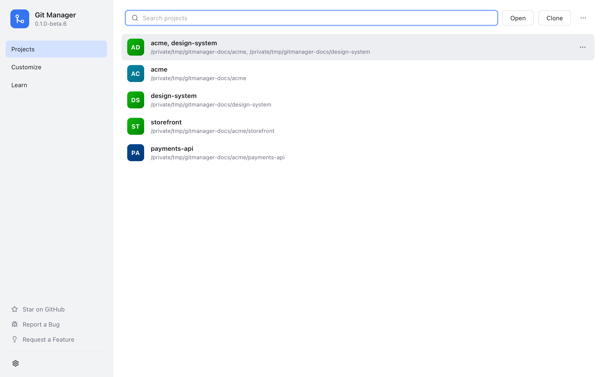
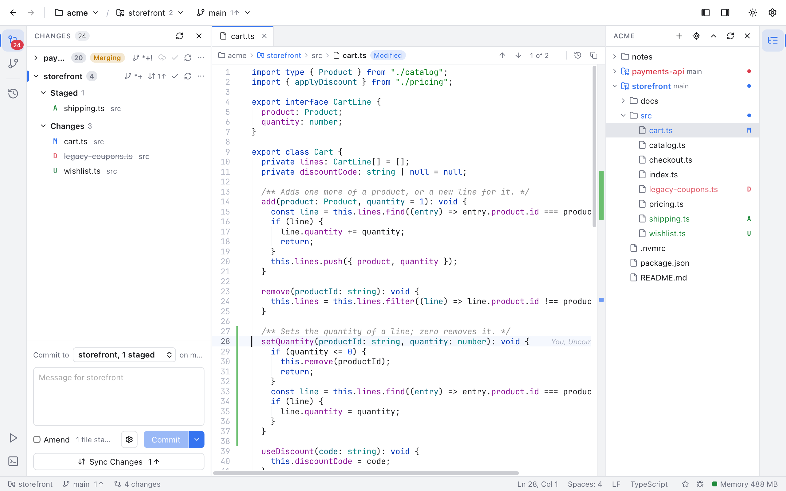

# Getting Started

Git Manager is a small, fast Git app for macOS and Windows. It shows what changed in your projects, lets you commit, switch branches and sync with a server, and has a friendly three pane tool for fixing merge conflicts.

## Install

Open the [Releases page](https://github.com/shibbirweb/git-manager/releases) on GitHub and look under the newest release.

### On a Mac

1. Download the `.dmg` file. It works on both Apple Silicon and Intel Macs.
2. Open the `.dmg` and drag **Git Manager** into your **Applications** folder.
3. The first time only: builds are not signed by Apple yet, so macOS warns about an "unidentified developer". Right-click (or Control-click) the app in Applications and choose **Open**, then **Open** again in the warning. After that it opens normally. If macOS still refuses, see [Troubleshooting](Troubleshooting.md).

### On Windows

1. Download the file that ends in `-setup.exe`. It is for 64-bit Windows 10 and 11.
2. Run it. It installs Git Manager for your account only, so it needs no administrator rights, and adds it to the Start menu.
3. The first time only: the installer is not signed yet, so Windows SmartScreen says "Windows protected your PC". Click **More info**, then **Run anyway**.

Git Manager draws its window with Microsoft Edge WebView2, which Windows 10 and 11 already have. If it is missing, the installer downloads it.

### Git itself

Git Manager uses the `git` already installed on your computer for every change it makes, so your hooks, passwords and signing keys work the same as in a terminal. If you have never used git on this computer, install it first: on a Mac with `xcode-select --install`, on Windows with [Git for Windows](https://git-scm.com/download/win).

## First launch

When nothing is open you see the welcome screen.

*The welcome screen with recent workspaces and folders.*

- **Open Folder...** picks any folder. It can be one repository (a project folder that git tracks), a folder with many repositories inside, or a plain folder with no git at all.
- **Clone Repository...** copies a repository from a server, such as GitHub, into a new folder and can open it right away (see [Clone](Git-Dialogs.md#clone)).
- **Open Workspace from File...** opens a saved workspace (see [Workspaces](Workspaces.md)).
- **Recent Workspaces** (saved workspace files and sets of several folders) and **Recent Folders** reopen what you used before. Hover a row and click the x (**Remove from list**) to drop it.
- **Settings**, **Star on GitHub**, **Report a Bug** and **Request a Feature** are small links under the big button.

Next time you start the app, it reopens the folders you had open when you quit. If you closed the folder before quitting, it starts on the welcome screen.

## A tour of the window

*The main window: Changes on the left, a file in the editor with its path bar, the Files panel on the right and the status bar at the bottom.*

From top to bottom and left to right:

- **Menu bar** (at the top of the screen on a Mac, inside the window on Windows). Git Manager, File, Edit, View, Code, Git, Window and Help. The **Git** menu holds commit, push, pull, fetch, merge, rebase, stash and the other git actions. See [Menus](Menus.md) and [Git Menu](Git-Menu.md). Fetch, pull, push and stash are also on each repository row in Changes (see [Repository Actions](Repository-Actions.md)).
- **Header** (the top bar of the window).
  - On the left: Back and Forward arrows, then the workspace name (click it for the folder menu).
  - Then the active repository and the number of repositories found. It shows when the workspace holds more than one repository, or when the repository is not the folder itself.
  - Then the current branch, with how many commits you can push or pull. Click it to switch branches.
  - On the right: two buttons that show or hide the left and right activity bars, a light and dark theme toggle, and Settings (Cmd+,). While git is working, a spinner and its progress line show up here too.
- **Left activity bar** (the thin icon strip on the left edge). Its icons pick what the left sidebar shows: **Changes** (Shift+Cmd+G, with a badge counting your changed files), **Branches and Stashes** (Shift+Cmd+E) and the **Log** (Shift+Cmd+L, the commit history, which opens in the middle). At the bottom of the strip, **Scripts** lists the scripts of your projects (see [Scripts](Scripts.md)) and **Terminal** (Ctrl+`) opens the bottom panel. Click the active icon again to hide its view. Option+Cmd+B hides or shows the left sidebar.
- **Left sidebar**. Changes shows your edited files and the commit box. Branches and Stashes shows branches, tags and stashes.
- **Editor area** (the middle). It holds tabs for open files, diffs, commits and terminals. The Log also opens here. When nothing is open, it shows shortcuts to get started (see [Editor and Tabs](Editor-and-Tabs.md)).
- **Bottom panel**, under the editor. Its tabs are **Terminal** (see [Terminal](Terminal.md)), **Run** (the output of scripts, once one ran), **Git Console** (the git commands the app ran, when turned on in Settings, Git, see [Git Console](Git-Console.md)) and **Shelf** (see [Shelf](Shelf.md)). Ctrl+` shows or hides it.
- **Right sidebar** with the **Files panel**, a tree of every file in the workspace. The right activity bar has one icon to show or hide it (Cmd+B).
- **Status bar** (the bottom line). It shows the repository, branch and number of changes of what you are looking at, the cursor position, update notices, Star and feedback buttons, and the app's memory use. See [Status Bar and Help](Status-Bar-and-Help.md).

You can drag the edge between a sidebar or the bottom panel and the editor to resize it. Double-click the edge to put it back to its normal size.

### Hide the activity bars

The two layout buttons next to the theme toggle hide or show the activity bars (the filled side shows a visible bar), like **View > Left Activity Bar** and **View > Right Activity Bar**. The sidebars stay usable with their keys, such as Option+Cmd+B and Cmd+B.

## Your first commit

1. Open a folder that is a git repository.
2. Edit a file, in Git Manager or any other editor. The change shows up in **Changes** on its own within a moment.
3. Click the file to see its diff, then hover it and click the **+** to **stage** it (staging means "put this in the next commit").
4. Type a message in the commit box and click **Commit**, or press Cmd+Enter.
5. Click **Sync Changes** under the commit box (**Publish Branch** for a branch the server does not have yet), or choose **Git > Push...**, to send it to the server (see [Remotes](Remotes.md)).

## Next steps

- [Workspaces](Workspaces.md): open several folders and repositories at once.
- [Changes and Commits](Changes-and-Commits.md): staging, discarding and amending.
- [Branches and Tags](Branches-and-Tags.md) and [Remotes](Remotes.md): work with others.
- [Resolving Conflicts](Resolving-Conflicts.md): what to do when a merge stops.
- [Keyboard Shortcuts](Keyboard-Shortcuts.md): every shortcut, also in Help > Keyboard Shortcuts.
- [MCP Server and Command Line Tool](MCP-and-CLI.md): let AI tools and scripts use Git Manager.

## Related

- [Workspaces](Workspaces.md)
- [Settings](Settings.md)
- [Troubleshooting](Troubleshooting.md)
- [Developer Guide](../developer/Developer-Guide.md)
