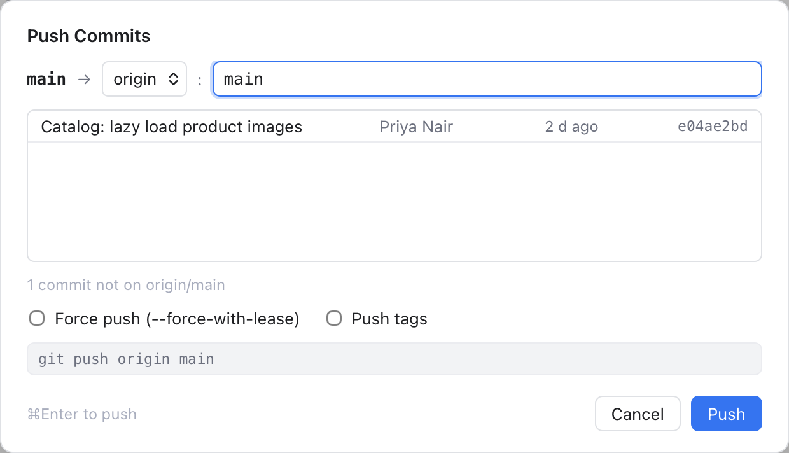
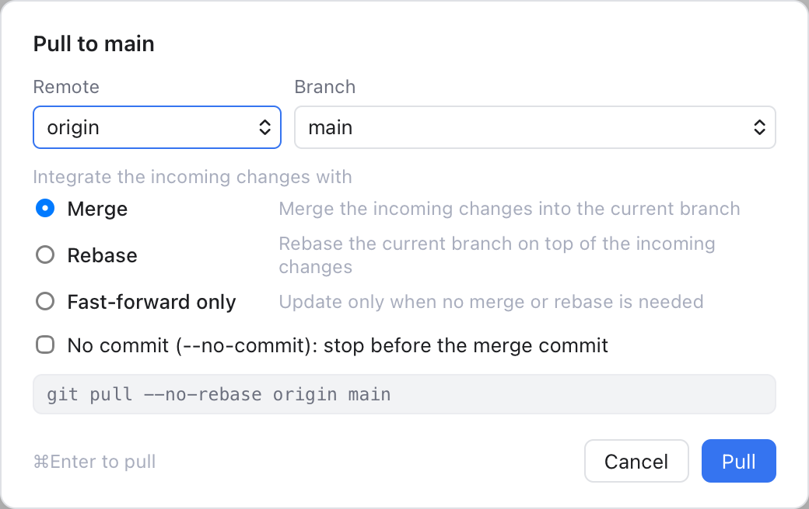
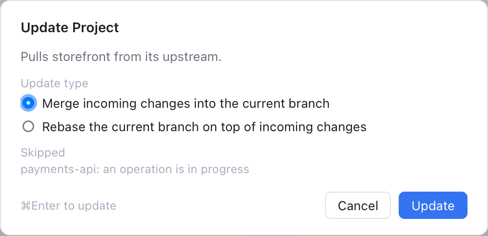
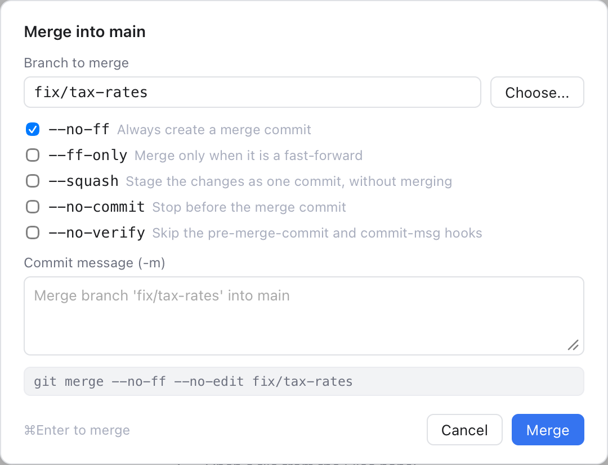
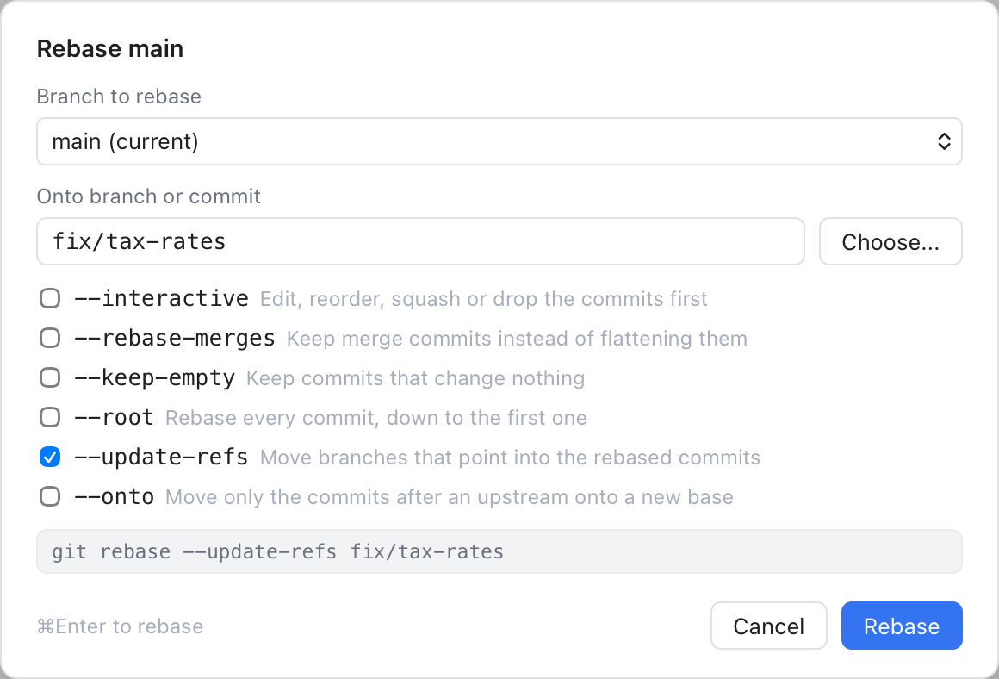
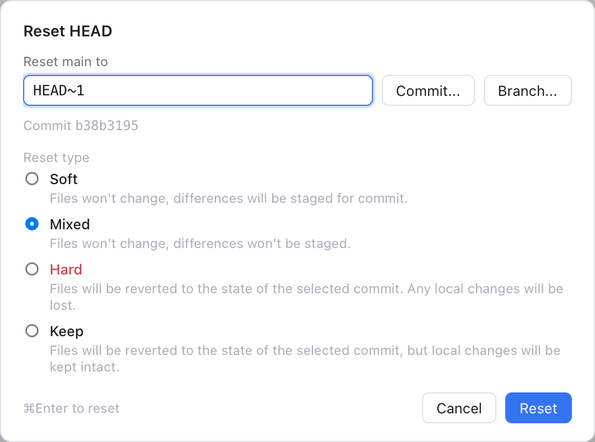
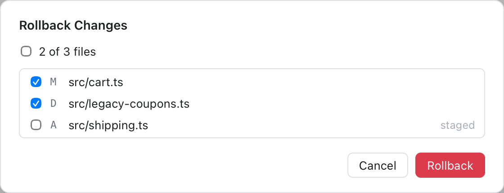
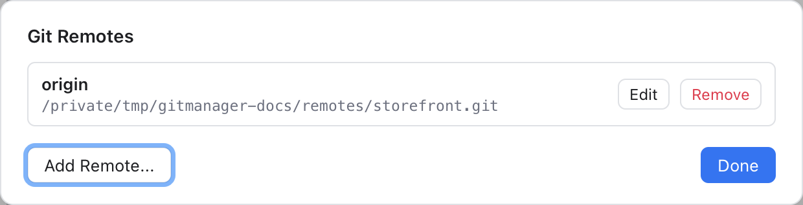
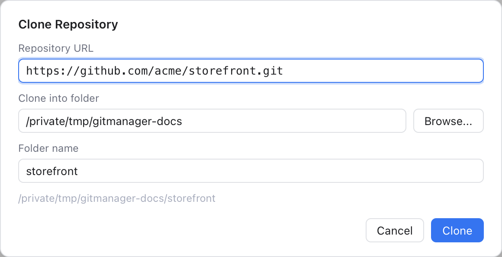

# Git Dialogs

Several items of the [Git Menu](Git-Menu.md) open a dialog, like their counterparts in JetBrains IDEs. They all work the same way:

- **Esc** cancels and **Cmd+Enter** runs the main button.
- Most of them show, at the bottom, the git command they will run. You can select and copy it, and it is a good way to learn git.
- Anything that can lose work asks you once more, with a red button.

The dialogs act on the active repository. While one is open, most menu items and the window shortcuts do nothing: a key you press then is dropped, not kept for later.

## Push

**Git > Push...** opens **Push Commits**.

*Push Commits: one local commit on its way to origin/main.*

- The top row reads "your branch → remote : remote branch". The remote and the remote branch start at your branch's **upstream** (the remote branch it follows), or at the same name on `origin` (the first remote when there is no `origin`). You can change both.
- When the branch has no upstream yet, a note says **new, sets upstream**: after this push, the branch follows the remote branch.
- The list shows the commits that will be pushed. **Nothing to push** means the remote has them all.
- **Force push (--force-with-lease)** replaces the remote branch with yours. It refuses if someone else pushed there since your last fetch, so you do not throw away their work. The button turns red and reads **Force Push**, and you confirm once more.
- **Push tags** also sends your tags.

## Pull

**Git > Pull...** opens **Pull to** your branch.

*Pull: the remote, the branch and how to combine the new commits with yours.*

Pick the **Remote** and **Branch**; they start at your upstream. Then choose how to **integrate the incoming changes**:

- **Merge**: make a merge commit when both sides have new commits.
- **Rebase**: put your new commits on top of the incoming ones.
- **Fast-forward only**: update only when you have no commits of your own. Git then just moves your branch forward to the new commits, with no merge commit. This is called a fast-forward.

**No commit (--no-commit)** works with Merge: it stops before the merge commit, so you can check the result first.

## Update Project

**Git > Update Project...** (Cmd+T) opens the Update Project dialog. Its **Update** button pulls every repository of the workspace from its upstream, one after another ("Updating 2 of 5"). It stops at the first conflict or failure.

*Update Project: the update type, and the repositories it skips.*

Choose **Merge incoming changes into the current branch** or **Rebase the current branch on top of incoming changes**. The choice is remembered. Repositories that cannot be pulled are listed under **Skipped**, with the reason: no upstream, detached HEAD, no commits yet, or an operation in progress. HEAD is git's name for the commit you have checked out; detached means it is not on a branch.

## Merge

**Git > Merge...** opens **Merge into** your branch. You can also start it from a repository's **...** menu in Changes (Branch, **Merge Branch...**, see [Repository Actions](Repository-Actions.md)) and from the Branches popup.

*Merge: the branch to merge, the options and the command it runs.*

Type the **Branch to merge** or click **Choose...**. Then tick options:

| Option | What it does |
| --- | --- |
| `--no-ff` | Always create a merge commit |
| `--ff-only` | Merge only when it is a fast-forward |
| `--squash` | Stage the changes as one commit, without merging |
| `--no-commit` | Stop before the merge commit |
| `--no-verify` | Skip the pre-merge-commit and commit-msg hooks |

Options that cannot go together turn each other off. **Commit message (-m)** appears when a merge commit can be made; leave it empty for git's usual message.

## Rebase

**Git > Rebase...** opens **Rebase** your branch. A **rebase** replays your commits on top of another commit, as if you had started there.

*Rebase: what to rebase, onto what, and the options.*

Choose the **Branch to rebase** (the current one by default) and type or **Choose...** what to rebase **onto**. The options:

- `--interactive`: edit, reorder, squash or drop the commits first. The button reads **Next...** and opens [Interactive Rebase](Interactive-Rebase.md).
- `--rebase-merges`: keep merge commits instead of flattening them.
- `--keep-empty`: keep commits that change nothing.
- `--root`: rebase every commit, down to the first one.
- `--update-refs`: other branches that point at one of the moved commits move along with it.
- `--onto`: pick which commits move. Only the commits after an **upstream** commit go onto a **new base**. A second field asks for the upstream.

## Reset HEAD

**Git > Reset HEAD...** moves your branch to another commit. HEAD is the commit you have checked out now.

*Reset HEAD: the target commit and the four reset types.*

Type HEAD, a commit id or a branch, or use **Commit...** and **Branch...** to pick one. The dialog shows which commit that is. Then pick the reset type:

- **Soft**: files stay as they are, and the differences are staged.
- **Mixed** (the default): files stay as they are, nothing is staged.
- **Hard**: files go back to that commit, and local changes are lost. You confirm once more.
- **Keep**: files go back to that commit, but your local changes are kept.

## Rollback

**Git > Uncommitted Changes > Rollback...** opens **Rollback Changes**: a list of your changed files, all ticked. New untracked files and files with conflicts are not listed. Untick the ones to keep. A file you added is removed from git but stays on disk, unless you tick **Delete local copies of added files**. You confirm before anything is lost.

*Rollback Changes: pick the files whose changes go.*

## Manage Remotes

**Git > Manage Remotes...** opens **Git Remotes**, the list of remotes with their URLs.

*Git Remotes: edit or remove a remote, or add a new one.*

- **Add Remote...** asks for a **Name**, a **URL** and an optional **Push URL**, for when you push somewhere else than you fetch from.
- **Edit** changes them. **Remove** asks first: the remote's branches go too, but nothing changes on the server.

## Clone

**Git > Clone...** copies a repository from a server into a new folder, even with no folder open. **Clone Repository...** on the welcome screen opens the same dialog.

*Clone Repository: the URL, where it goes and the folder name.*

Paste the **Repository URL**. **Clone into folder** starts next to the open folder (or in your home folder), and **Folder name** fills in from the URL. The full path shows below.

While it clones you see git's progress. **Cancel** stops git and removes the folder it was creating. When the clone is done, choose **Open in This Window**, **Add to Workspace** (only when a folder is open) or **Not Now**.

Scripts and AI tools can clone too, with `git-manager cli clone` or the `clone_repository` tool. See [MCP Server and Command Line Tool](MCP-and-CLI.md).

## Related

- [Git Menu](Git-Menu.md)
- [Remotes](Remotes.md)
- [Branches and Tags](Branches-and-Tags.md)
- [How the Git dialogs work (developer)](../developer/How-the-Git-Dialogs-Work.md)
