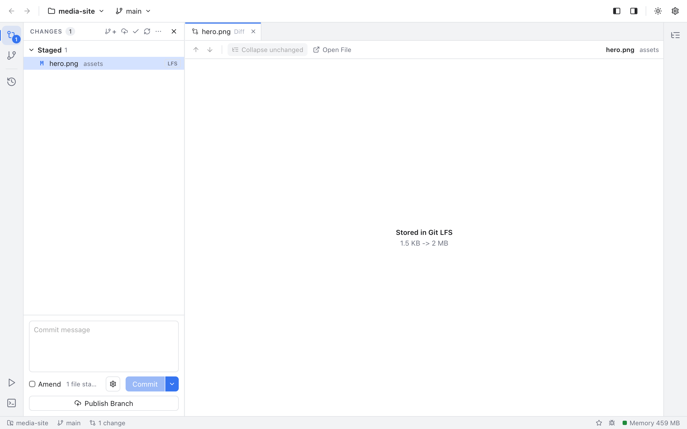
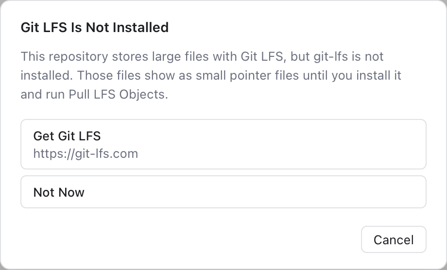

# Git LFS

Git LFS (Large File Storage) is an add-on for git that keeps big files, like images, videos or design files, out of the repository's history. Git stores only a small **pointer file** (a few lines of text with the file's id and size), and the real content lives on the LFS server. When you check out a branch, LFS downloads the content and puts the real file in its place.

Git Manager works with LFS through the `git-lfs` tool, the same one you use in a terminal. Install it from [git-lfs.com](https://git-lfs.com) (or with Homebrew: `brew install git-lfs`).

## See which files use LFS

Files stored in LFS have a small **LFS** tag:

- in the Changes sidebar, next to the file name;
- in the Files panel, next to the file name. See [Files Panel](Files-Panel.md).

Git Manager reads the list of LFS files once each time a repository's status refreshes, and only for repositories on screen, so it stays quick.

## Diffs of LFS files

Comparing two pointer files line by line would tell you nothing, so the diff of an LFS file shows **Stored in Git LFS** and the sizes instead:

- `1.5 KB -> 2 MB` when the file changed;
- `Added: 2 MB` for a new file, `Deleted: 1.5 KB` for a removed one;
- `Size: 10 B, same content` when only something else changed, for example the file mode.

See [Diffs](Diffs.md) for diffs in general.

## When git-lfs is not installed

If a repository uses LFS but `git-lfs` is missing, its large files are only pointer files on your disk. Git Manager tells you once, with a **Git LFS Is Not Installed** notice. Choose **Get Git LFS** to open the download page, or **Not Now**. It does not ask again.

The LFS commands below also check first. Without `git-lfs`, they show the same title with **Get Git LFS** and **Cancel** instead of running.

## The LFS menus

You find the LFS commands in two places, both for one repository:

- **Git > LFS** in the menu bar, for the active repository;
- the repository's **...** menu in the Changes sidebar, under **LFS**.

| Item | What it does |
| --- | --- |
| **Track Pattern...** | Stores files that match a pattern in LFS from now on, for example `*.psd`. |
| **Untrack Pattern...** | Stops storing a pattern in LFS. |
| **Pull LFS Objects** | Downloads the LFS content of the current checkout and puts the real files in place. |
| **Fetch LFS Objects** | Downloads the content without changing your files. |
| **Prune LFS Objects...** | Deletes local copies of old LFS content that is already on the server. |
| **Install Hooks** | Sets up LFS for this repository only. |

In the repository menu, Pull, Fetch and Prune are disabled when the repository does not use LFS, and Untrack when there is no pattern to remove.

## Track a pattern

1. Choose **Git > LFS > Track Pattern...**.
2. In **Track with Git LFS**, type a pattern in **Pattern (added to .gitattributes)**, like `*.psd` or `assets/videos/**`.
3. Click **Track**.

The pattern is added to the `.gitattributes` file at the root of the repository (the file where git keeps rules per path). Commit `.gitattributes` so everyone uses LFS for those files. Files you add from now on that match go to LFS. Files already committed stay as they are.

## Untrack a pattern

Choose **Git > LFS > Untrack Pattern...** and pick one of the patterns from `.gitattributes`. New files that match are stored in git again. Commit `.gitattributes` afterwards.

## Pull, fetch and prune

**Pull LFS Objects** is what you need after a clone without LFS, or after installing `git-lfs`: it replaces pointer files with the real content. **Fetch LFS Objects** only downloads, which is useful before going offline. Both show their progress in the status bar.

**Prune LFS Objects...** frees disk space. It asks first: content that recent commits do not need and that the server already has is deleted from your computer. It is downloaded again when needed.

## Install hooks

Git LFS uses git hooks (small scripts git runs on commit, push and checkout) to upload and download content. **Install Hooks** sets them up for this repository only, which helps when a clone was made before `git-lfs` was installed.

## Example

You want to add design files to `storefront` without making the history huge.

1. Choose **Git > LFS > Track Pattern...**, type `*.sketch` and click **Track**.
2. Copy `homepage.sketch` into the repository. In Changes it shows the **LFS** tag.
3. Commit `.gitattributes` and `homepage.sketch` together and push. Git uploads the content to the LFS server.

## Related

- [Changes and Commits](Changes-and-Commits.md)
- [Diffs](Diffs.md)
- [Git Menu](Git-Menu.md)
- [How Git LFS works (developer)](../developer/How-Git-LFS-Works.md)
