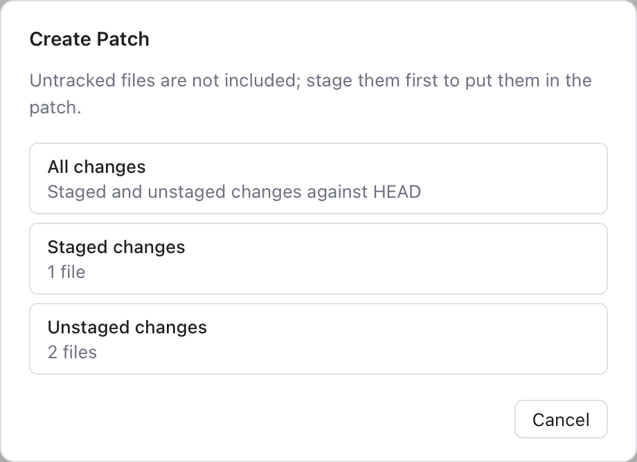
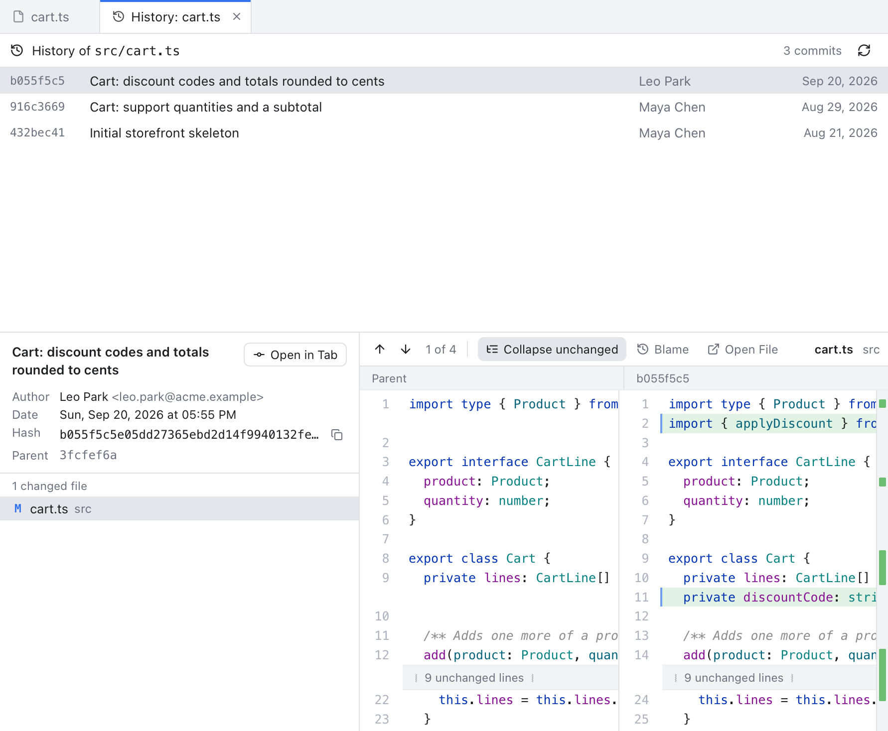
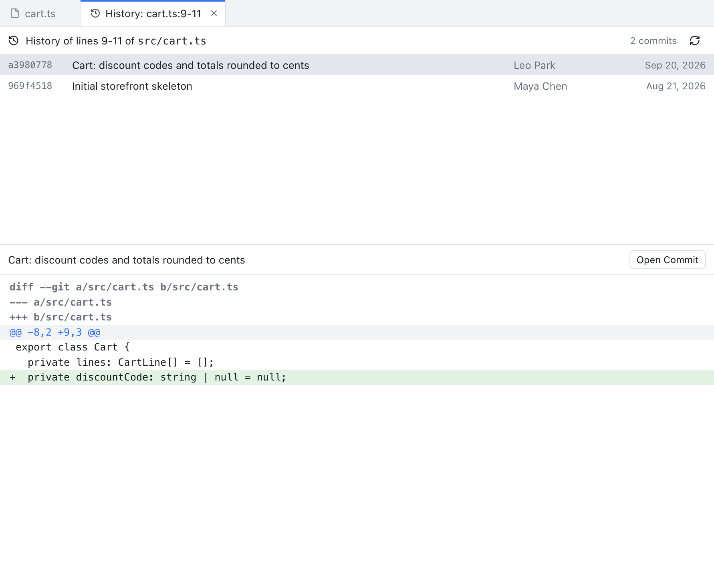
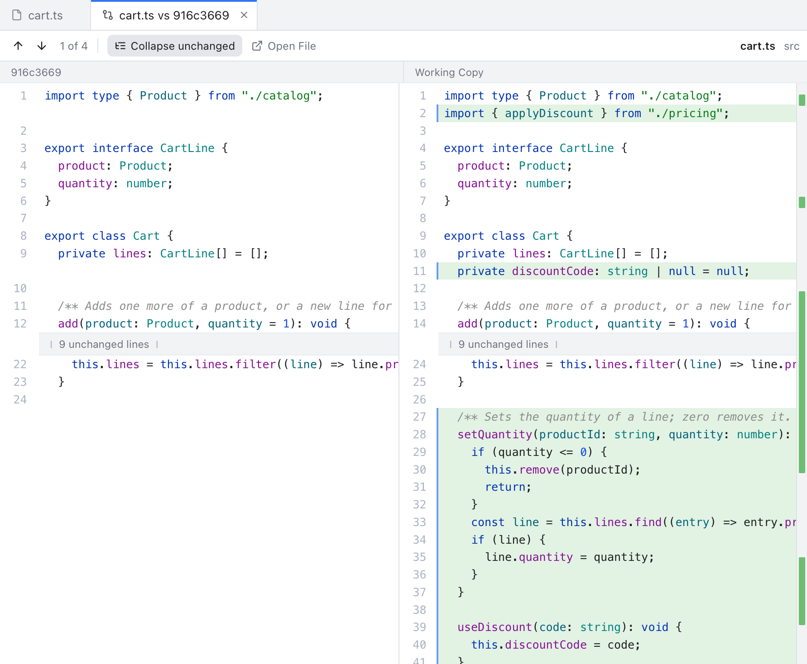

# Git Menu

The **Git** menu in the menu bar holds every git command, laid out like the Git menu of JetBrains IDEs. Most items act on the **active repository**: the one picked in the header and selected in Changes. The **Current File** submenu acts on the file open in the editor.

Items are grey when they cannot run now, for example Push without a remote. The dialogs are explained in [Git Dialogs](Git-Dialogs.md), and the menu bar as a whole in [Menus](Menus.md).

## Commit, push and pull

- **Commit...** (Cmd+K) opens Changes and puts the cursor in the commit message. See [Changes and Commits](Changes-and-Commits.md).
- **Push...** opens the Push dialog. With commits to push it reads **Push (2 ahead)...**.
- **Update Project...** (Cmd+T) opens the Update Project dialog. Its **Update** button pulls every repository of the workspace, one after another.
- **Pull...** opens the Pull dialog. With new commits on the remote it reads **Pull (1 behind)...**.
- **Fetch** downloads new commits from your branch's remote (usually `origin`), without changing your files. **Fetch All Remotes** asks every remote and drops remote branches deleted there. See [Remotes](Remotes.md).

## Branches and history

- **Merge...** and **Rebase...** open the Merge and Rebase dialogs.
- **Interactive Rebase...** lets you pick the oldest commit to rewrite, then opens the [Interactive Rebase](Interactive-Rebase.md) dialog.
- **Branches...** opens the [Branches Popup](Branches-Popup.md).
- **New Branch...** asks for a name and creates the branch at the current commit, and checks it out unless you untick **Checkout branch**.
- **New Tag...** asks for a tag name. Add a message to make an annotated tag.
- **Reset HEAD...** opens the Reset HEAD dialog. HEAD is the commit you have checked out now.
- **Cherry-Pick...** lets you pick a commit from the latest 200 commits of all branches and applies it on top of your branch. Merge commits cannot be picked here.
- **Force Push...** asks first, then pushes with `--force-with-lease`. It replaces the remote branch with yours, but refuses if someone else pushed there since your last fetch.

## During a merge, rebase, cherry-pick or revert

A revert is a new commit that undoes an older one. While git is stopped in the middle of one of these operations, extra items appear, named after it:

- **Resolve Conflicts...** while there are conflicts. See [Resolving Conflicts](Resolving-Conflicts.md).
- **Continue Merge** (or Rebase, Cherry-Pick, Revert), grey until every conflict is resolved.
- **Abort Merge** (and so on), which asks first and puts your branch back as it was.
- **Skip Commit**, during a rebase only.

The banner at the top of the window has the same buttons.

## Log and console

- **Show Git Log** (Cmd+9) opens the [Log](History-and-Log.md).
- **Show Git Console** shows the commands the app ran. It is there only while the console is on in Settings, Git. See [Git Console](Git-Console.md).

## Patch

A **patch** is a text file with changes in it, which you can apply to another copy of the code.

*Create Patch asks which changes go into the patch.*

- **Create Patch...** asks for **All changes**, **Staged changes** or **Unstaged changes**, then where to save the `.patch` file. Untracked files are left out: stage them first to include them.
- **Create Patch from Commit...** saves one commit as a patch, with its author and message. It uses the commit selected in the Log, or lets you pick one.
- **Apply Patch...** picks a `.patch` or `.diff` file and applies it to your files. Nothing is staged. If it does not apply cleanly, the app tries a 3-way merge: git compares both versions with the original they came from. Any conflicts show in Changes.
- **Apply Patch from Clipboard** does the same with copied patch text.

## Uncommitted Changes

- **Stash Changes...** asks for a message (WIP by default) and whether to include untracked files. **Unstash Changes...** lets you pick a stash, then **Pop** (apply it and drop it) or **Apply** (keep it). See [Stashes](Stashes.md).
- **Shelve Changes...** and **Show Shelf**: see [Shelf](Shelf.md).
- **Rollback...** opens the Rollback dialog, to throw away changes to some files.
- **Show Local Changes** opens Changes.

## Current File

These items need a file editor tab on screen, for a file inside a repository.

- **Commit File...** asks for a message and an optional description, and commits only this file.
- **Add to Git** (Option+Cmd+A) stages the file.
- **Annotate with Git Blame** turns the blame gutter on or off. See [Blame](Blame.md).
- **Show Diff** opens the file's diff in Changes.
- **Compare with Revision...** lets you pick a commit that changed the file. A tab opens with the file at that commit on the left and your working copy on the right, read-only. **Compare with Branch...** does the same with a branch or tag.
- **Show History** opens a tab with every commit that changed the file, following renames. Click a commit to see its details and diff; right-click for **Open Commit in Tab**, **Compare with Working Copy**, **Show in Log** and **Copy Revision Hash**.
- **Show History for Selection** opens a tab with the commits that changed the selected lines (or the cursor line), each with its diff of those lines. Uncommitted lines above the selection do not throw it off; the tab names the lines as they are numbered in the last commit. If you select only new lines, a message says they are not committed yet.
- **Rollback File...** asks first, then throws away the file's staged and unstaged changes. A newly added file is removed from git but stays on disk.

*Show History: the commits that changed `src/cart.ts`, and the selected commit's diff.*

*Show History for Selection: only the commits that touched these lines.*

*Compare with Revision: the file at an older commit, next to your working copy.*

## Worktrees, Submodules and LFS

These submenus have pages of their own: [Worktrees](Worktrees.md), [Submodules](Submodules.md) and [Git LFS](Git-LFS.md).

## Remotes, Clone and GitHub

- **Manage Remotes...** opens the Git Remotes dialog.
- **Clone...** opens the Clone dialog. It works even with no folder open.
- **GitHub** shows for every repository:
  - **Share Project on GitHub...**, **Sync Fork** and **Create Gist...** use your GitHub account. See [GitHub](GitHub.md).
  - **Open on GitHub**, **Create Pull Request**, **View Pull Requests** and **Copy GitHub Link** only open or copy links, so they need no account, just a remote on github.com.

Open on GitHub and Copy GitHub Link point at the file on screen and its selected lines. The link uses the branch name when your pushed branch matches your local one. Otherwise it uses the commit. Create Pull Request opens GitHub's compare page for your branch.

## Related

- [Git Dialogs](Git-Dialogs.md)
- [Interactive Rebase](Interactive-Rebase.md)
- [Menus](Menus.md)
- [How the Git menu works (developer)](../developer/How-the-Git-Menu-Works.md)
