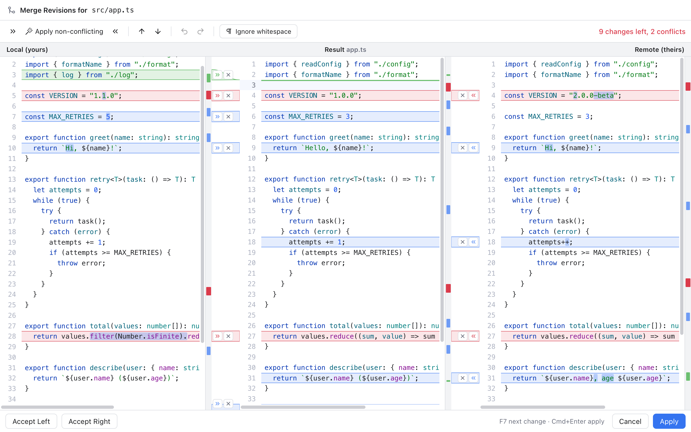

# Git Mergetool

You can use Git Manager's three pane [Merge Tool](Merge-Tool.md) from the Terminal too. After a one-time setup, `git mergetool` opens each conflicted file in a Git Manager window, and closes it again when you are done.

This is handy if you do most of your git work on the command line but like a visual tool for conflicts.

## Set it up

Run these lines once in the Terminal. They assume Git Manager is in your Applications folder.

```sh
APP="/Applications/Git Manager.app/Contents/MacOS/git-manager"
git config --global mergetool.gitmanager.cmd "\"$APP\" merge \"\$BASE\" \"\$LOCAL\" \"\$REMOTE\" \"\$MERGED\""
git config --global mergetool.gitmanager.trustExitCode true
git config --global merge.tool gitmanager
```

What each line does:

1. `APP=...` stores the path to the program inside the app, just to keep the next line short.
2. `mergetool.gitmanager.cmd` tells git how to start Git Manager. The word `merge` switches the app into merge tool mode, followed by the four files git prepares: the common ancestor (`BASE`), your version (`LOCAL`), the other version (`REMOTE`) and the file to write the result to (`MERGED`).
3. `trustExitCode true` lets git read from Git Manager whether you finished the file or gave up.
4. `merge.tool gitmanager` makes it the tool `git mergetool` uses by default.

Leave out `--global` to set it up for one repository only. If the app lives somewhere else, change the `APP` path.

## Use it

1. Run a merge, rebase or pull that stops on conflicts.
2. Run `git mergetool`.
3. For each conflicted file, a Git Manager window opens.



*The merge tool in its own window, opened by git mergetool.*

The window has only the merge tool, titled **Merge Revisions for** and the file, such as `src/app.ts`. The left pane is **Local (yours)**, the right pane is **Remote (theirs)**, and the **Result** is in the middle. The top right counts what is left, for example **9 changes left, 2 conflicts**. Everything from the [Merge Tool](Merge-Tool.md) page works here: apply and ignore buttons, **Apply non-conflicting**, F7 navigation, undo and **Ignore whitespace**.

Turning **Ignore whitespace** on or off here also saves it as your default (the same switch as in Settings, Merge and Log).

When you are done with the file:

- **Apply** (or Cmd+Enter, from any pane) writes the result to the file and closes the window. Git Manager tells git it succeeded, so git marks the file as resolved and moves on to the next one. If changes are still unresolved, or the result still has conflict markers (`<<<<<<<`), you are asked first (**Save Anyway**).
- **Cancel** (or Esc), or closing the window, leaves the file untouched. Git Manager tells git it did not finish, so the file stays unresolved. If you changed anything, you are asked (**Discard Changes**) before it is thrown away. Quitting with Cmd+Q also leaves the file unresolved, but without asking.

**Accept Left** and **Accept Right** also work: they resolve the whole file with one side and close the window.

After the last file, finish the operation in the Terminal as usual, for example `git merge --continue` or `git rebase --continue`.

## Good to know

- Git keeps a backup of each conflicted file with a `.orig` ending. If you do not want those, run `git config --global mergetool.keepBackup false`.
- Binary files (such as images) cannot be merged as text. The window says so and offers **Quit**; resolve those with `git checkout --ours` or `git checkout --theirs` instead.
- If the files git passed cannot be read, the window says **Could not load the files passed by git mergetool** with the reason, and offers **Quit**.
- The merge window does not check for updates or show What's New.
- If git passes an empty or missing ancestor (for example when both sides added the same file), the merge starts from an empty result.
- Opening the full app is separate: starting Git Manager with a folder or a workspace file instead of `merge` opens it normally, for example `"$APP" ~/code/acme`.

## Related

- [Merge Tool](Merge-Tool.md)
- [Resolving Conflicts](Resolving-Conflicts.md)
- [Keyboard Shortcuts](Keyboard-Shortcuts.md)
- [Troubleshooting](Troubleshooting.md)
- [How mergetool mode works (developer)](../developer/How-Mergetool-Mode-Works.md)
