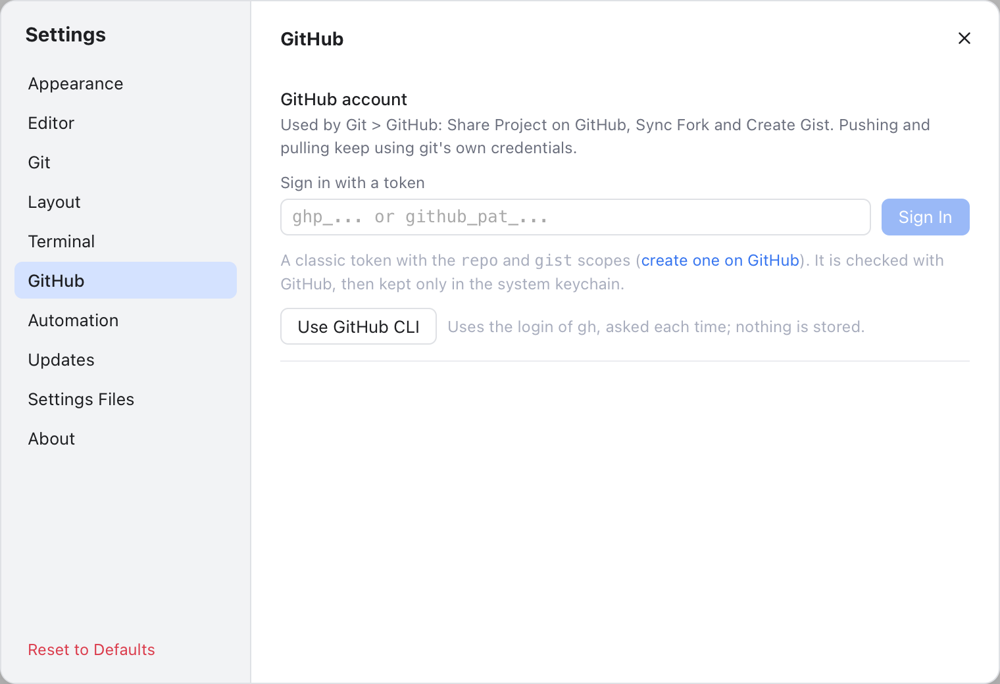
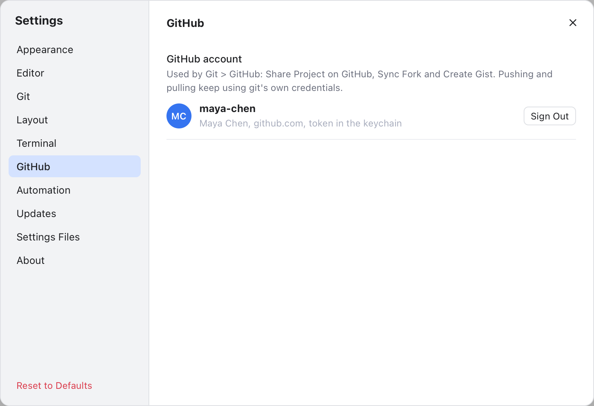
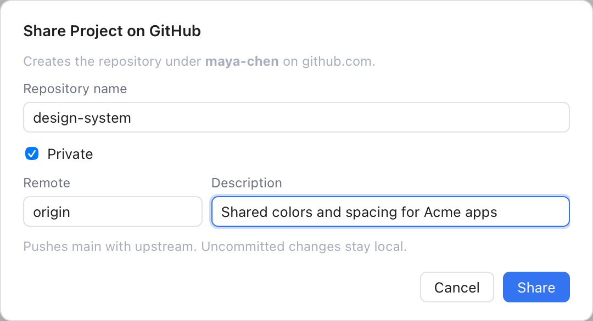
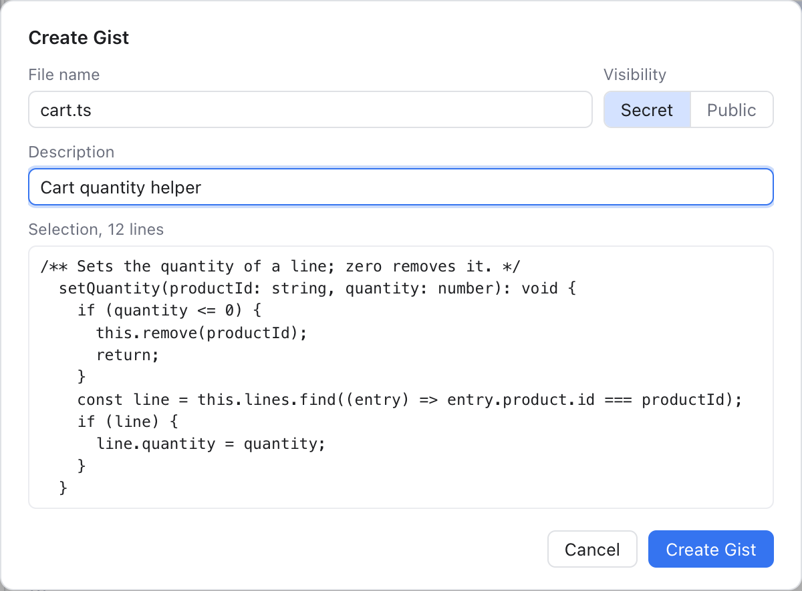

# GitHub

Git Manager can sign in to your GitHub account to do three things git alone cannot: create a repository on GitHub for a project (**Share Project on GitHub**), update your fork from the project you forked (**Sync Fork**), and share a file or a selection as a gist (**Create Gist**). All three are in **Git > GitHub**.

Pushing and pulling do not use this account. They keep using git's own sign-in, exactly as in a terminal.

The other GitHub items in that submenu (Open on GitHub, Create Pull Request, View Pull Requests, Copy GitHub Link) only open or copy links and need no account. See [Git Menu](Git-Menu.md).

## Sign in

Open **Settings** (Cmd+,) and choose **GitHub**. There are two ways to sign in.

**With a token.** A personal access token is a password-like key that you create on GitHub and that only allows what you tick.

1. Click **create one on GitHub** in the hint. It opens GitHub's token page with the `repo` and `gist` scopes (permissions) already ticked.
2. Create the token on GitHub and copy it.
3. Paste it into **Sign in with a token** and click **Sign In** (or press Enter).

Git Manager checks the token with GitHub, then keeps it only in the macOS Keychain. The field is cleared at once and the token is never shown again.

**With the GitHub CLI.** If you use GitHub's `gh` command line tool, click **Use GitHub CLI**. Git Manager then asks `gh` for its login each time it needs it, and stores nothing. The button only shows when `gh` is installed; when `gh` is not signed in, it says to run `gh auth login` first.

Once signed in, the section shows your initials, your login, your name, the host and where the sign-in comes from ("token in the keychain" or "through the GitHub CLI").

If a classic token lacks the `repo` or `gist` scope, a warning says which one is missing: some GitHub actions will fail until you create a new token.

**Sign Out** asks first. For a token, it removes it from the Keychain. For the GitHub CLI, it only stops using `gh`'s login; `gh` itself stays signed in.

If you choose a GitHub action while signed out, a **Sign In to GitHub** dialog appears with the same choices, and the action continues once you are signed in.

## Share Project on GitHub

Use this for a project that is not on GitHub yet. It is disabled when a remote (a named link to a server copy) already points to GitHub.

1. Choose **Git > GitHub > Share Project on GitHub...**.
2. **Repository name** starts from the folder name, cleaned up to letters, digits, `.`, `-` and `_`.
3. **Private** is ticked. Untick it for a public repository: you are asked to confirm, because anyone can then see the code and its history.
4. **Remote** is `origin`, or `github` when `origin` is taken. **Description** is optional.
5. Click **Share**.

Git Manager creates the repository under your account, adds it as the remote and pushes the current branch, set to track it. A **Shared on GitHub** dialog then offers **Copy Link** and **Open on GitHub**.

If the repository has no commits yet, the dialog asks for an **Initial commit message**, and every file that is not ignored is committed first. You need a branch checked out (not a detached HEAD).

If pushing fails, you see **Created on GitHub, Not Pushed**: the repository exists and the remote is added, but git could not sign in to github.com. Set up git's own sign-in (for example run `gh auth setup-git`), then push again.

## Sync Fork

A fork is your own copy of someone else's repository on GitHub. When the original moves on, **Git > GitHub > Sync Fork** asks GitHub to bring those changes into your fork, like GitHub's own Sync fork button.

It syncs your current branch when it tracks a branch of the same name on the fork, and otherwise the fork's default branch. You confirm first. Afterwards Git Manager fetches, so you can pull the changes into your local branch when you are ready. The result says whether it was a fast-forward (the branch just moved forward, no merge commit needed), a merge commit, or already up to date.

If the branch conflicts with the original, GitHub cannot sync it. The **Fork has conflicts** dialog offers **Open Pull Request**, which opens a pull request on GitHub where you can merge and resolve the conflicts.

If the repository was not forked from another one, a note says **Not a fork**.

## Create Gist

A gist is a small snippet of code or text shared on GitHub with its own link.

1. Open a file in the editor. Select some lines to share only those; otherwise the whole file is shared.
2. Choose **Git > GitHub > Create Gist...**.
3. **File name** starts as the file's name. **Visibility** is **Secret** (only people with the link can see it) or **Public** (listed on your profile; you are asked to confirm). **Description** is optional.
4. The dialog shows a preview and says "Selection" or "Whole file" with the line count.
5. Click **Create Gist**.

The **Gist Created** dialog has **Copy Link** and **Open Gist**.

## Privacy

- The token is kept only in the macOS Keychain, never in a settings file, the Git Console or an error message. `~/.gitmanager/github.json` holds only your login, name, host, the sign-in source and missing scopes.
- With the GitHub CLI, nothing is stored.
- A development build may ask for Keychain access; choose **Always Allow**.

## Related

- [Remotes](Remotes.md)
- [Git Menu](Git-Menu.md)
- [Settings](Settings.md)
- [Terminal, GitHub and Automation Settings](Settings-Terminal-and-Automation.md#github)
- [How GitHub works (developer)](../developer/How-GitHub-Works.md)
