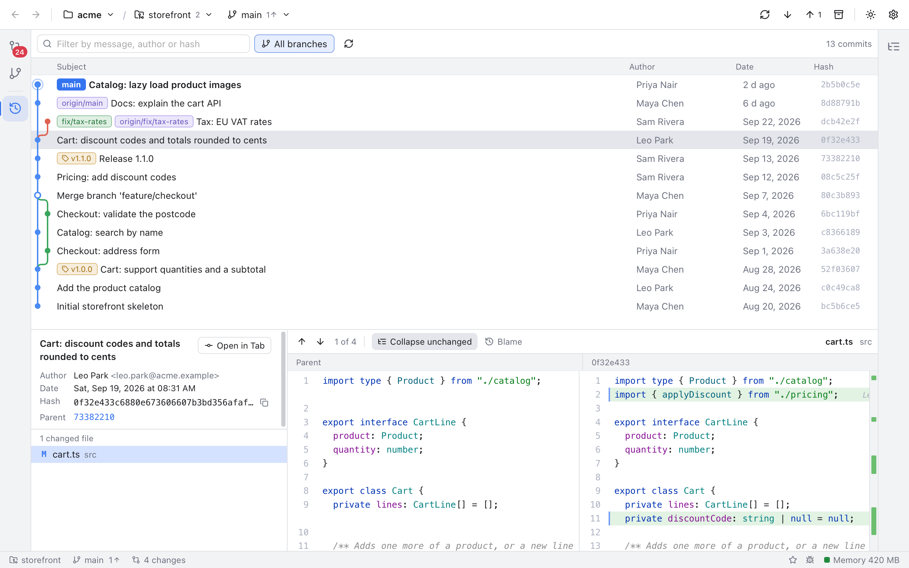
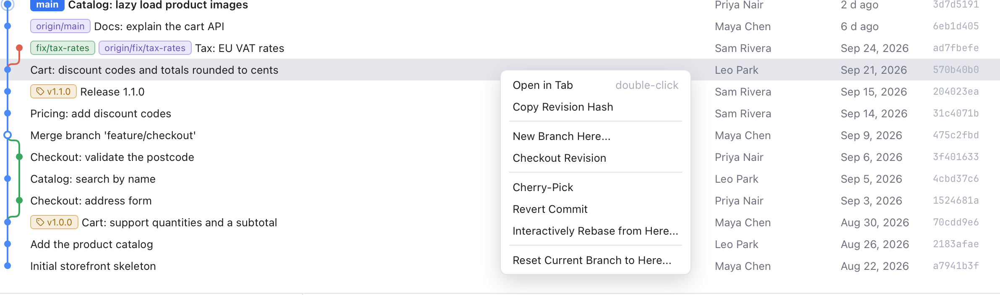

# History and Log

The Log shows the history of the active repository: every commit, drawn as a graph so you can see where branches split and join. Select a commit to read it and see what it changed. Right-click it to copy, undo or reuse it.

## Open the Log

- Click the Log icon (the clock) in the left activity bar, below the Changes and Branches icons.
- Or press Shift+Cmd+L.

The Log opens in the middle of the window. Click the icon or press the shortcut again to hide it. It always shows the **active repository**; switch repositories from the header (see [Workspaces](Workspaces.md)).

*The commit list with its branch graph, branch and tag labels, authors and dates.*

## Reading the list

Each row is one commit (a saved snapshot with a message):

- **Graph**: colored lanes show branches. A dot is a commit; a line splitting or joining is a branch or a merge. The commit you have checked out (HEAD) is highlighted.
- **Subject**: the first line of the commit message, with labels for branches and tags that point at it, such as `main`, `origin/main` or `v1.1.0`. When there are more than three, a **+2** label lists the rest on hover.
- **Author**, **Date** and the short **Hash**. Recent dates read "2 h ago", "yesterday" or "6 d ago"; older ones show the day, such as "Sep 22, 2026". Hover the author for the email, or the date for the exact time.

History loads 300 commits at a time and more as you scroll, so even huge repositories open quickly. The count on the right of the toolbar reads, for example, **13 commits**, or **300+ commits** while there is more to load.

The toolbar also has:

- **All branches**: on by default, it shows commits from every local and remote branch (like `git log --all`). Turn it off to see only the history of what you have checked out. The same switch is in Settings, Merge and Log.
- The circular arrow refreshes the history. It also refreshes on its own after commits, checkouts, fetches and similar.

## Find a commit

Type in **Filter by message, author or hash**. The list narrows to commits whose subject (the first line of the message), author name or email contains the text, or whose hash starts with it. The count changes to, for example, **4 of 300+ loaded commits**.

The filter only searches commits that are already loaded. While there is more history, a **Load more** button appears next to the count: click it to search further back. Press Esc or click the x in the box to clear the filter.

## Keyboard

Click in the list, then use Up and Down, Page Up and Page Down, Home and End to move the selection. In the filter box, Down or Enter jumps into the list.

## Commit details

*The selected commit: message, author, date, hash, parents, changed files and the diff.*

Selecting a commit opens its details under the list. Drag the bar between them to give either more room, and drag the line between the details and the diff to widen either side.

On the left:

- The full commit message.
- **Author** with email, and **Date**. **Committer** (with its own date) is shown too when someone else committed it, for example after a rebase or a cherry-pick.
- **Hash**, with a button to copy it.
- **Parent** (or **Parents** for a merge). Click one to jump to it. A parent that is not loaded yet is greyed out; scroll down to load it.
- **1 changed file** (or more), each with its status letter: **M** modified, **A** added, **D** deleted, **R** renamed, **C** copied, **T** type changed. Hover a file for its full path. Use Up and Down to step through them.

On the right is the diff of the selected file: **Parent** on the left, the commit's short hash on the right. It is read-only and works like the [Diffs](Diffs.md) view, with the change arrows, **Collapse unchanged** and [Blame](Blame.md) for the file as it was at that commit.

When you open a commit from blame, the Log loads more history until it finds it, and the diff opens on the line you clicked. If it is not there, a note says **Commit is not in the loaded history**; with **All branches** off, try turning it on.

## Open a commit in a tab

The details pane is handy for a quick look, but a big change is easier to read with the whole editor area. Like in VS Code, you can open a commit in its own tab:

- Double-click the commit in the list (or select it and press Enter).
- Click **Open in Tab** next to the commit message.
- Double-click a file under the changed files, to open the tab on that file.
- Right-click the commit and choose **Open in Tab**.

*The commit in a tab: the same details and changed files, with the diff using the whole editor area.*

The tab shows the commit's short hash and sits next to your file tabs; hover it for the message. It stays open until you close it, and opening the same commit again goes back to its tab. Clicking a **Parent** opens that commit in a tab too. Right-click the tab for **Copy Commit Hash**. To get back to the list, click the Log button.

## Right-click a commit

*Everything you can do with a commit.*

- **Copy Revision Hash** copies the full hash.
- **New Branch Here...** creates a branch that starts at this commit. **Checkout branch** is ticked, so you switch to it right away.
- **Checkout Revision** checks out the commit itself. This is a "detached HEAD": you are not on any branch, so create a branch if you want to keep new commits made there. You are asked first.
- **Cherry-Pick** copies this commit's change onto your current branch as a new commit.
- **Revert Commit** makes a new commit that undoes this one. The history stays as it is, which makes it safe for commits you already pushed.
- **Reset Current Branch to Here...** moves your current branch back (or forward) to this commit.

Cherry-Pick and Revert are disabled for merge commits (the menu says **merge commit**). Everything except Copy is disabled while another operation runs. If Cherry-Pick or Revert stops on conflicts, Git Manager opens the Conflicts dialog; see [Resolving Conflicts](Resolving-Conflicts.md).

### Reset modes

Reset opens a dialog such as **Reset main to a9f492b** that asks how to treat the changes from the commits you move past:

- **Soft**: move the branch only. Those changes stay staged.
- **Mixed**: move the branch and reset the index (the staging area). The changes stay in your files, unstaged.
- **Hard**: move the branch and throw away all changes in the index and your files. Git Manager asks once more (**Hard Reset**), because this cannot be undone.

Example: you committed "WIP" twice on `main` and want to redo them as one commit. Right-click the commit before them, choose Reset, pick **Soft**, then commit again from [Changes](Changes-and-Commits.md).

## Related

- [Branches and Tags](Branches-and-Tags.md)
- [Blame](Blame.md)
- [Diffs](Diffs.md)
- [Navigation](Navigation.md)
- [How the log works (developer)](../developer/How-the-Log-Works.md)
- [How commit tabs work (developer)](../developer/How-Commit-Tabs-Work.md)
