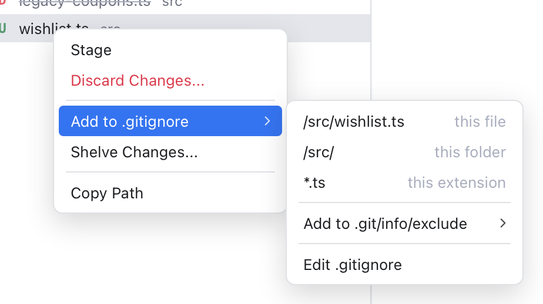

# Ignoring Files

Some files never belong in a commit: build output, logs, editor settings, secrets in a `.env` file. You can tell git to ignore them, and they stop showing up as changes. Git Manager does this from a right-click, the way JetBrains IDEs do.

A few words first. A **`.gitignore`** file lists patterns of files git should ignore. It lives in the repository and is committed, so everyone on the team shares it. **`.git/info/exclude`** works the same way, but it stays on your computer and is never committed: use it for things only you have, such as your own scratch files. An **untracked** file is one git does not know yet.

## Add a file or folder

1. Right-click a file or folder in the [Files panel](Files-Panel.md), or a file in [Changes](Changes-and-Commits.md).
2. Choose **Add to .gitignore**.
3. Pick a pattern.

*The Add to .gitignore submenu for src/wishlist.ts: the file, its folder or its extension.*

For a file, the submenu offers three patterns. Each item is the pattern itself, with a grey hint next to it:

- `/src/wishlist.ts` (this file): only that one file.
- `/src/` (this folder): the folder the file is in, with everything inside. A file at the top of the repository has no folder choice.
- `*.ts` (this extension): every file with that ending, in every folder. Files like `Makefile` or `.env` have no extension, so this choice is left out.

For a folder, the submenu offers only the folder itself, such as `/dist/`.

The leading `/` anchors the pattern at the top of the repository, so `/dist/` ignores the `dist` folder there and not one deeper down. Names with special characters, such as `*`, `?`, `[`, a leading `#` or trailing spaces, are written so that git reads them as plain names.

The pattern goes into the `.gitignore` at the top of the repository, which is created when it is missing. A note confirms it, for example **Added /src/wishlist.ts to .gitignore**. If the pattern is there already, the note says so and nothing is added twice. The new line keeps the file's own line endings.

## Only on this computer

To keep the pattern out of the shared file, open **Add to .gitignore > Add to .git/info/exclude** and pick the same kind of pattern there. Nobody else sees it.

## Edit the file by hand

**Add to .gitignore > Edit .gitignore** opens the repository's `.gitignore` in an editor tab, creating an empty one first if there is none. Use it to remove a line, add a comment (a line starting with `#`) or write a pattern of your own.

## Files git already tracks

Ignoring only works for files git does not track yet. A file that is already committed stays tracked, even when a pattern matches it. So after adding a pattern, Git Manager checks for tracked files it now matches. When it finds some, it asks **Remove from Git?**:

- **Remove from Git** runs `git rm --cached` on them. The files stay on your disk, but git stops tracking them. The removal shows up as a staged deletion in Changes, and you commit it like any other change.
- Cancel leaves them tracked. The pattern is still added and applies to new files.

Example: someone committed `debug.log` by mistake. Right-click it in the Files panel, choose **Add to .gitignore** and the file pattern, then confirm **Remove from Git** and commit. From then on, `debug.log` stays on your disk but out of git.

## Good to know

- Ignoring never changes or deletes your files.
- The menu is not offered for conflicted files or for the repository folder itself.
- In a workspace with several repositories, the pattern goes to the repository the file belongs to.

## Related

- [Changes and Commits](Changes-and-Commits.md)
- [Files Panel](Files-Panel.md)
- [How ignoring files works (developer)](../developer/How-Ignoring-Files-Works.md)
