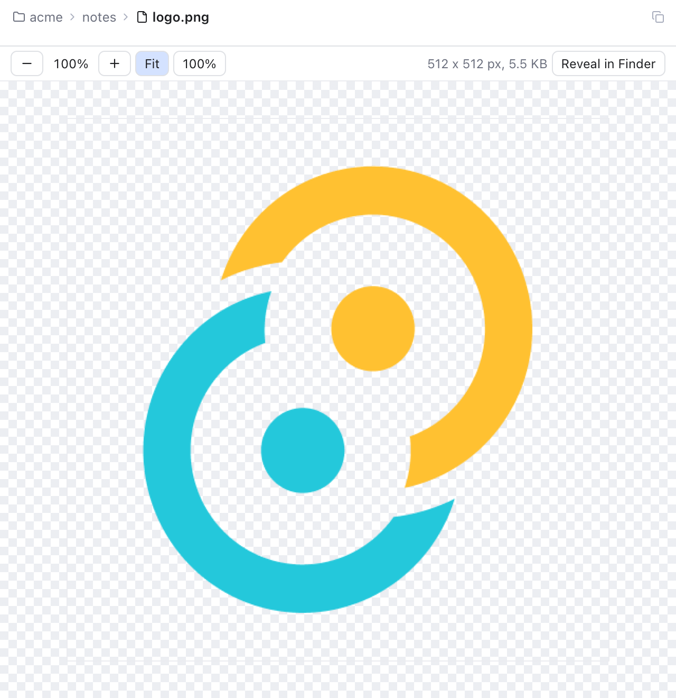
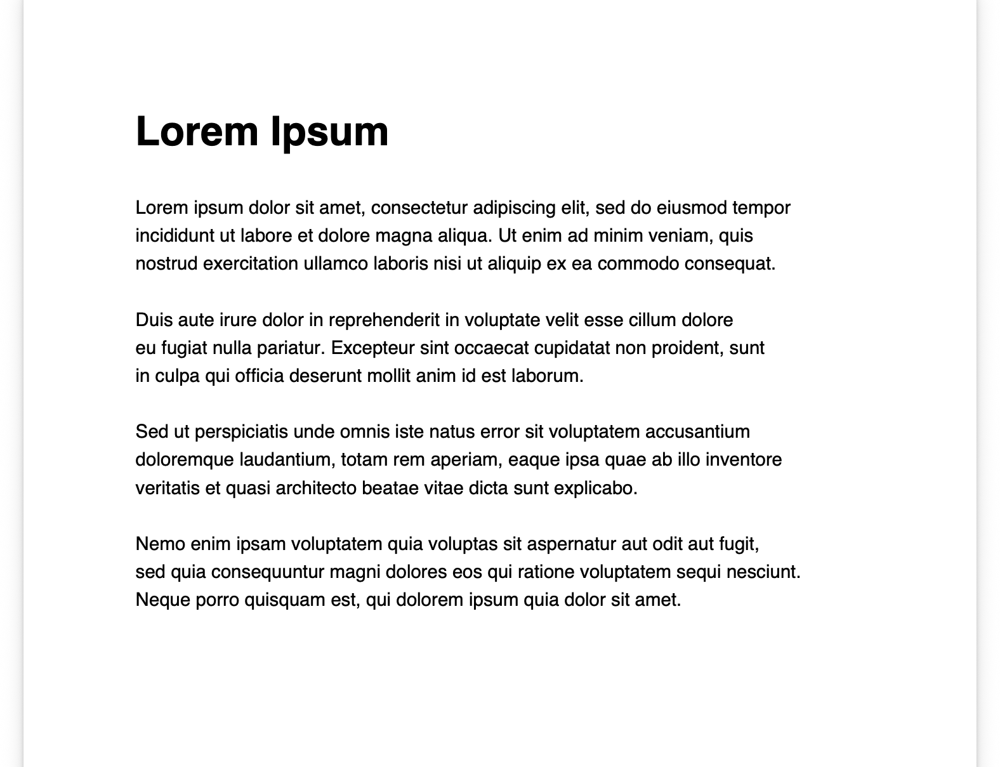

# Image and PDF Preview

Click an image or a PDF in the [Files panel](Files-Panel.md), or open one with [Search Everywhere](Search-Everywhere.md), and it opens in a preview tab instead of the "Binary file, not shown" message.

*An image fitted to the tab, with the zoom buttons, its size in pixels and the file size.*

## Which files

- **Images:** PNG, JPEG, GIF, WebP, BMP, ICO and AVIF.
- **PDF** documents.

SVG files are text, so they open in the editor, where you can change them. Their pictures show in the [Markdown preview](Markdown-Editor.md).

## Images

The image starts **fitted** to the tab. A small image keeps its real size; a big one shrinks until it fits. The bar above it has:

- **Zoom out** and **Zoom in** (the minus and plus buttons), with the zoom in between, such as **62%**.
- **Fit** to fit the image in the tab again, and **100%** to show it at its real size.
- The image's width and height in pixels and the file size.
- **Reveal in Finder** to show the file in Finder.

You can also zoom with a pinch on the trackpad, or with Cmd and the mouse wheel. A checkerboard behind the image shows its transparent parts.

## PDF documents

PDFs use the viewer that is built into macOS, the same one Safari uses. Scroll through the pages, select and copy text, and use its own zoom. The bar above shows the file size and **Reveal in Finder**, which also lets you open the document in Preview.

*A PDF in its tab, shown by the built-in viewer.*

## Memory

A preview only holds the file while its tab is on screen. When you switch to another tab or close it, the picture or document is let go, and Git Manager reads the file again when you come back. So a folder full of big photos or manuals does not fill your memory. The part of the app that shows previews is small and loads the first time you open one.

There are limits so a single file cannot use too much memory: 50 MB for an image and 100 MB for a PDF. Bigger files show a message instead.

## When the file changes

If the file changes on disk, for example after `git pull` or when another app saves it, the preview reloads it.

## Related

- [Editor and Tabs](Editor-and-Tabs.md)
- [Files Panel](Files-Panel.md)
