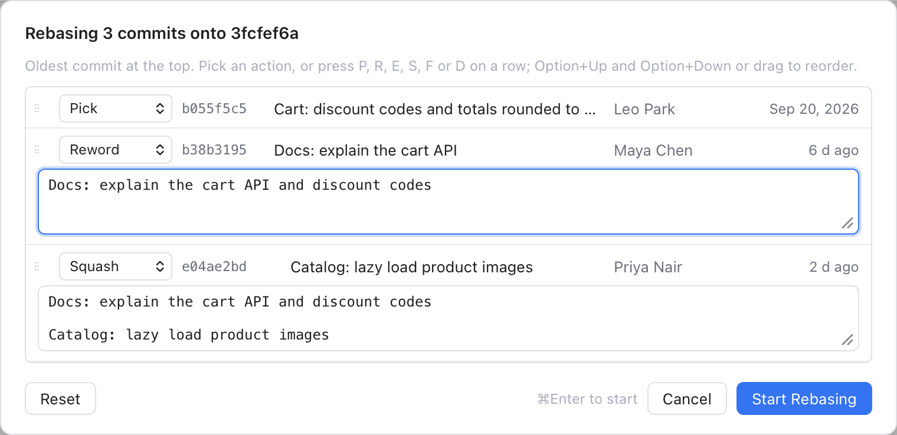
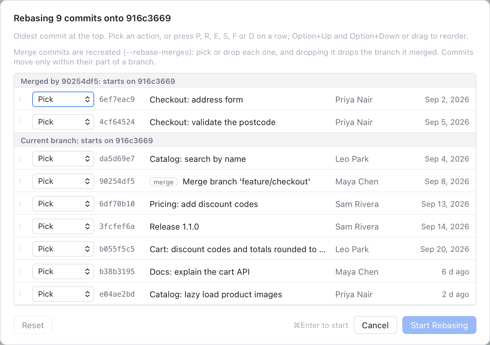

# Interactive Rebase

An **interactive rebase** lets you tidy up your recent commits before you share them: put them in another order, fix a message, melt a small fix into the commit it belongs to, or drop a commit. Git Manager shows the commits as a list you edit, like JetBrains IDEs, so you never touch git's text "todo" file.

A rebase writes new commits, with new hashes, in place of the old ones. That is fine for commits only you have. For commits you already pushed, you will need a force push afterwards, and the app warns you.

## Start it

There are three ways in. All of them need a checked-out branch, not a detached HEAD. (HEAD is the commit you have checked out; detached means you are on no branch.) No merge, rebase, cherry-pick or revert may be in progress.

- **From the Log**: right-click a commit and choose **Interactively Rebase from Here...**. The list holds that commit and every newer one on your branch. See [History and Log](History-and-Log.md).
- **Git > Interactive Rebase...**: pick the oldest commit to rewrite from your branch's latest 200 commits.
- **Git > Rebase...** with `--interactive` ticked: the button reads **Next...**, and the list holds the commits your branch has that the target lacks. They are replayed onto that target. See [Git Dialogs](Git-Dialogs.md).

## The dialog

*Rebasing 3 commits: one reworded, one squashed into the commit above, with the combined message ready to edit.*

The title says how many commits and onto what, for example "Rebasing 3 commits onto 4f2a9c1e". The **oldest commit is at the top**, the order git applies them in. Each row shows a grip to drag, the action, the short hash, the message, the author and the age.

Pick an action for each row:

| Action | Key | What happens |
| --- | --- | --- |
| Pick | P | Keep the commit |
| Reword | R | Keep the commit and edit its message |
| Edit | E | Stop at the commit to amend it |
| Squash | S | Meld into the commit above and edit the message |
| Fixup | F | Meld into the commit above and keep its message |
| Drop | D | Remove the commit |

Working with the list:

- Click a row (or Tab to it) and press a letter to set its action.
- Up and Down move between rows. **Option+Up** and **Option+Down** move the row itself, and so does dragging it by its grip. Press Esc while dragging to put it back.
- **Reword** opens a box with the commit's message, ready to edit.
- **Squash** joins the nearest kept commit above it. The last squash of a group gets a box with all their messages one after another, like git does; edit it into one good message. Fixup adds nothing to the message.
- Dropped rows are greyed out.
- **Reset** puts the list back as it was.

**Start Rebasing** (or Cmd+Enter) stays grey until you change something. A red note tells you what to fix, for example:

- At least one commit must remain.
- The first commit cannot be squashed or fixed up, as there is nothing above it to meld into.
- A reworded or squashed message cannot be empty.

## Before it starts

Two checks may ask you something first:

- **Rewrite Pushed Commits**: the commits are already on a remote branch, such as origin/main, so the rewrite will need a force push. Click **Rebase Anyway** to go on.
- **Uncommitted Changes**: git needs a clean working tree. **Stash and Rebase** puts your changes aside, rebases, and brings them back (`git rebase -i --autostash`).

## While it runs

Most rebases finish at once, with a note such as "Rebased main: 3 commits". Two things can stop it halfway:

- **An Edit row.** The rebase stops on that commit and says "Rebase stopped for editing: amend, then Continue Rebase". Change the files, amend the commit (for example with **Commit (Amend)** in [Changes](Changes-and-Commits.md)), then click **Continue** in the banner or **Git > Continue Rebase**.
- **A conflict.** Two commits changed the same lines. Resolve it as described in [Resolving Conflicts](Resolving-Conflicts.md), then continue. You can also **Skip Commit**, or **Abort Rebase** to put your branch back as it was before.

When you rewrote pushed commits, finish with **Git > Force Push...** or the Push dialog's **Force push** option.

## Merge commits in the list

When the range holds merge commits, the list follows git's `--rebase-merges` mode, which keeps them.

*A range with a merge: the rows are grouped by branch, and the merge row can only be picked or dropped.*

- Rows are grouped by branch, under headings such as "Current branch: starts on main" or "Merged by 9c1d2e3: starts after ...".
- A merge row has a **merge** badge and offers only **Pick** or **Drop**.
- Dropping a merge also drops the branch it brought in. Those rows go grey: "Dropped with the merge that brought it in".
- You can move or squash a commit only within its own group. It cannot cross into the group of another branch.

When the range has merges, you cannot start from the very first commit of the repository. Start from a later commit.

## Example

You made three commits on `main`: "Cart: discount codes", "Docs: explain the cart API" and "fix typo". Open the Log, right-click "Cart: discount codes" and choose **Interactively Rebase from Here...**. Drag "fix typo" up under "Cart: discount codes" and press F on it. Press R on the docs commit and improve its message. Click **Start Rebasing**: your history now reads two clean commits.

## Related

- [Git Menu](Git-Menu.md)
- [Git Dialogs](Git-Dialogs.md)
- [Resolving Conflicts](Resolving-Conflicts.md)
- [How interactive rebase works (developer)](../developer/How-Interactive-Rebase-Works.md)
