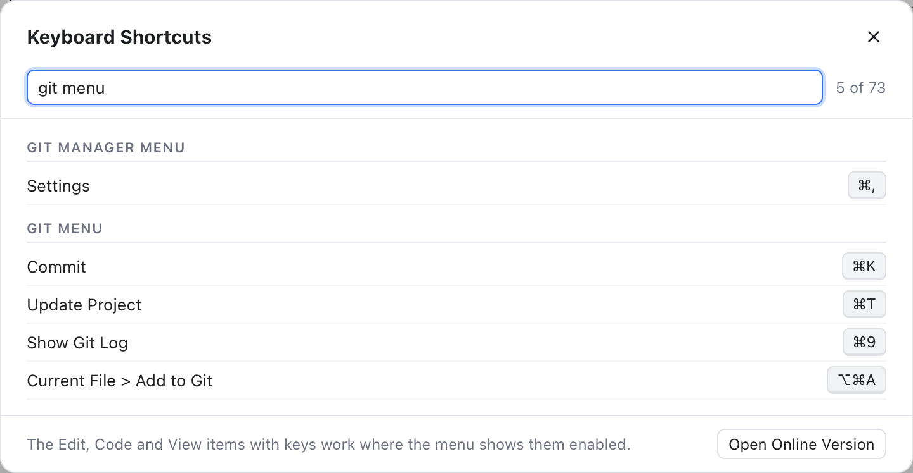

# Keyboard Shortcuts

Every shortcut in Git Manager, grouped by where it works. Keys are written as on a Mac keyboard: Cmd (Command), Shift, Option and Ctrl (Control). This page has the window, menu, search, terminal and mouse shortcuts. The keys of the text editor, the find bar, the merge tool and the lists are on [Editor and List Shortcuts](Keyboard-Shortcuts-Editor.md).

## The shortcuts window

*Help > Keyboard Shortcuts: every shortcut of the app, with a filter box.*

Choose **Help > Keyboard Shortcuts** in the menu bar to see every shortcut inside the app. It lists the keys of each menu (one section per menu), then the shortcuts no menu shows. Type in the filter box to narrow the list, for example `terminal`, `commit` or `F7`. The keys use the macOS symbols (⌘ Cmd, ⌥ Option, ⇧ Shift, ⌃ Ctrl). **Open Online Version** opens this page in your browser. Esc closes the window.

The menu sections are built from the menu bar's own definition, so they always match the real keys. The other sections list the keys no menu shows, for the platform you are on.

## Who gets a key first

The focused part of the window sees a key before the menu bar. So when two actions share a key, the one where you are wins:

- **Shift+Cmd+G** is Find Previous in an editor, and shows Changes everywhere else.
- **Shift+Cmd+L** selects every match of the selection in an editor with text selected, and shows the Log everywhere else.
- **Cmd+K** makes a link in a Markdown file and clears a terminal, and opens Commit everywhere else.
- **Cmd+B** makes text bold in a Markdown file, and hides or shows the sidebar everywhere else.

Window shortcuts do nothing while a dialog or the merge tool is open: the key is dropped, not kept for later. Window shortcuts that use Cmd also accept Ctrl. How keys are routed between the page and the menu bar is in [Menu keys and routing](../developer/Menu-Keys-and-Routing.md).

## Menu shortcuts

| Keys | Menu item |
| --- | --- |
| Cmd+, | Git Manager > Settings... |
| Cmd+H, Option+Cmd+H, Cmd+Q | Hide Git Manager, Hide Others, Quit Git Manager |
| Cmd+S | File > Save |
| Option+Cmd+S | File > Save All |
| Cmd+W | File > Close Tab |
| Cmd+Z and Shift+Cmd+Z | Edit > Undo and Redo |
| Cmd+X, Cmd+C, Cmd+V, Cmd+A | Edit > Cut, Copy, Paste, Select All |
| Cmd+F and Cmd+R | Edit > Find... and Replace... |
| Cmd+G and Shift+Cmd+G | Edit > Find Next and Find Previous |
| Ctrl+Cmd+G | Edit > Select All Occurrences |
| Shift+Cmd+F | Edit > Find in Files... |
| Shift+Cmd+R | Edit > Replace in Files... |
| Cmd+P | Edit > Go to File... |
| Cmd+O | Edit > Go to Class... |
| Option+Cmd+O | Edit > Go to Symbol... |
| Shift Shift (press Shift twice) | Edit > Search Everywhere |
| Shift+Cmd+E | View > Branches and Stashes |
| Shift+Cmd+L | View > Log |
| Option+Cmd+B | View > Files Panel |
| Cmd+B | View > Sidebar |
| Ctrl+` | View > Terminal |
| Option+Z | View > Word Wrap |
| Cmd+=, Cmd+- and Cmd+0 | View > Zoom In, Zoom Out and Reset Zoom (the editor font size) |
| Ctrl+Cmd+F | View > Enter Full Screen |
| Cmd+K | Git > Commit... |
| Cmd+T | Git > Update Project... |
| Cmd+9 | Git > Show Git Log |
| Option+Cmd+A | Git > Current File > Add to Git |
| Cmd+M | Window > Minimize |
| Shift+Cmd+] and Shift+Cmd+[ | Window > Next Tab and Previous Tab |

The Code menu's keys (comments, duplicate, move and delete lines, folding, Go to Line) work in the editor and are listed on [Editor and List Shortcuts](Keyboard-Shortcuts-Editor.md#code-menu). Push and Force Push have no key, since Shift+Cmd+K is Delete Line. Every menu is explained in [Menus](Menus.md), the Git menu in [Git Menu](Git-Menu.md) and its dialogs in [Git Dialogs](Git-Dialogs.md).

## Search and moving around

| Keys | Action |
| --- | --- |
| Shift Shift | Search Everywhere |
| Cmd+P or Shift+Cmd+O | Go to File |
| Shift+Cmd+G | Show Changes (outside a text editor) |
| Ctrl+- | Go Back |
| Ctrl+Shift+- | Go Forward |
| Esc | Close the open dialog, menu or popup |

Ctrl+- really is Control, not Command, as in VS Code on the Mac. See [Search Everywhere](Search-Everywhere.md) and [Navigation](Navigation.md).

## Terminal and bottom panel

| Keys | Action |
| --- | --- |
| Ctrl+` | Show or hide the bottom panel |
| Ctrl+Shift+` | New terminal |
| Cmd+C and Cmd+V | Copy the selection and paste, in a terminal |
| Cmd+K | Clear the terminal |
| Cmd+A | Select everything in the terminal |
| Ctrl+C | Stop the running command, in a terminal or the Run tab |
| Cmd-click a link | Open the link, in a terminal |

These Ctrl+` keys work even from inside a terminal. Every other key goes to the shell, except Cmd keys, which stay app shortcuts. Ctrl+Cmd keys go to the shell too. See [Terminal](Terminal.md) and [Scripts](Scripts.md).

## Mouse shortcuts

| Action | Result |
| --- | --- |
| Mouse back and forward buttons | Go Back and Go Forward |
| Ctrl or Cmd + scroll, or pinch, over code | Change the editor font size (turn it on in Settings, Editor) |
| Option+Shift-click in an editor | Add a cursor |
| Click a blame note or gutter block | Open that commit in the Log |
| Option-click a blame note or gutter block | Copy the commit hash |
| Cmd-click a link in Markdown Preview Only | Open it |
| Double-click a file in Changes | Stage or unstage it (a conflicted file opens in the merge tool) |
| Double-click a commit in the Log | Open it in a tab |
| Double-click a changed file of a commit | Open the commit in a tab on that file |
| Double-click a branch or tag | Check it out |
| Double-click a file in the Files panel | Open it in a tab that stays open |
| Double-click a tab | Keep a preview tab open |
| Middle-click a tab | Close the tab |
| Double-click a sidebar or panel edge | Reset its size |
| Double-click the line between diff sides | Split the diff 50/50 again |
| Double-click the Settings title | Center the Settings dialog |

## On Windows and Linux

Builds for Windows and Linux are planned. There Cmd is Ctrl. A few keys differ, because there Ctrl keys belong to the shell or the editor:

- Tabs switch with Ctrl+PageDown and Ctrl+PageUp.
- A terminal copies and pastes with Ctrl+Shift+C and Ctrl+Shift+V.
- The Git menu keys (Cmd+K, Cmd+T, Cmd+9, Option+Cmd+A) are left out.

Settings and About move to the File and Help menus.

## Related

- [Editor and List Shortcuts](Keyboard-Shortcuts-Editor.md)
- [Menus](Menus.md)
- [Status Bar and Help](Status-Bar-and-Help.md)
- [Getting Started](Getting-Started.md)
- [How the status bar works (developer)](../developer/How-the-Status-Bar-Works.md)
