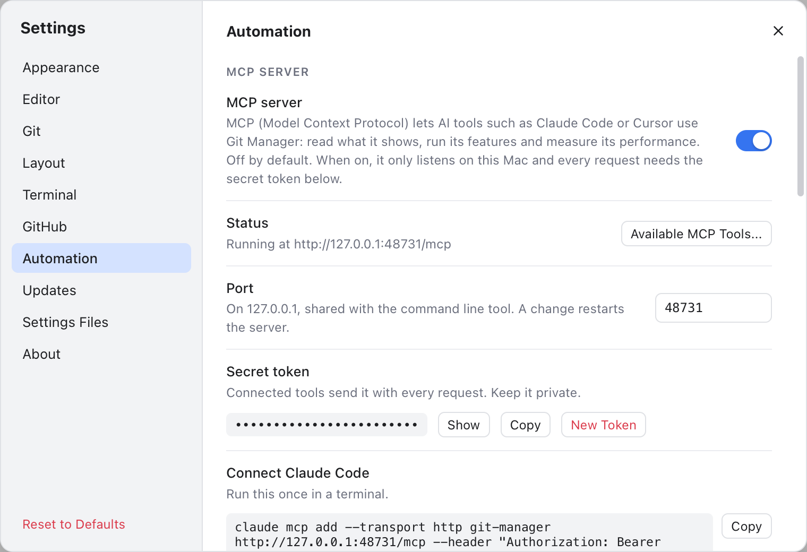
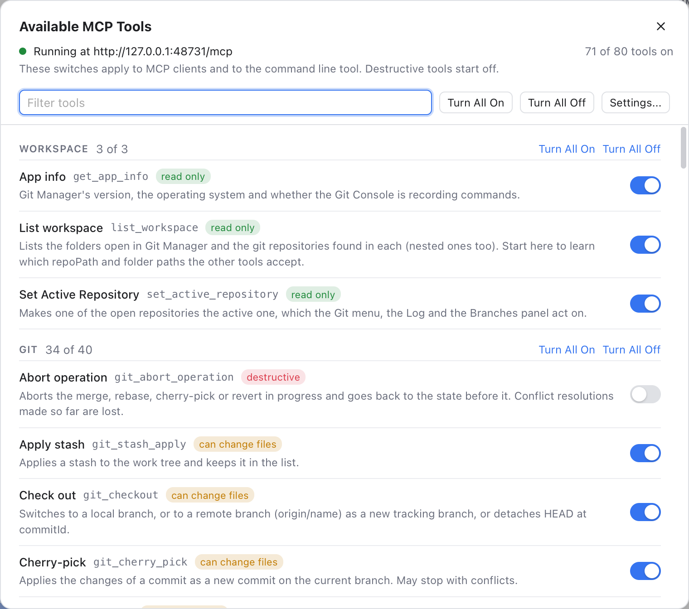
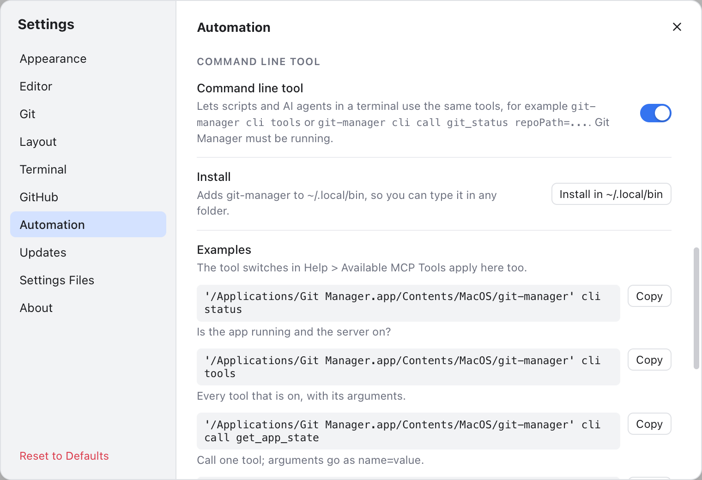

# MCP Server and Command Line Tool

Git Manager can let AI tools such as Claude Code, Cursor or VS Code use the app. They can read your repositories, run git actions, open files, drive the window and measure its memory. It does this with **MCP** (Model Context Protocol), an open standard that AI tools use to call "tools" in other programs. The same tools also work from a terminal with the **command line tool**, `git-manager cli`.

Both are off by default. While both are off, nothing listens and nothing extra runs.

## Turn on the MCP server



*Settings, Automation: the server is running, with the secret token and the command for Claude Code.*

1. Open **Settings** (Cmd+,) and pick **Automation** (every setting there is listed in [Terminal, GitHub and Automation Settings](Settings-Terminal-and-Automation.md)).
2. Turn on **MCP server**.
3. The **Status** line now says **Running at http://127.0.0.1:48731/mcp**.

**Port** is 48731 unless you change it (any number from 1024 to 65535). A change restarts the server. If another program already uses the port, the Status line says so in red: pick another one.

**Secret token** is made the first time the server starts. Every connected tool must send it. **Show** reveals it, **Copy** copies it, and **New Token** makes a new one, so tools that use the old token stop working until you update them.

## Connect Claude Code

Under **Connect Claude Code**, click **Copy** and run the command once in a terminal. It looks like this, with your real token:

```sh
claude mcp add --transport http git-manager http://127.0.0.1:48731/mcp --header "Authorization: Bearer <token>"
```

Then start Claude Code and ask, for example, "What changed in my repository?" or "Open the file with the cart logic in Git Manager". Git Manager must be running with a folder open.

## Connect other tools

Most other MCP clients (Cursor, VS Code, Windsurf and more) read a JSON config. Copy the one under **Other MCP clients** into the client's MCP settings:

```json
{
  "mcpServers": {
    "git-manager": {
      "type": "http",
      "url": "http://127.0.0.1:48731/mcp",
      "headers": { "Authorization": "Bearer <token>" }
    }
  }
}
```

## Choose what tools may do



*Help > Available MCP Tools: every tool with its switch, grouped by category, and the recent calls at the bottom.*

Open **Help > Available MCP Tools...** (or the button next to the Status line). It lists every tool with a switch, grouped by category: Workspace, Git, Files, Search, Scripts, Terminal, App and Performance. A badge tells you what each one can do:

- **read only**: it only looks.
- **can change files**: for example staging or committing.
- **destructive**: it can lose work or run commands, such as discarding changes, pushing, resetting a branch, writing, renaming, moving or trashing files, running scripts or typing in a terminal. These start **off**.

Type in **Filter tools** to find one. **Turn All On** and **Turn All Off** work on the tools shown, or on one category. **Turn All On** asks first when it would turn on destructive tools. **Restore Defaults** puts the tools shown back to how they start, destructive tools off and every other tool on, after asking you. A single switch turns its tool on right away. The header says how many tools are on, for example "74 of 86 tools on".

**Recent calls** shows the last calls as they happen: the tool, **MCP** or **CLI**, the time, how long it took and any error.

## What the tools can do

There are about 86 tools. Some highlights:

- **Workspace and app**: `list_workspace` (start here), `get_app_state`, `list_menu_commands` and `run_menu_command` (any menu bar item), `show_panel`, `open_settings`.
- **Git**: `git_status`, `git_diff`, `git_log`, `git_blame`, `git_branches`, and actions such as `git_stage`, `git_commit`, `git_pull`, `git_push`, `git_merge`, `git_rebase` and the stash tools.
- **Files and search**: `read_file`, `open_file`, `get_editor_text`, `search_files`, `search_text`, `search_symbols`.
- **File operations**: `create_file`, `create_folder`, `copy_paths`, and `rename_path`, `move_paths` and `trash_paths`, which work like the [Files panel](File-Operations.md): open tabs follow, a file with unsaved edits is refused and nothing is ever replaced. Rename, move and trash start off; trash only moves to the system Trash.
- **Scripts and terminal**: `list_scripts`, `run_script` and `stop_run` (the Run tab), `list_terminals`, `new_terminal` and `send_terminal_text`. `run_script` and `send_terminal_text` can run any command, so they start off.
- **Performance**: `get_memory_usage`, `sample_memory`, a live memory recording, `get_ui_performance`, `inspect_elements`, `scroll_view` and `take_screenshot`.

Your AI tool reads each tool's own description, so you can simply ask in plain words.

## The command line tool



*The Command line tool section with Install in ~/.local/bin and example commands.*

Turn on **Command line tool** in Settings, Automation. Then click **Install in ~/.local/bin** so you can type `git-manager` in any folder. If `~/.local/bin` is not on your PATH yet, Settings shows a line to add to `~/.zshrc`. **Remove** takes the link away again.

```sh
git-manager cli status                     # is the app running, which switches are on
git-manager cli tools                      # the tools that are on (--all lists every tool)
git-manager cli describe git_log           # what a tool does and its arguments
git-manager cli call git_log repoPath="$PWD" limit=5
git-manager cli call copy_paths paths='["/Users/me/shop/src/cart.ts"]' targetFolder=/Users/me/shop/lib
git-manager cli screenshot ~/Desktop/gm.png
git-manager cli memory --duration 10       # live memory, then the minimum, average and peak
```

Arguments go as `name=value`. A list is written as JSON in single quotes, like `paths='["/a.ts","/b.ts"]'` above. Add `--json` for JSON output. The tool switches in Available MCP Tools apply here too.

The exit code is the number a command hands back to the shell or script that ran it:

- **0**: it worked.
- **1**: the tool reported an error.
- **2**: the app cannot be reached or is switched off, or the command was used wrongly.

The command line tool is for macOS (and later Linux). On Windows it prints nothing yet.

## Is it safe?

- The server only listens on this Mac (127.0.0.1), never on the network.
- Every request needs the secret token. It is kept in `~/.gitmanager/mcp.json`, readable only by you.
- Web pages cannot use it: requests from a browser are refused.
- Tools only reach the folders open in Git Manager right now. Anything else is refused.
- Destructive tools are off until you turn them on.
- Each switch has its own job. With only the command line tool on, an MCP client cannot get in. With only the MCP server on, the command line tool cannot get in.

Turn the switches off when you do not use them. See [Troubleshooting](Troubleshooting.md) if a tool cannot connect.

## Related

- [Settings](Settings.md) and [Terminal, GitHub and Automation Settings](Settings-Terminal-and-Automation.md)
- [Status Bar and Help](Status-Bar-and-Help.md)
- [Troubleshooting](Troubleshooting.md)
- [How MCP and the CLI work (developer)](../developer/How-MCP-and-CLI-Work.md)
