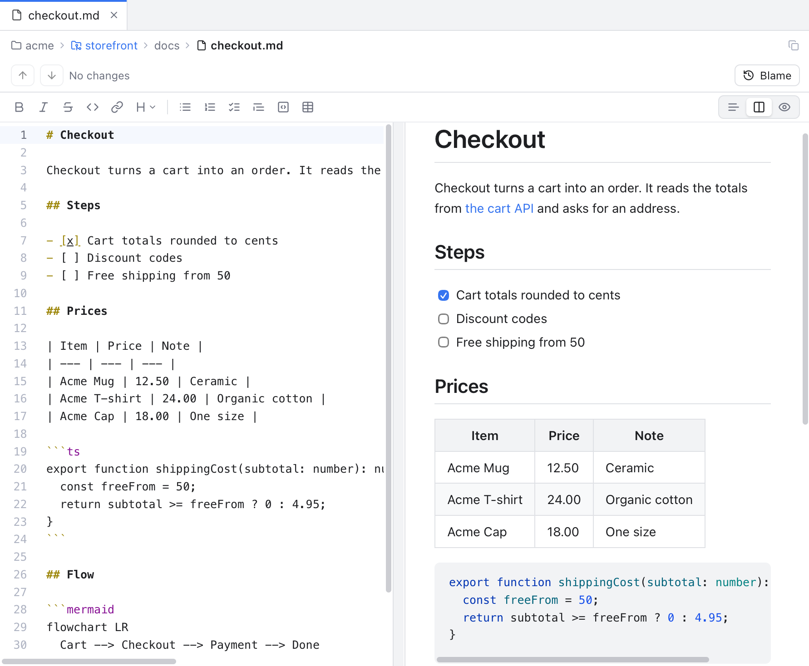
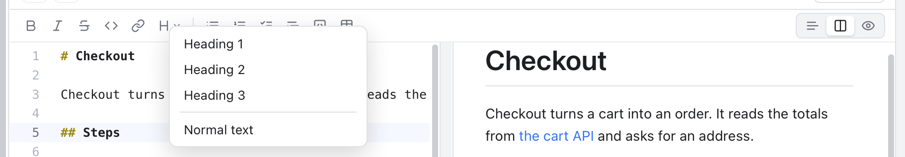
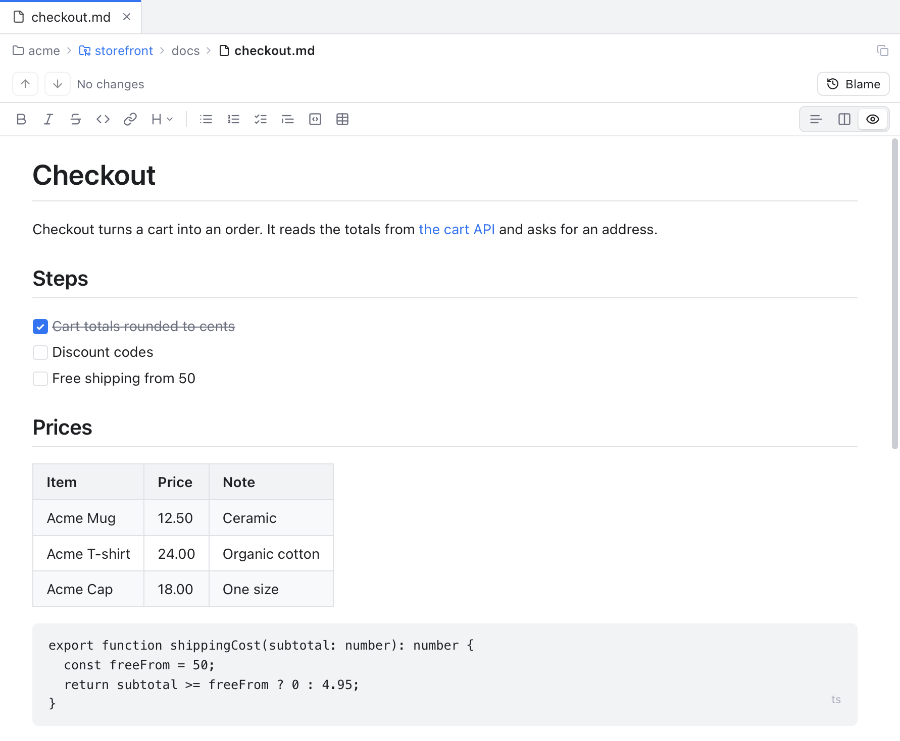
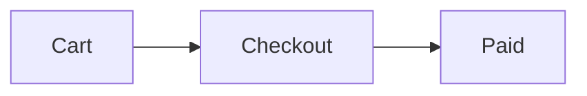
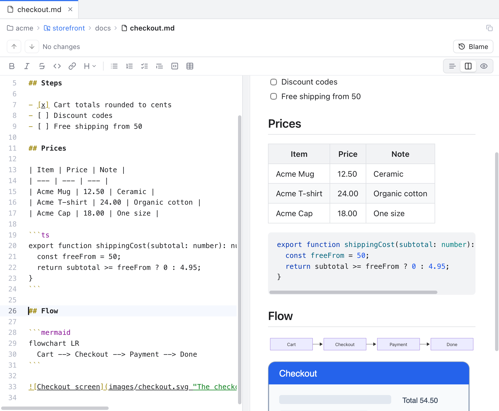

# Markdown Editor

Markdown files get their own editor: the text, a live preview of the finished page, and a toolbar for the usual formatting. You can even edit the finished page directly, like a word processor.

This works for files ending in `.md`, `.markdown` and `.mdx` (MDX is shown as plain Markdown). Open one from the [Files panel](Files-Panel.md) or with **Go to File** (Cmd+P, see [Search Everywhere](Search-Everywhere.md)), as with any file.



*Editor and Preview: the text on the left, the preview on the right, the toolbar above both.*

## Three ways to look at a file

The three buttons at the top right of the editor switch the view:

| Button | What you see |
| --- | --- |
| **Editor Only** | Just the text, like any other file. |
| **Editor and Preview** | The text and a live preview side by side. This is the default. |
| **Preview Only** | The finished page, which you can edit in place (see below). |

The same choices are in the menu bar under **View > Markdown** (**Editor Only**, **Editor and Preview**, **Preview Only**). They are enabled only while a Markdown file is the active tab.

Each file remembers its own view until you quit the app. New files open in the view picked in **Settings > Editor > Markdown preview**; see [Settings](Settings.md).

In Editor and Preview, drag the line between the two sides to give the preview more or less room. Double-click the line to split 50/50. The size is kept for every Markdown file and saved for next time.

## The toolbar



*The formatting buttons, the Heading menu and the view switch.*

From left to right:

- **Bold**, **Italic**, **Strikethrough**, **Inline code** and **Link**.
- **Heading**: a menu with **Heading 1**, **Heading 2**, **Heading 3** and **Normal text**.
- **Bulleted list**, **Numbered list**, **Task list**, **Quote**, **Code block** and **Table**.

In the text editor, press a button again to remove the style (**Bold** on bold text removes the stars). With no selection, a style applies to the word under the cursor. Each press is one Undo step, on every cursor at once. **Table** adds three columns, a header and two rows, and selects "Column 1" so you can type its name.

Keys in a Markdown text editor: Cmd+I for italic and Cmd+K for a link. Cmd+B stays the sidebar toggle there, as in the rest of the app, even though the **Bold** button's tooltip shows Cmd+B.

## Editor and Preview

The preview follows your typing after a short pause, and only the changed parts are drawn again.

- **Scrolling is linked.** Scroll either side and the other follows to the same place.
- **Task boxes work.** Click a box in the preview to tick or clear `- [ ]` in the text.
- **Links open.** Web and mail links open in your browser. Links to other files in your workspace open them in a tab. Links to a heading (`#install`) scroll to it. Anything else shows **Link not opened**.
- **Code blocks are colored** with the same colors as the editor.
- Cmd+S saves, also while the preview has focus.

## Preview Only: edit the page itself



*Preview Only is a rich text editor: headings, lists, task boxes and tables are edited as they look.*

Preview Only shows the finished page and lets you type in it, like Typora or a word processor. Behind the scenes the text is still the real file:

- **Only what you edit changes.** Each paragraph, list or table you did not touch keeps its exact text, spaces and markers. A paragraph you edit is written back in the common GitHub style (`-` for bullets, `*` for emphasis).
- **Undo, save and diff work as usual.** The tab shows the unsaved dot, Cmd+S saves and the [diff](Diffs.md) shows the change.
- **The toolbar works here too.** The same buttons format the selected text. **Link** (or Cmd+K) asks for an **Address**. When the cursor is already on a link, it removes that link.
- Cmd+B and Cmd+I make text bold and italic.
- **Click a task box** to tick it.
- **Links**: a click puts the cursor in the link text, so you can edit it. Cmd+click follows the link.
- **Front matter** (the `---` block of settings at the top of some files) is kept as written and hidden from the page.

Some Markdown cannot be kept exactly by the rich editor, for example unusual raw HTML. Then the page stays read-only and a note says: **This file uses Markdown the rich editor cannot keep exactly. Edit it in the text editor.** Switch to Editor and Preview to change that file.

Leaving Preview Only opens the text at the top of the file.

## Diagrams

A fenced code block with the language `mermaid` becomes a diagram:

````markdown

````



*The preview draws mermaid diagrams. In Preview Only the diagram shows under its code, and changes as you type.*

Diagrams follow the light or dark look and your [color theme](Color-Themes.md). A diagram with a mistake shows **Mermaid:** and the error instead.

## Images

- **Images in your workspace** show, as long as they are PNG, JPEG, GIF, WebP or SVG and at most 10 MB. Paths are relative to the Markdown file, and `/path` starts at the repository root, like on GitHub.
- **Images from the web are not loaded.** You see **Remote image not loaded** with the address as a tooltip. This keeps the app from contacting servers just because you opened a file.
- **Images outside the workspace** show **Image outside the workspace**.

## Safe by design

A Markdown file can contain raw HTML, and a file from a cloned repository is not always trustworthy. So the preview removes scripts, event handlers, frames, forms, styles and `javascript:` links before anything is shown, and the page never navigates away. Diagrams are cleaned the same way.

## Good to know

- Long files with many diagrams stay light: diagrams and images are drawn only when they are near the screen, and a tab you are not looking at frees its preview until you come back.
- A link like `other.md#section` opens the file but does not scroll to the section yet.
- In Preview Only, diagrams keep their old colors after you change the theme until they are drawn again: scroll far away and back, or reopen the file.

## Related

- [Editor and Tabs](Editor-and-Tabs.md)
- [Color Themes](Color-Themes.md)
- [Settings](Settings.md)
- [How the Markdown editor works (developer)](../developer/How-the-Markdown-Editor-Works.md)
