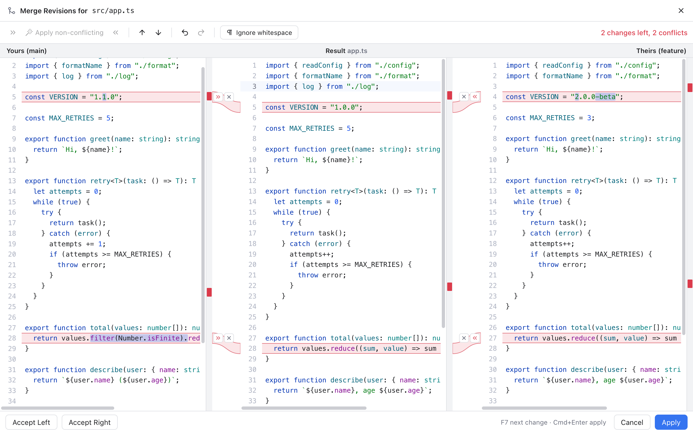

# Merge Tool

The merge tool fixes a conflicted file line by line. It shows your version, the other version and the result side by side, so you can pick exactly which changes to keep. If you have used the JetBrains merge window, it will feel familiar.

*Merging src/app.ts: Yours (main) on the left, the Result in the middle, Theirs (feature) on the right, with colored connectors and 9 changes left.*

## Open it

- In the [Conflicts dialog](Resolving-Conflicts.md), select a file and click **Merge...**, or double-click it.
- In [Changes](Changes-and-Commits.md), click a file in the **Conflicts** group, or use its merge icon or **Resolve in Merge Tool** in its right-click menu.
- In the editor, click **Resolve in Merge Tool** above a conflict or in the toolbar.
- In the [Files panel](Files-Panel.md), right-click a conflicted file and choose **Resolve Conflict...**.

The tool opens over the main window, titled **Merge Revisions for** and the file path, with a close button at the far right that works like **Cancel**.

## The three panes

- **Left**: your side, labelled for example **Yours (main)**. Read-only.
- **Middle**: the **Result**, labelled with the file name. It starts as the common ancestor (the file as it was before either side changed it). This is the text that will be saved, and you can type in it.
- **Right**: their side, labelled for example **Theirs (feature)**. Read-only.

During a rebase the labels read **Upstream (...)** and **Your commit (...)** instead. See [Resolving Conflicts](Resolving-Conflicts.md).

Colored ribbons connect each change on a side with its place in the result:

- Blue: a changed block.
- Green: added lines.
- Grey: removed lines.
- Red: a conflict, where both sides changed the same lines.

Inside a change, the exact words that differ are highlighted. The three panes scroll together, so matching lines stay next to each other.

## Take changes, one at a time

Each ribbon has two small buttons in the gap next to its side:

- **»** (on the left, **Apply left change**) or **«** (on the right, **Apply right change**) applies that change to the result.
- **x** (**Ignore left change** or **Ignore right change**) marks that change done without applying it.

For a red conflict you can take both sides: apply one, and the other side's button now appends (its tooltip changes to **Append right change** or **Append left change**), adding its lines after the first. When a side of a change is applied or ignored, that ribbon disappears.

You can also edit the result by hand at any time, like a normal editor.

## Take all the easy changes at once

Most files have many changes that only one side made. Those are safe to take automatically. In the toolbar:

- **Apply non-conflicting** (the wand) applies every change that is not a conflict, from both sides.
- The **»** button before it does the same for the left side only, and **«** after it for the right side only.

These buttons are greyed out once no such changes are left.

*After Apply non-conflicting: 2 changes left, both conflicts, and the wand is greyed out.*

## Move around

- **F7** jumps to the next unresolved change, **Shift+F7** to the previous one. The arrow buttons in the toolbar do the same.
- The status on the right of the toolbar counts what is left, for example **9 changes left, 2 conflicts**, and says **All changes processed** when you are done.
- The strip beside each scrollbar has a tick for every change. Click one to jump there.

## Undo and whitespace

- The **Undo** and **Redo** arrows in the toolbar (or Cmd+Z and Shift+Cmd+Z in the result) step back through every apply, ignore and edit, including the state of the buttons.
- **Ignore whitespace** hides changes that only differ in spaces or tabs, which helps after someone reformatted the file. Switching it reloads the merge and drops what you did so far, so you are asked first. It is the same switch as **Ignore whitespace in the merge tool** in Settings, Merge and Log, so the next merge starts the same way.

## Save the result

The bottom bar shows the hint **F7 next change · Cmd+Enter apply**.

- **Apply** (or Cmd+Enter) saves the result and marks the file as resolved. Cmd+Enter works in every pane, also while you type in the result. If changes are still unresolved, or the text still contains conflict markers (`<<<<<<<`, `=======`, `>>>>>>>`), you are asked first (**Save Anyway**).
- **Accept Left** or **Accept Right** in the bottom bar resolves the whole file with one side and saves right away.
- **Cancel** (or Esc, or the close button in the title bar) closes the tool without saving. If you changed anything, you are asked first (**Discard Changes**).

After saving, go back to the [Conflicts dialog](Resolving-Conflicts.md) or the banner and click **Continue** once every file is done.

## Files the tool cannot merge as text

Some conflicts are about the whole file, not its lines:

- **Binary files** (such as images) can only be resolved by picking one version: **Accept Yours** or **Accept Theirs**. Each button also names its side.
- **Deleted on one side, changed on the other.** The tool explains which side deleted it and offers **Keep Deleted** or the version with the changes (**Accept Yours** or **Accept Theirs**). **Merge Text Anyway** opens the normal three panes if you want to combine the text yourself.

**Cancel** closes these choices without resolving anything.

## Related

- [Resolving Conflicts](Resolving-Conflicts.md)
- [Git Mergetool](Git-Mergetool.md)
- [Diffs](Diffs.md)
- [Keyboard Shortcuts](Keyboard-Shortcuts.md)
- [How the merge tool works (developer)](../developer/How-the-Merge-Tool-Works.md)
