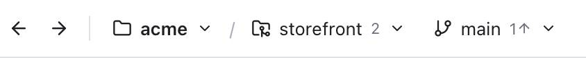

# Navigation

Back and Forward work like in a web browser: they take you to where you were before. Git Manager remembers places in files, diffs and commits, so after a detour you can jump straight back to the line you were reading.

*The Back and Forward arrows at the left of the header, before the folder, repository and branch.*

## Go back and forward

Any of these works:

- Click the **left arrow** (Go Back) or **right arrow** (Go Forward) at the top left of the header. Hover them to see their shortcuts.
- Press **Ctrl+-** to go back and **Ctrl+Shift+-** to go forward. These are the same keys as VS Code on the Mac. Note that it is Control, not Command.
- Use the back and forward side buttons on your mouse, if it has them.

The arrows are greyed out when there is nowhere to go. The keys do nothing while a dialog or the merge tool is open.

## What is remembered

Git Manager adds a stop to the history when you:

- Open a file in the editor, or move the cursor far in it (ten lines or more). Small moves update the current stop instead of adding new ones, so the history stays useful.
- Open a file, class, symbol or text match from [Search Everywhere](Search-Everywhere.md). The place you came from is a stop too, so Back returns there.
- Select a file in [Changes](Changes-and-Commits.md) to see its diff.
- Click a [blame](Blame.md) note or gutter block to open a commit in the Log. The line you clicked from is saved first, so Back returns to exactly that line. The Log opens the diff on that same line, as it was in that commit.

Selecting commits inside the Log itself, or clicking a parent there, does not add stops. Back from anywhere in the Log returns to where you were before it.

Tabs that are not files, such as a terminal, a commit or a file history tab, are never stops.

The same history feeds **Recent Files** in Search Everywhere: the files you visited, newest first.

Up to 50 stops are kept. Going back and then doing something new clears the forward stops, just like in a browser.

## What happens when you go back

- To a **file**: the file opens (or its tab is shown) and the cursor moves to the remembered line, centred on screen.
- To a **diff**: the change is selected in Changes again and the diff scrolls to the remembered line. If that change no longer exists, for example because you committed it, the stop is skipped and removed.
- To a **commit**: the Log opens on that commit, in the right repository, with the same file's diff.

Stops that no longer exist, such as a deleted file, a change you committed or a repository that left the workspace, are skipped and removed, so Back goes straight to the next place that still exists. If none is left, a note says **Nothing left to go back to** (or **Nothing left to go forward to**). If you cancel a step, for example to keep unsaved changes, you stay where you are.

## A typical detour

1. You are on line 120 of `src/cart.ts` and wonder why a line changed.
2. You click the blame note on that line. The Log opens on the commit by Maya Chen.
3. You read the commit and click a parent to look further.
4. You press Ctrl+- and land back on line 120 of `src/cart.ts`.

## When the history is cleared

Opening another folder or workspace starts with an empty history, since the old places belong to a different set of files.

## Related

- [Editor and Tabs](Editor-and-Tabs.md)
- [Blame](Blame.md)
- [History and Log](History-and-Log.md)
- [Keyboard Shortcuts](Keyboard-Shortcuts.md)
- [How navigation works (developer)](../developer/How-Navigation-Works.md)
