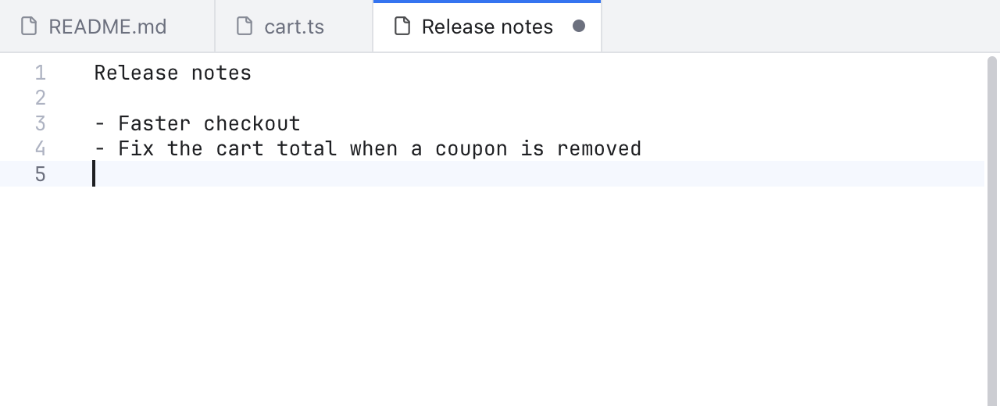
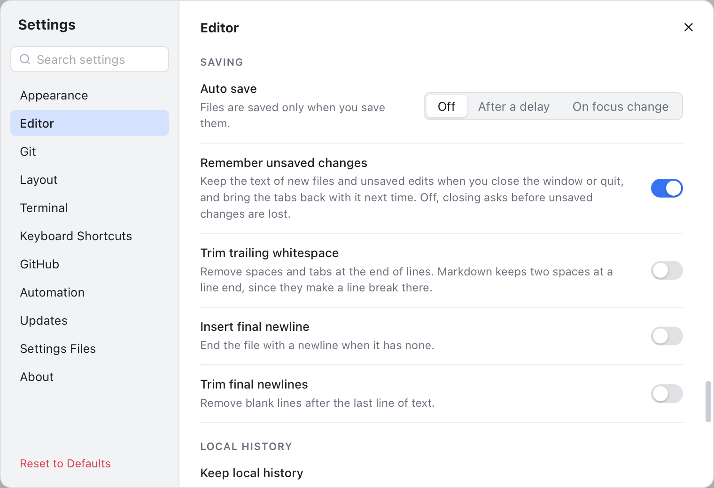

# New File and Unsaved Changes

Sometimes you just want to jot something down: a note, a command to try, a piece of text to compare. **File > New File** (Cmd+N) opens an empty tab for that, like Sublime Text. You decide later whether it becomes a file.

Git Manager also keeps your unsaved work when you close the window or quit. The text of new tabs and the unsaved edits in your files come back the next time you open the folder, until you save them.

*File > New File: the new tab takes its name from the first line you type.*

## Make a new file

1. Open a folder (New File needs one, since the tab lives in the folder's window).
2. Press **Cmd+N**, or choose **File > New File**. An empty tab called **Untitled** opens next to the tab on screen, with the cursor in it.
3. Type. The tab takes its name from the first line with text in it, and a dot shows it has unsaved changes.

The new tab is plain text. It has find and replace, multiple cursors and the Code menu, but no Git features, since it is not a file yet.

## Save it as a file

Press **Cmd+S** (or **File > Save**) in the Untitled tab. A save dialog opens in the active repository's folder, with a name made from the first line (`untitled.txt` when there is no text).

- **Saved inside your folder:** the tab turns into the file's tab in the same place. From then on it is a normal file tab with Git markers, blame and everything else.
- **Saved somewhere else:** the file is written and the tab closes, since tabs only show files of the open folder. A message tells you where it went.

**Save All** (Option+Cmd+S) also covers Untitled tabs: it saves your edited files first, then asks where to save each Untitled tab, one at a time.

## Your unsaved work is kept

With **Remember unsaved changes** on (it is on by default), closing the window, quitting with Cmd+Q, closing the folder or opening another one never asks about unsaved changes. Instead:

- The text of every Untitled tab with text in it is kept.
- The unsaved edits of every file tab are kept, without touching the file itself.
- Next time you open the same folder or workspace, those tabs come back with their text and the unsaved dot. The file on disk is still the old version until you press Cmd+S.

The text is written to disk half a second after you stop typing, so even a crash loses at most the last moment of typing.

*Settings, Editor, Saving: Remember unsaved changes.*

A few details:

- **Closing a tab yourself still asks.** If you close a tab with unsaved changes, you are asked before they are thrown away, as before. Choosing **Discard** forgets the kept text too.
- **An empty Untitled tab is not kept.** Delete all its text, or close it, and it is gone.
- **Works without Reopen tabs on start.** If **Reopen tabs on start** is off, only the tabs with unsaved changes come back.
- **A file that was deleted meanwhile:** if a file with kept edits no longer exists when you open the folder again, its text comes back in a new Untitled tab, so nothing is lost.
- **Revert File** drops the unsaved edits and the kept copy. In an Untitled tab it clears the text, after asking.
- **Clear Cache** keeps your unsaved changes too, instead of asking you to save first. See [Clear Cache](Clear-Cache.md).

## Turn it off

Turn off **Settings > Editor > Saving > Remember unsaved changes** to get the old behavior: closing the window or the folder asks before unsaved changes are lost. New File still works; an Untitled tab then counts as unsaved while it has text.

## AI tools and the command line

`get_app_state` lists an Untitled tab with `"kind": "untitled"` and its `untitled:` path. `get_editor_text` and `get_editor_selection` take that path, and `save_file` on it opens the save dialog for you to choose where it goes. See [MCP and CLI](MCP-and-CLI.md).

## Where the text is kept

Each kept text is one file in `~/.gitmanager/unsaved/`. See [Settings Files](Settings-Files.md). Saving, reverting or discarding a tab removes its file. Text bigger than 16 MB is not kept, and you see a warning once.

## Related

- [Editor and Tabs](Editor-and-Tabs.md): saving, reverting and the unsaved dot.
- [Keyboard Shortcuts](Keyboard-Shortcuts.md): Cmd+N and the other keys.
- Developers: [How New File and unsaved changes work](../developer/How-New-Files-and-Unsaved-Changes-Work.md).
