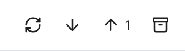

# Remotes

A remote is a copy of your repository on a server, such as GitHub. It is usually called `origin`. Fetch, pull and push keep your copy and the remote in step, and Git Manager shows how far apart they are.

## A few words first

- **Upstream**: the remote branch your local branch follows, for example `origin/main` for `main`.
- **Ahead**: commits you made that are not on the server yet. Push sends them.
- **Behind**: commits on the server that you do not have yet. Pull brings them in.
- **Fetch** downloads what is new on the server without changing your files. **Pull** fetches and then merges (or rebases) into your branch. **Push** uploads your commits.

## The buttons

*Fetch, Pull and Push in the header, with the number of commits to push, then the Stash button.*

On the right of the header:

- **Fetch all remotes** (the circular arrows) fetches every remote and removes remote branches that were deleted on the server.
- **Pull** (the down arrow) pulls into your current branch. A number next to it shows how many commits you are behind; with nothing to pull there is no number.
- **Push** (the up arrow) pushes your current branch. A number next to it shows how many commits you are ahead. Option-click it to force push (see below).

They work on the **active repository**. With several repositories, switch first (see [Workspaces](Workspaces.md)). The box icon after them is **Stash changes** (see [Stashes](Stashes.md)).

## While it runs

*A fetch in progress: the spinner and "Fetch..." in the header, with the buttons greyed out.*

While an operation runs, a spinner and its name, such as **Fetch...**, appear on the left of the buttons. As git reports progress, the name changes to git's own line, for example "Receiving objects: 45%". The status bar shows the spinner too. Fetch, Pull, Push and Stash are greyed out until it is done, so you cannot start two at once.

When it finishes, a short note says **Fetched all remotes**, **Pulled** or **Pushed**. If it fails, the note says, for example, **Push failed** with git's message.

## Where you see ahead and behind

The same numbers appear in several places, with an up arrow for ahead and a down arrow for behind:

- The branch name in the header.
- The branch in the status bar.
- Each repository header in [Changes](Changes-and-Commits.md) (with several repositories).
- Each local branch in the [Branches sidebar](Branches-and-Tags.md).

Behind counts are only as fresh as your last fetch. Click **Fetch all remotes** to update them.

Example: in the `storefront` repository you committed once and have not pushed. The header shows `main` with **1** and an up arrow, and the Push button shows **1**. Click Push, and both go away.

## Push a new branch

The first time you push a branch that has no upstream yet, Git Manager pushes it to `origin` (or the first remote, if there is no `origin`) and sets it as the upstream. After that, Pull and Push just work for that branch.

Push needs a branch. If you checked out a commit or tag directly (a "detached HEAD"), you get **Cannot push a detached HEAD**: create a branch first. A repository without any remote says **This repository has no remote to push to**.

## Force push

Sometimes you rewrote commits you already pushed, for example after a rebase or an amend. A normal push is then refused. To replace the server's copy:

1. Hold Option and click **Push**.
2. Confirm **Force Push** in the dialog.

Git Manager uses `--force-with-lease`, the safer kind of force push: it refuses if someone else pushed to the branch since your last fetch, so you do not throw away their work by accident.

## When a pull stops

A pull can stop on conflicts when you and someone else changed the same lines. A note says **Pull stopped with conflicts**, and Git Manager opens the Conflicts dialog so you can fix them. See [Resolving Conflicts](Resolving-Conflicts.md).

Whether a pull merges or rebases follows your git settings (for example `pull.rebase`), exactly like `git pull` in the Terminal.

## Signing in

Git Manager runs your own `git`, so it uses the same sign-in as the Terminal: the macOS keychain for HTTPS, or your SSH keys and agent. It never shows a password prompt. If a push or pull fails with an authentication error, see [Troubleshooting](Troubleshooting.md).

## Related

- [Branches and Tags](Branches-and-Tags.md)
- [Changes and Commits](Changes-and-Commits.md)
- [Stashes](Stashes.md)
- [Resolving Conflicts](Resolving-Conflicts.md)
- [Status Bar and Help](Status-Bar-and-Help.md)
- [How remotes work (developer)](../developer/How-Remotes-Work.md)
