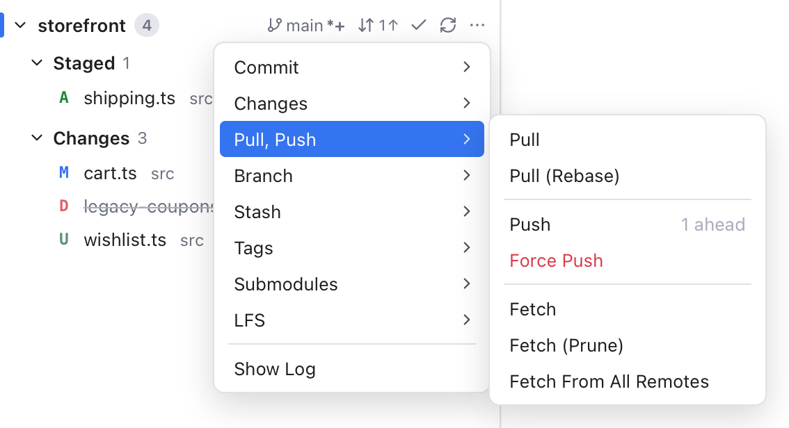
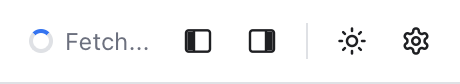

# Remotes

A remote is a copy of your repository on a server, such as GitHub. It is usually called `origin`. Fetch, pull and push keep your copy and the remote up to date with each other, and Git Manager shows how far apart they are.

## A few words first

- **Upstream**: the remote branch your local branch follows, for example `origin/main` for `main`.
- **Ahead**: commits you made that are not on the server yet. Push sends them.
- **Behind**: commits on the server that you do not have yet. Pull brings them in.
- **Fetch** downloads what is new on the server without changing your files. **Pull** fetches and then merges (or rebases) into your branch. **Push** uploads your commits.

## Where to find fetch, pull and push

*The ... menu of storefront with its Pull, Push submenu: Push shows 1 ahead.*

There are three places, and each one says which repository it works on:

- **The Git menu** in the menu bar, for the **active repository**: **Fetch**, **Fetch All Remotes**, **Pull...** and **Push...** (which open [dialogs with options](Git-Dialogs.md#push)), **Update Project...** (a dialog that pulls every repository), and **Force Push...**. When there is something to pull or push, the menu shows the count, such as **Pull (2 behind)...** or **Push (1 ahead)...**. See [Git Menu](Git-Menu.md).
- **The Sync button** on each repository row in [Changes](Changes-and-Commits.md): one click pulls, then pushes. See below.
- **The ... menu** of a repository row, under **Pull, Push**: **Pull**, **Pull (Rebase)**, **Push**, **Force Push**, **Fetch**, **Fetch (Prune)** and **Fetch From All Remotes**. See [Repository Actions](Repository-Actions.md).

The header has no Fetch, Pull, Push or Stash buttons: these live in the Git menu, next to everything else git can do.

What the fetch items do:

- **Fetch** downloads from the remote of your branch (usually `origin`), like a plain `git fetch`.
- **Fetch (Prune)** does the same and removes remote branches that were deleted on the server.
- **Fetch All Remotes** (Fetch From All Remotes in the ... menu) fetches every remote and prunes.

## Sync Changes

**Sync Changes** is the quickest way to get up to date: it pulls what the server has, then pushes your commits, and tells you what happened, for example **Pulled 2 commits and pushed 1**. You find it on each repository row in Changes (with counts like **2** and a down arrow, **1** and an up arrow) and, when there is something to sync, as a wide button under the commit box. Its tooltip says exactly what it will do.

If the pull stops on conflicts, nothing is pushed and the Conflicts dialog opens. A branch without an upstream shows **Publish Branch** instead (see below).

## While it runs

*A fetch in progress: the spinner and "Fetch..." in the header.*

While an operation runs, a spinner and its name, such as **Fetch...**, appear on the right of the header. For the active repository, the name changes to git's own progress line as it arrives, for example "Receiving objects: 45%". The status bar shows the spinner too. Other git actions are greyed out until it is done, so you cannot start two at once.

When it finishes, a short note says, for example, **Fetched all remotes**, **Pulled** or **Pushed**. If it fails, the note says **Push failed** with git's message.

## Where you see ahead and behind

The same numbers appear in several places, with an up arrow for ahead and a down arrow for behind:

- The branch name in the header.
- The branch in the status bar.
- The Sync button of each repository in [Changes](Changes-and-Commits.md), and Sync Changes under the commit box.
- Each local branch in the [Branches sidebar](Branches-and-Tags.md) and the [Branches popup](Branches-Popup.md).
- The Git menu's Pull and Push items.

Behind counts are only as fresh as your last fetch. Fetch to update them.

Example: in the `storefront` repository you committed once and have not pushed. The header shows `main` with **1** and an up arrow, and so does the Sync button. Click Sync, and both go away.

## Push a new branch

The first time you push a branch that has no upstream yet, Git Manager pushes it to `origin` (or the first remote, if there is no `origin`) and sets it as the upstream. The Sync button shows **Publish Branch** (a cloud with an up arrow) for such a branch, and the ... menu adds **Branch > Publish Branch**. After that, Pull and Push just work for that branch.

Push needs a branch. If you checked out a commit or tag directly (a "detached HEAD"), you get **Cannot push a detached HEAD**: create a branch first. A repository without any remote says **This repository has no remote to push to**.

## Force push

Sometimes you rewrote commits you already pushed, for example after a rebase or an amend. A normal push is then refused. To replace the server's copy:

1. Choose **Git > Force Push...**, or **...** > **Pull, Push** > **Force Push** on the repository row.
2. Confirm **Force Push** in the dialog.

The Push dialog (**Git > Push...**) also has a force push option. See [Git Dialogs](Git-Dialogs.md#push).

Git Manager uses `--force-with-lease`, the safer kind of force push: it refuses if someone else pushed to the branch since your last fetch, so you do not throw away their work by accident.

## When a pull stops

A pull can stop on conflicts when you and someone else changed the same lines. A note says **Pull stopped with conflicts**, and Git Manager opens the Conflicts dialog so you can fix them. See [Resolving Conflicts](Resolving-Conflicts.md).

Whether a plain pull merges or rebases follows your git settings (for example `pull.rebase`), exactly like `git pull` in the Terminal. **Pull (Rebase)** always rebases, and the [Pull dialog](Git-Dialogs.md#pull) lets you choose each time.

## Signing in

Git Manager runs your own `git`, so it uses the same sign-in as the Terminal: the macOS keychain for HTTPS, or your SSH keys and agent. It never shows a password prompt. If a push or pull fails with an authentication error, see [Troubleshooting](Troubleshooting.md).

## Related

- [Git Menu](Git-Menu.md)
- [Git Dialogs](Git-Dialogs.md)
- [Repository Actions](Repository-Actions.md)
- [Branches and Tags](Branches-and-Tags.md)
- [Changes and Commits](Changes-and-Commits.md)
- [Stashes](Stashes.md)
- [Resolving Conflicts](Resolving-Conflicts.md)
- [Status Bar and Help](Status-Bar-and-Help.md)
- [How remotes work (developer)](../developer/How-Remotes-Work.md)
