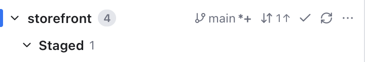
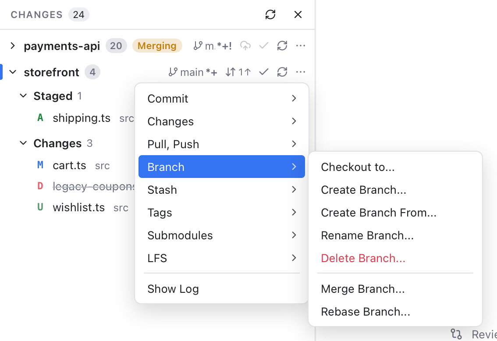

# Repository Actions

Every repository in the [Changes](Changes-and-Commits.md) sidebar has its own row of buttons, like the repositories in VS Code's Source Control. They always act on that repository, not on the active one, so you can pull one project and commit in another without switching.

*The storefront row: the branch main with its marks, Sync with 1 commit to push, Commit, Refresh and the ... button.*

With several repositories the buttons sit on each repository header. With one repository they sit in the sidebar title. Repositories under **No Changes** have them too, without Commit. When the sidebar gets narrow, the branch name hides first, then the sync counts.

## The branch button

The first button shows the branch you are on, such as **main**. A detached HEAD (no branch, for example after checking out a tag) is shown in italics. Marks after the name tell you what is going on, as in VS Code:

- `*` there are changes you have not staged (new files count too).
- `+` there are staged changes.
- `!` there are conflicts.

So **main*+** means you have both. Hover it for the meaning and the upstream it tracks. Click it to open the [Branches popup](Branches-Popup.md) for this repository.

## Sync and Publish

The Sync button (two circling arrows) shows how far you are from the upstream, the server branch yours follows: **2** with a down arrow means 2 commits to pull, **1** with an up arrow 1 to push. Its tooltip says exactly what a click does, for example "Pull 2 commits from origin/main, then push 1 commit to origin/main".

A click on **Sync Changes**:

1. pulls what the server has, if anything;
2. then pushes your commits, counting again first, because the pull may have added a merge commit;
3. and says what happened, for example **Pulled 2 commits and pushed 1**.

If the pull stops on conflicts, the sync stops there and the [Conflicts dialog](Resolving-Conflicts.md) opens. Nothing is pushed. When you are already up to date, a click still pulls, in case the server has news since your last fetch.

A branch that was never pushed has no upstream yet. The button then shows a cloud with an up arrow, **Publish Branch**: it pushes the branch to `origin` (or the first remote when there is no `origin`) and makes it the upstream. The button is hidden on a detached HEAD and in a repository with no commits yet. It is greyed out while a merge or rebase is in progress.

The same **Sync Changes** or **Publish Branch** button also appears under the commit box when there is something to sync.

## Commit, Refresh and ...

- **Commit** (the check mark) commits this repository with its message from the commit box. With no message yet, it puts the caret in the box. With nothing staged but changed tracked files, it asks **Commit All** first: stage all changes to tracked files and commit them, as VS Code does. New untracked files are never committed this way; stage them first.
- **Refresh** reads the repository's status again (and its branches, when it is the active one).
- **...** opens the menu below. Right-clicking the repository header opens it too.

## The ... menu

*The ... menu of storefront, with the Branch submenu open.*

**Commit**
- **Commit**: the same as the check mark.
- **Commit Staged** commits only what is staged. **Commit All** stages every change to tracked files first.
- **Undo Last Commit** takes the last commit back and keeps its changes staged (`git reset --soft`, which moves the branch back one commit and leaves your files alone). You are asked first. You are also warned when the commit is already on the server, because pushing afterwards then needs a force push: a push that replaces the branch on the server. Its message comes back into an empty commit box. The very first commit cannot be undone.
- **Commit (Amend)** amends the last commit.

**Changes**: **Stage All Changes**, **Unstage All Changes** and **Discard All Changes** (asks first).

**Pull, Push**
- **Pull** (with the number behind) and **Pull (Rebase)**. A plain Pull follows your git settings, such as `pull.rebase` (the setting that makes every pull rebase instead of merge).
- **Push** (with the number ahead) and **Force Push**, which asks first and uses `--force-with-lease`: it replaces the remote branch with yours, but refuses if someone else pushed there since your last fetch. See [Remotes](Remotes.md).
- **Fetch** gets the branch's remote, **Fetch (Prune)** also removes branches deleted there, and **Fetch From All Remotes** fetches every remote and prunes.

**Branch**
- **Checkout to...** lists **+ Create Branch...**, **+ Create Branch From...**, then every branch, remote branch and tag. Type to filter.
- **Create Branch...** starts at HEAD. **Create Branch From...** asks for the starting branch, remote branch or tag.
- **Rename Branch...** renames the branch you are on. **Delete Branch...** lists the others.
- **Merge Branch...** and **Rebase Branch...** open the Merge and Rebase dialogs (see [Git Dialogs](Git-Dialogs.md)).
- **Publish Branch** appears when the branch has no upstream.

**Stash**: **Stash**, **Stash (Include Untracked)**, **Apply Latest Stash**, **Pop Latest Stash**, then **Apply Stash...**, **Pop Stash...** and **Drop Stash...** with a list to pick from, and **Drop All Stashes** (asks first). **Shelve Changes...** and **Show Shelf** open the [Shelf](Shelf.md). See [Stashes](Stashes.md).

**Tags**
- **Create Tag...** tags the commit you are on. Add a message to make an annotated tag (one with its own message, author and date), or leave it empty for a lightweight tag (just a name).
- **Delete Tag...** deletes a local tag, after asking. A copy already pushed stays on the server.
- **Push Tags** sends all your local tags.

**Submodules** and **LFS** follow, for [submodules](Submodules.md) and [Git LFS](Git-LFS.md). **Show Log** makes the repository active and opens the [Log](History-and-Log.md).

Items that cannot run are greyed out: Stash, Stash (Include Untracked) and Shelve Changes with no changes, the other stash items with no stashes, Delete Tag and Push Tags with no tags, Push without a remote, Pull without an upstream, and history changes while a merge or rebase is in progress. Everything waits while another operation runs.

## Related

- [Changes and Commits](Changes-and-Commits.md)
- [Remotes](Remotes.md)
- [Branches Popup](Branches-Popup.md)
- [Git Menu](Git-Menu.md)
- [How repository actions work (developer)](../developer/How-Repository-Actions-Work.md)
