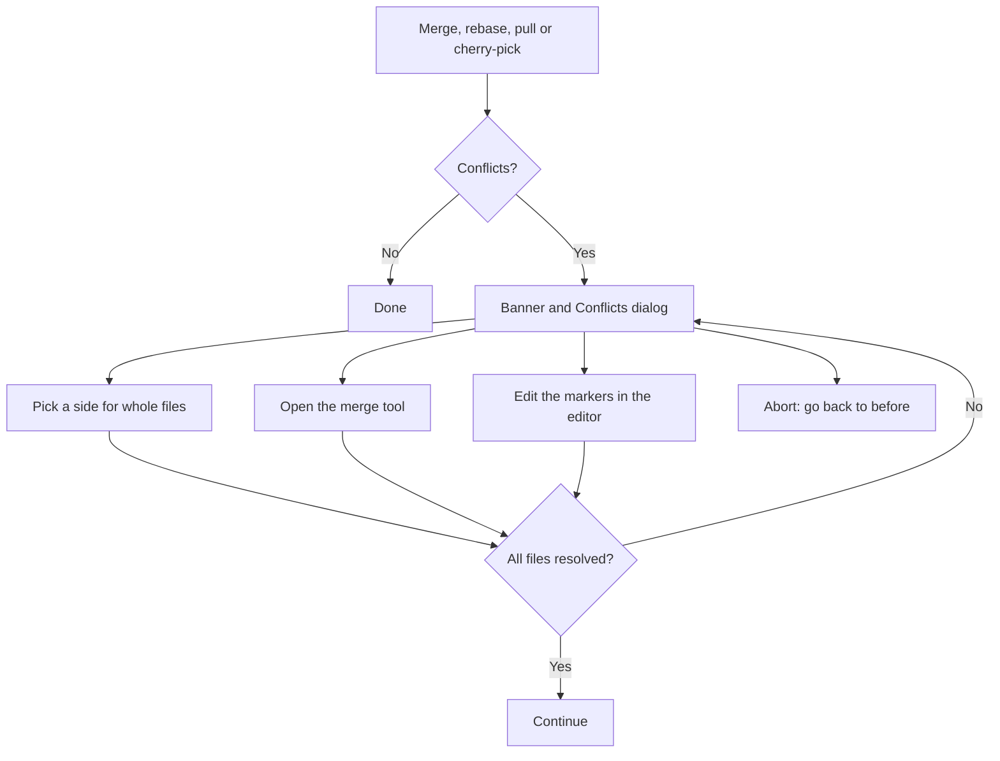
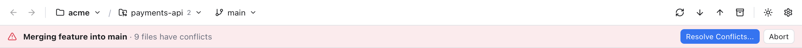
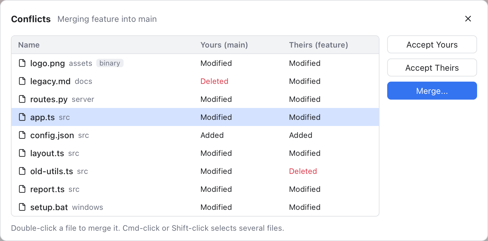
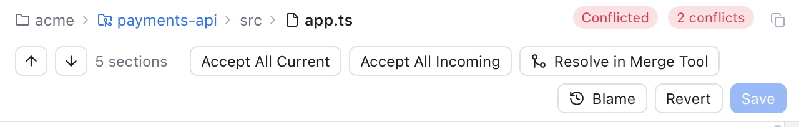

# Resolving Conflicts

A conflict happens when two branches changed the same lines, and git cannot tell which version to keep. Git then stops and asks you to decide. This page shows how to find the conflicts, fix them, and finish (or cancel) the operation.

## When it happens

Any of these can stop on conflicts: merging a branch, rebasing, cherry-picking or reverting a commit, pulling, and applying or popping a stash.

When that happens, Git Manager shows a note ("Merge stopped with conflicts. Resolve them to continue.") and opens the **Conflicts** dialog for you. You can also find conflicts from:

- The red badge on the Changes icon.
- The **Conflicts** group in [Changes](Changes-and-Commits.md).
- The red **conflicts** item in the status bar.

Commits are blocked while any file is still in conflict.

## The overall flow

## The banner

*The banner under the header while a merge is stopped on conflicts.*

While an operation is in progress, a banner under the header says what is going on, for example **Merging feature into main**, and how many files still have conflicts (**9 files have conflicts**). Once none are left it says **all conflicts resolved**. Its buttons:

- **Resolve Conflicts...** opens the Conflicts dialog. It shows while conflicts are left.
- **Continue** takes its place once every conflict is resolved. It finishes the merge, rebase, cherry-pick or revert with git's prepared message.
- **Skip Commit** (rebase only) drops the commit being replayed and moves on.
- **Abort** cancels the whole operation and puts your branch back as it was before it started. You are asked to confirm.

The banner belongs to the active repository. In a workspace with several repositories, clicking the conflicts item in the status bar or in Changes switches to the right one.

## The Conflicts dialog

*Every conflicted file of the merge, with what each side did to it. logo.png is marked binary.*

The dialog lists every conflicted file. The two columns show what each side did: **Modified**, **Added** or **Deleted**. The column titles name the sides, for example **Yours (main)** and **Theirs (feature)**.

For the selected files:

- **Accept Yours** keeps your version of the whole file.
- **Accept Theirs** keeps their version of the whole file.
- **Merge...** opens the [Merge Tool](Merge-Tool.md) to combine them line by line. Double-click a file, or press Enter, to do the same. It is greyed out for a binary file (tagged **binary**) or when several files are selected.

Cmd-click or Shift-click selects several files, so you can accept one side for many at once. Accept Yours and Accept Theirs also work for binary files (such as images) and for files that one side deleted, which the merge tool cannot combine as text. Up and Down move the selection, and Esc closes the dialog.

When the list is empty the dialog says **All conflicts are resolved.** and offers **Continue Merge** (or Continue Rebase, Cherry-Pick or Revert).

**A note on rebase.** During a rebase git swaps the sides: "yours" is the branch you are rebasing onto, and "theirs" is your own commit being replayed. Git Manager labels them **Upstream (...)** and **Your commit (...)** so you do not have to remember that.

## Fix conflicts in the editor

If you open a conflicted file in the editor, the conflict blocks between the `<<<<<<<`, `=======` and `>>>>>>>` markers are colored: your side green with **(Current Change)**, the other side blue with **(Incoming Change)**. A common ancestor part (from git's `diff3` style) is grey. A row of links sits above each block.

*Accept Current Change, Accept Incoming Change, Accept Both Changes and Resolve in Merge Tool above the markers, with Conflict 1 of 2 on a second line.*

- **Accept Current Change** keeps your side (HEAD).
- **Accept Incoming Change** keeps the other side.
- **Accept Both Changes** keeps both, yours first.
- **Resolve in Merge Tool** opens the three pane [Merge Tool](Merge-Tool.md) for this file. With unsaved edits you are asked first, because the tool starts from git's versions of the file.

With more than one block, the row ends with a counter such as **Conflict 1 of 2**. When the editor is narrow it moves to a second line. F7 jumps to the next block. You can also just edit the text by hand.

*The toolbar of a conflicted app.ts: the Conflicted and 2 conflicts badges, 5 sections, and the conflict buttons.*

The toolbar above the editor helps with the whole file:

- The **Conflicted** badge means git lists the file as conflicted. **2 conflicts** counts the blocks still in the text.
- The label (**5 sections**) counts the conflict blocks and other changes together. The arrows step through them.
- **Accept All Current** and **Accept All Incoming** settle every block at once.
- **Resolve in Merge Tool** opens the merge tool, like the link above a block.

When no markers are left, the Accept All buttons go away and **Mark as Resolved** appears next to Resolve in Merge Tool. It saves the file and stages it, which tells git the conflict is fixed.

## Finish

1. Resolve every file, in whichever way suits each one.
2. Click **Continue** in the banner, or **Continue Merge** in the dialog.

For a rebase with several commits, git may stop again on the next commit. Repeat until the banner goes away.

Changed your mind? Click **Abort** at any point to go back to how things were before.

## Related

- [Merge Tool](Merge-Tool.md)
- [Branches and Tags](Branches-and-Tags.md)
- [Remotes](Remotes.md)
- [Git Mergetool](Git-Mergetool.md)
- [How conflict resolution works (developer)](../developer/How-Conflict-Resolution-Works.md)
