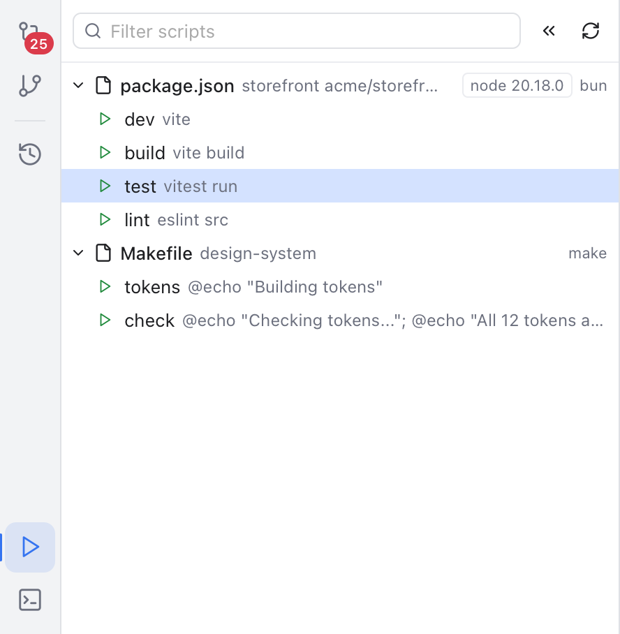
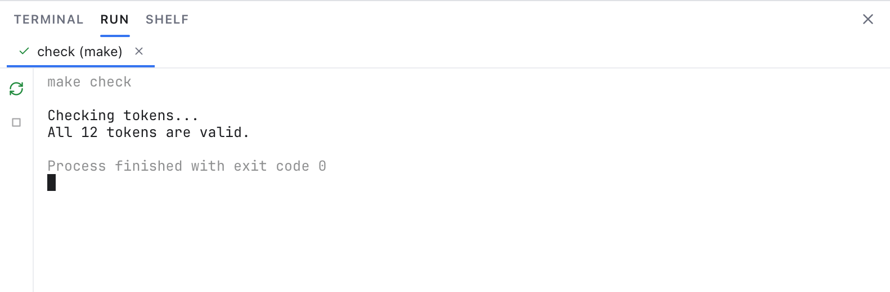
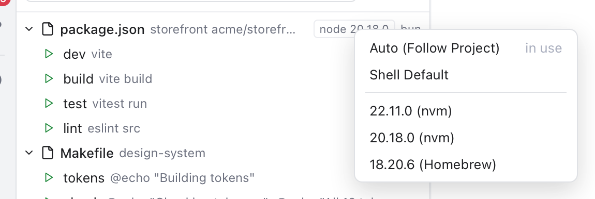

# Scripts

The Scripts panel lists the scripts of your projects and runs them with one click, like the npm and Composer windows of JetBrains IDEs. No need to remember whether a project uses npm, pnpm or yarn.

*The Scripts panel: each file with its scripts, the package manager on the right and the Node version badge.*

## Open the panel

Click the **play** button in the left activity bar, just above the Terminal button, or choose **View > Scripts**. The panel opens on the left, in place of Changes. Click the button again, or the **X** at the top right of the panel, to hide it.

## What it lists

Git Manager looks through every workspace folder for these files:

| File | Scripts it lists | Runs them with |
| --- | --- | --- |
| `package.json` | `scripts` | npm, yarn, pnpm or bun |
| `composer.json` | `scripts` | `composer run-script` |
| `Makefile` | targets | `make` |
| `deno.json`, `deno.jsonc` | `tasks` | `deno task` |
| `justfile` | public recipes | `just` |

Each file is a row with its name, then the package name and its folder, dimmed. Click a file row to fold or unfold its scripts. Each script shows its name and what it runs.

Folders with downloaded or built files are skipped: `node_modules`, `vendor`, `target`, `dist`, `build`, hidden folders and anything your `.gitignore` leaves out. If a file cannot be read (for example broken JSON), its row shows a warning sign; hover it for the reason.

The list is read again each time the panel opens. Click **Refresh** in the panel's title bar after you add a script.

### Which package manager

For a `package.json`, the name on the right of the row is the package manager that runs its scripts. Git Manager picks:

1. The `packageManager` field of the `package.json`, for example `"pnpm@9.1.0"`.
2. Otherwise the nearest lockfile, in the package's folder or a parent folder up to the workspace folder: `bun.lock` or `bun.lockb`, `pnpm-lock.yaml`, `yarn.lock`, `package-lock.json` or `npm-shrinkwrap.json`.
3. Otherwise npm.

To use another one, right-click the file row and choose **Run With**, then npm, yarn, pnpm or bun. The menu marks the one **in use** and the **detected** one. This choice lasts until you quit the app.

## Run a script

Double-click a script, select it and press **Enter**, or click the green play button in front of its name.

The script runs in the **Run** tab of the bottom panel. Every script gets its own tab, named like "dev (pnpm)", so you can keep a dev server running while you run the tests.

*The Run tab: one tab per script, Rerun and Stop on the left, the command at the top and the output below.*

- The first line shows the command and, for Node projects, the Node version, for example `pnpm run dev    (Node 20.11.1, nvm)`.
- The output keeps its colors, and you can type when a script asks a question.
- Each tab shows its state: running, finished, stopped, or the exit code when it failed.
- At the end, a dim line says "Process finished with exit code 0" (or another code), or "Process stopped" after Stop. The tab stays, so you can read the output.

The buttons on the left:

- **Rerun** starts the script again in the same tab, with fresh output. While it still runs, the button stops it first (**Stop and Rerun**).
- **Stop** ends the script and anything it started.

Right-click a run tab for **Rerun**, **Stop** and **Close**. Running a script again from the Scripts panel while it still runs asks first ("Process Is Running"), and so does closing a tab whose script still runs.

If the program is not installed, the Run tab says so with the reason and a **Retry** button.

### Scripts run without a shell

A script runs as its own program, not typed into a terminal, so it works the same whatever your shell is. Git Manager still finds your tools. It asks your shell once for its environment: the settings a new Terminal window starts with. That includes `PATH`, the list of folders where programs are looked up, as your `.zshrc` sets it up for nvm, Homebrew, pnpm or Composer. Opening the panel or clicking **Refresh** reads it again, so a tool you just installed is found.

## Right-click menus

On a script:

- **Run 'name'**: runs it.
- **Copy Command**: copies the command, such as `pnpm run build`, to paste in a terminal.
- **Jump to Source**: opens the file on the line that defines the script.

On a file:

- **Open File**.
- **Node Version** (package.json only, see below).
- **Open .nvmrc** (or the file the Node version comes from).
- **Run With** (package.json only).
- **Expand All**, **Collapse All** and **Refresh**.

## Node version

Projects often need a certain Node version. Git Manager looks for it the way version managers do, nearest folder first, from the package's folder up to the workspace folder:

1. `.nvmrc`, `.node-version` or `.tool-versions` (the `nodejs` or `node` line).
2. Otherwise `volta.node` in the `package.json`.
3. Otherwise `engines.node` in the `package.json`, such as `>=18 <21`.

It picks the newest installed version that fits, from nvm, Herd, fnm, Volta, asdf, mise, nodenv, n and Homebrew.

The version shows as a badge on the file row, like **node 18.20.6**. Hover it to see why that version was picked. If the project asks for a version you do not have, the badge says "missing" in the warning color, and running a script tells you it uses the shell's default node instead.

*Clicking the badge opens the Node Version menu: Auto, Shell Default and every installed version with its manager.*

Click the badge, or use **Node Version** in the file's menu, to choose:

- **Auto (Follow Project)**: the version the project asks for. This is the default.
- **Shell Default**: whatever `node` your shell finds.
- **A version**, such as **20.11.1 (nvm)**.

Your choice is saved for that `package.json`, so it stays after a restart.

## Filter and keys

Type in **Filter scripts** at the top to show only scripts whose name or command contains every word you type. Press **Down** or **Enter** to jump into the list, and **Escape** to clear the filter.

In the list, **Up** and **Down** move, **Left** and **Right** fold and unfold a file, **Enter** runs a script and **Shift+F10** opens the menu.

## Related

- [Terminal](Terminal.md)
- [Settings](Settings.md)
- [How scripts work (developer)](../developer/How-Scripts-Work.md)
