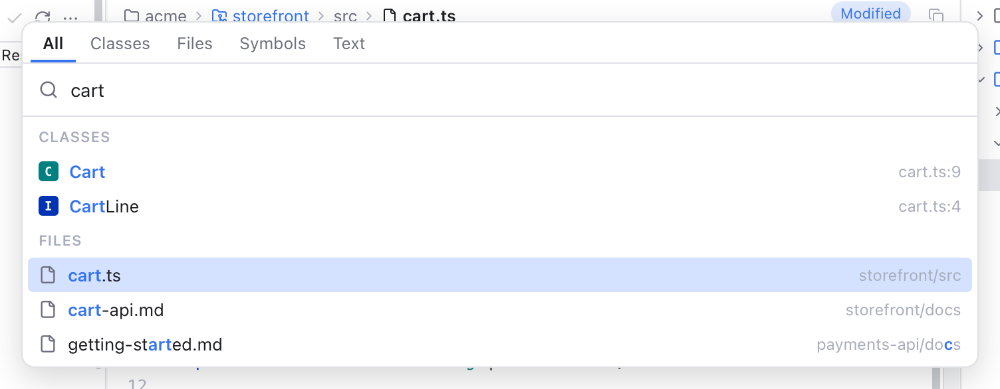
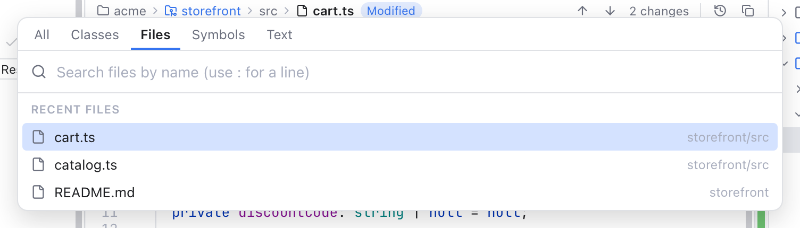
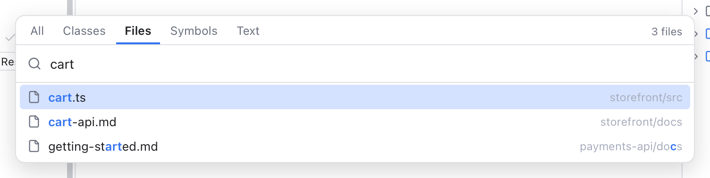
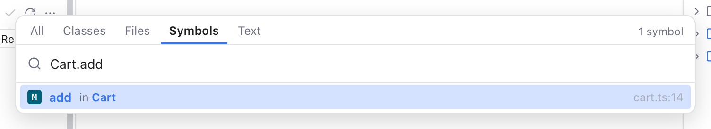
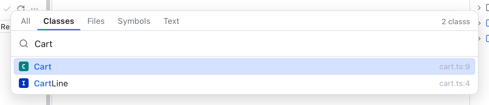
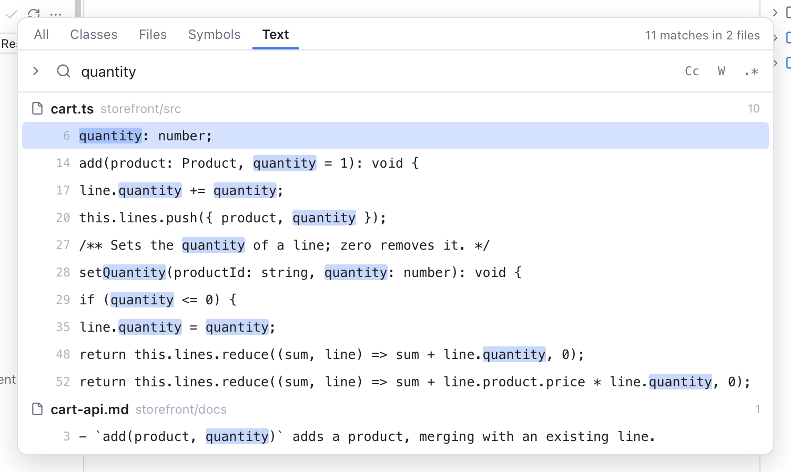

# Search Everywhere

Search Everywhere is one popup that finds files, classes, functions and text in every folder of your workspace. It works like the popup of the same name in JetBrains IDEs: press Shift twice and start typing.

*The All tab for "cart": the best files, classes and symbols, each with a row that leads to its own tab.*

## Open it

| To open | Press | Or choose |
| --- | --- | --- |
| The **All** tab | Shift twice, quickly | **Edit > Search Everywhere (Double Shift)** |
| The **Classes** tab | Cmd+O | **Edit > Go to Class...** |
| The **Files** tab | Cmd+P or Shift+Cmd+O | **Edit > Go to File...** |
| The **Symbols** tab | Option+Cmd+O | **Edit > Go to Symbol...** |
| The **Text** tab | Shift+Cmd+F | **Edit > Find in Files...** |

Double Shift means two short taps of Shift alone, with no other key in between. It works everywhere in the window, even while you type in the editor or the terminal. Double Shift opens the tab you used last time you opened the popup this way (the All tab the first time). The other keys always open their own tab.

**Search for the selected text.** Select a word or a short piece of one line in the editor, then press Shift twice (or any of the keys above). The popup opens with that text already in the field and selected, so you can search right away without copying and pasting, or just type to replace it. A selection in a diff or the merge tool works too. Selections over several lines, or longer than 200 characters, are left out.

The popup does not open while a dialog or the merge tool is open.

## Move around

- Type to search. Results update on every key.
- **Up** and **Down** (or Ctrl+N and Ctrl+P) move the selection. They wrap around at the ends. **Page Up** and **Page Down** jump ten rows.
- **Tab** and **Shift+Tab** switch to the next or previous tab. You can also click a tab, or press its shortcut while the popup is open.
- **Enter** opens the selected result in a normal tab. **Shift+Enter** or **Cmd+Enter** opens it in a preview tab instead (see [Editor and Tabs](Editor-and-Tabs.md)). A click works the same way.
- **Esc**, or a click outside the popup, closes it and puts the focus back where it was.

Opening a result adds a stop to Back and Forward, so Ctrl+- takes you back. See [Navigation](Navigation.md).

## All

The All tab shows the best six results of three kinds, in this order: **Files**, **Classes** and **Symbols**. When a kind has more, a row such as **14 more** opens that kind's own tab with the same text.

## Files and Recent Files

*The Files tab before you type: the files you visited last, newest first.*

Before you type, the All and Files tabs show **Recent Files**: the file you are on, then the files you worked on last (newest first, the same list as the [Recent Files](Recent-Files.md) popup), then your other open tabs.

*The Files tab for "cart": matched letters in bold, the folder after each name.*

The search is fuzzy: the letters you type must appear in order, but not next to each other. `crt` finds `cart.ts`. A whole name or a name that starts with your text comes first.

- **Folders:** type part of the folder too. `views/log` finds files in a `views` folder whose name contains "log". `srccart` finds `src/cart.ts` even without the slash.
- **A leading slash:** `/readme` only finds files directly in a workspace folder.
- **A line number:** add `:42` to open the file on line 42, or `:42:7` for line 42, column 7.

When the workspace has several folders, each result starts with its folder's name.

The search covers every file in the workspace folders, including hidden files. It skips:

- files your `.gitignore` ignores (a `.gitignore` file lists files git should not track);
- the `.git` folder;
- dependency and build folders such as `node_modules`, `vendor`, `target`, `dist` and `build`.

## Classes and Symbols

*The Symbols tab for "Cart.add": each result with its kind letter, its class and its file and line.*

**Classes** finds classes, interfaces, traits, structs, enums, types and similar. **Symbols** finds those plus functions, methods and constants. A colored letter shows the kind: C for a class, I for an interface, F for a function, M for a method, K for a constant, and so on (hover it to read the kind).

*The Classes tab for "Cart".*

To find a method of one class, type the class, a dot and the method: `Cart.add`. `Cart::add` and `Cart#add` work too.

Classes and Symbols understand TypeScript, JavaScript, Svelte and Vue (their script blocks), PHP, Python, Rust, Go, Java, Kotlin, C#, Ruby, Swift, C and C++. They read the code line by line, without a full parser, so a definition written in an unusual way can be missed. Files over 1 MB and minified files are skipped.

## Text

*The Text tab for "quantity": each file with its number of matching lines, then the lines with the matches marked.*

The Text tab searches inside files, like Find in Files in other editors. Type at least two characters. Like every tab, it starts with the text selected in the editor.

The three buttons at the end of the field change how text matches:

- **Cc** (Option+C): match upper and lower case exactly.
- **W** (Option+W): whole words only.
- **.\*** (Option+X): the text is a regular expression (a search pattern such as `add\w+`).

Results stream in while the search runs. The search stops after 2,000 matching lines or 300 files, and the status says **Showing the first ...** when there were more. Binary files and files over 5 MB are skipped.

To replace text across files, see [Find and Replace](Find-and-Replace.md#replace-in-files).

## The status line

The top right of the popup tells you what is going on:

- **Indexing 1,234 files...** while the file list is still being read. Results show up and grow while it works, so you can type right away.
- **Showing the first 50 of 312** when more results match than are shown. Type more to narrow them down.
- A **Capped** badge when a very large workspace hit a limit: only the first 500,000 files are searched.

The file list is kept in memory while you use the popup and for two minutes after it closes, so opening it again is instant. It updates itself when files are created, deleted or renamed.

## Related

- [Find and Replace](Find-and-Replace.md)
- [Editor and Tabs](Editor-and-Tabs.md)
- [Navigation](Navigation.md)
- [Keyboard Shortcuts](Keyboard-Shortcuts.md)
- [How Search Everywhere works (developer)](../developer/How-Search-Everywhere-Works.md)
