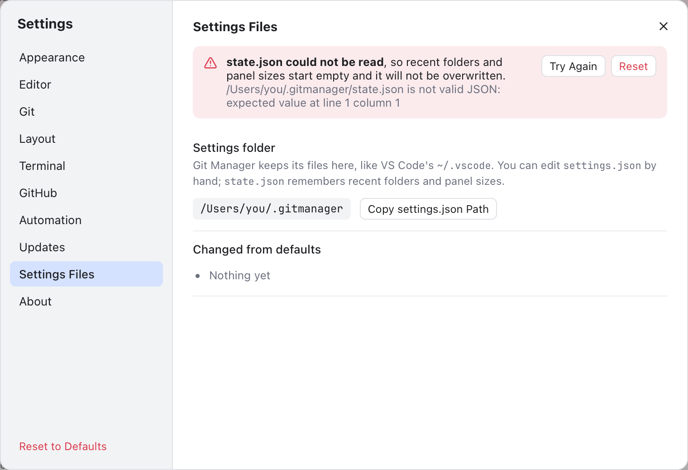

# Settings Files

Like VS Code keeps its files in `~/.vscode`, Git Manager keeps its own in a folder in your home folder. This page explains what is in it, how to edit `settings.json` by hand and what happens when a file is broken. The options themselves are explained in [Settings](Settings.md).

## The folder

```
~/.gitmanager/
  settings.json   your preferences, safe to edit by hand
  state.json      recent folders, the last session, panel sizes and layout
  mcp.json        the MCP secret token, and the port while the server runs
  logs/memory.log the debug memory log, written while it is on
  unsaved/        unsaved text kept until it is saved (Remember unsaved changes)
```

On Windows the folder is `C:\Users\<you>\.gitmanager`. It is created the first time a setting is saved. **Settings > Settings Files** shows the **Settings folder** path, a **Copy settings.json Path** button and **Changed from defaults**: each setting you changed, such as `tabSize: 2`, or **Nothing yet**.

Your GitHub token is not in this folder: it is kept in the system keychain. See [Terminal, GitHub and Automation Settings](Settings-Terminal-and-Automation.md).

## Editing settings.json by hand

Each key matches a setting in the dialog. Values in quotes must be one of the choices listed.

**Appearance**: `theme` (`"system"`, `"light"`, `"dark"`), `roundedPanels`, `fileToolbar` (`"top"`, `"bottom"`, `"none"`), `fileToolbarBreadcrumbs`, `fileToolbarBadges`, `fileToolbarChanges`, `fileToolbarBlame`, `fileToolbarCopyPath`, `fileToolbarMarkdownView`, `fileToolbarMarkdownFormat`, `uiFontSize`.

**Editor**: `lightColorTheme` and `darkColorTheme` (theme ids such as `"github-light"` or `"dracula"`, see [Color Themes](Color-Themes.md)), `editorFontFamily`, `editorFontSize`, `editorLineHeight`, `mouseWheelZoom`, `fontLigatures`, `syntaxHighlighting`, `tabSize` (2, 4 or 8), `detectIndentation`, `renderWhitespace` (`"none"`, `"boundary"`, `"selection"`, `"trailing"`, `"all"`), `wordWrap`, `unloadHiddenTabs`, `unloadHiddenTabsMinutes` (5, 15, 30 or 60), `rememberUnsaved`, `markdownViewMode` (`"editor"`, `"split"`, `"preview"`), `currentLineBlame`, `blameGutter`.

**Git**: `diffLayout` (`"sideBySide"` or `"inline"`, see [Inline Diffs](Inline-Diffs.md)), `ignoreWhitespace`, `logAllRefs`, `commitSignOff`, `commitGpgSign` (`"default"`, `"sign"`, `"noSign"`), `gitConsole`, and `updateMethod` (`"merge"` or `"rebase"`, default `"merge"`, saved by [Git > Update Project...](Git-Dialogs.md#update-project); there is no switch for it in Settings).

**Terminal**: `terminalShell` (the shell's full path, or `null` for the login shell), `terminalFontFamily` (empty for the editor font), `terminalFontSize`, `terminalLineHeight`, `terminalLetterSpacing`, `terminalFontWeight` and `terminalFontWeightBold` (`"normal"`, `"medium"`, `"bold"`), `terminalLigatures`, `terminalNerdFontIcons`, `terminalCursorStyle` (`"block"`, `"bar"`, `"underline"`), `terminalCursorBlink`, `terminalScrollback`, `terminalCopyOnSelect`, and the switches `terminalFind`, `terminalFileLinks`, `terminalGpuAcceleration`, `terminalUnicode11`, `terminalOptionAsMeta`, `terminalVisualBell`, `terminalSmoothScrolling` and `terminalDropPaths` (`true` or `false`).

**Automation**: `mcpEnabled`, `mcpPort`, `mcpTools` (tool names switched away from their default, each `true` or `false`), `cliEnabled`, `memoryLogEnabled`, `memoryLogIntervalMs`, `memoryLogThresholdMb`.

**Layout**: `confirmDragAndDrop` (ask before a drag in the Files panel moves files). The other Layout choices live in `state.json`.

**Updates**: `checkForUpdates`, `updateChannel` (`"auto"`, `"stable"`, `"beta"`).

For example:

```json
{
  "theme": "dark",
  "darkColorTheme": "dracula",
  "editorFontFamily": "'JetBrains Mono', Menlo, monospace",
  "fontLigatures": true,
  "renderWhitespace": "trailing",
  "tabSize": 2
}
```

Git Manager checks every value when it loads:

- A value it does not understand falls back to the default.
- Numbers are kept within their range: a font size of 40 becomes the largest allowed size.
- A light color theme in `darkColorTheme` (or the other way round) falls back to the default theme.
- Keys it does not know are kept when it saves, so a key from a newer version survives. Only **Reset to Defaults** drops them.

The exact ranges and defaults are in [Settings Reference](../developer/Settings-Reference.md). If saving fails, a note says **Could not save settings**.

## What state.json remembers

`state.json` is written by the app; you rarely need to touch it. It holds:

- **Recent and last session:** `recentFolders`, `recentWorkspaces`, `recentWorkspaceFiles`, `lastSession`, `lastSessionFile` and `activeRepos` (the active repository per folder).
- **Updates:** `lastRunVersion` (for What's New) and `skippedVersion`.
- **Layout:** `explorerOpen` (Files panel), `leftPanel` (`"changes"`, `"branches"`, `"scripts"` or `null` when hidden), `leftBarVisible` and `rightBarVisible` (the activity bars), `sidebarWidth`, `explorerWidth`, `terminalHeight`, `terminalListWidth`, `changesListWidth` and `changesListVisible` (the Changes tab's file list), `diffSplitRatio` (the left side's share of a side-by-side diff) and `markdownPreviewRatio` (the preview's share in Editor and Preview).
- **Scripts:** `scriptNodeVersions`, the Node version picked for each `package.json`. See [Scripts](Scripts.md).

**Reset to Defaults** in Settings does not touch this file.

## When a file is broken

If `settings.json` is not valid JSON (a missing comma, say), Git Manager uses the defaults, shows **settings.json could not be read** at the top of Settings, and does not overwrite your file. Fix the file, then click **Try Again**.

The same goes for `state.json`. Recent folders, the last session and panel sizes then start empty, and the file is left alone. You see **state.json could not be read** in three places:

- a note at start;
- a banner at the top of Settings;
- the welcome screen, which says why recent folders are missing. Its **Open Settings** link opens **Settings Files**.

Fix the file and click **Try Again**, or click **Reset** to start a fresh one. Reset asks first, because what the old file held is lost.



*The state.json banner, shown above every Settings section: Try Again rereads the file, Reset replaces it with a fresh one.*

## Related

- [Settings](Settings.md)
- [Troubleshooting](Troubleshooting.md)
- [How settings work (developer)](../developer/How-Settings-Work.md)
