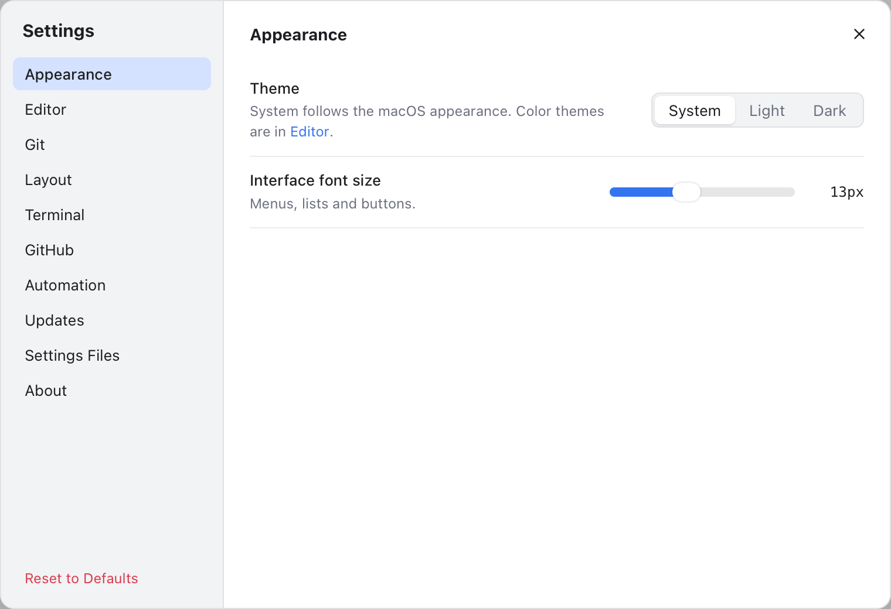
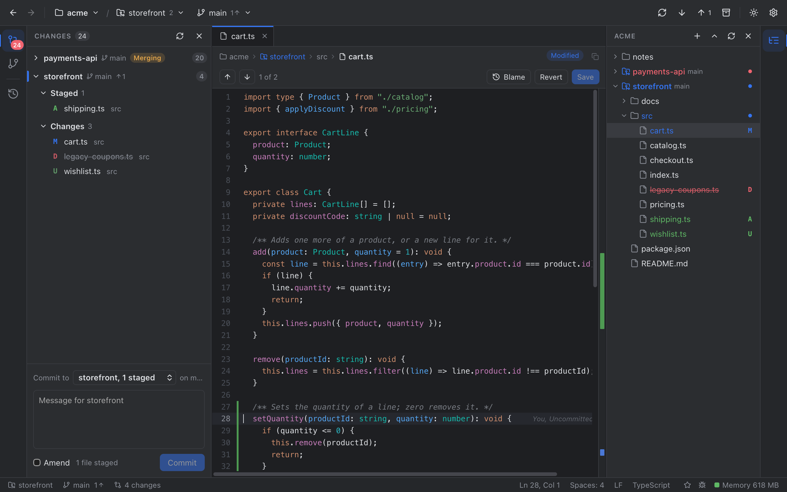
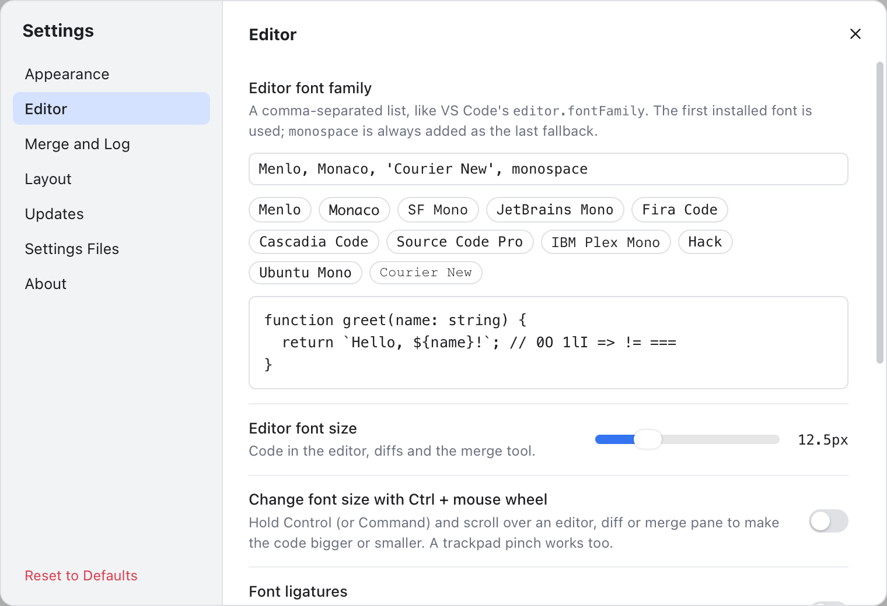
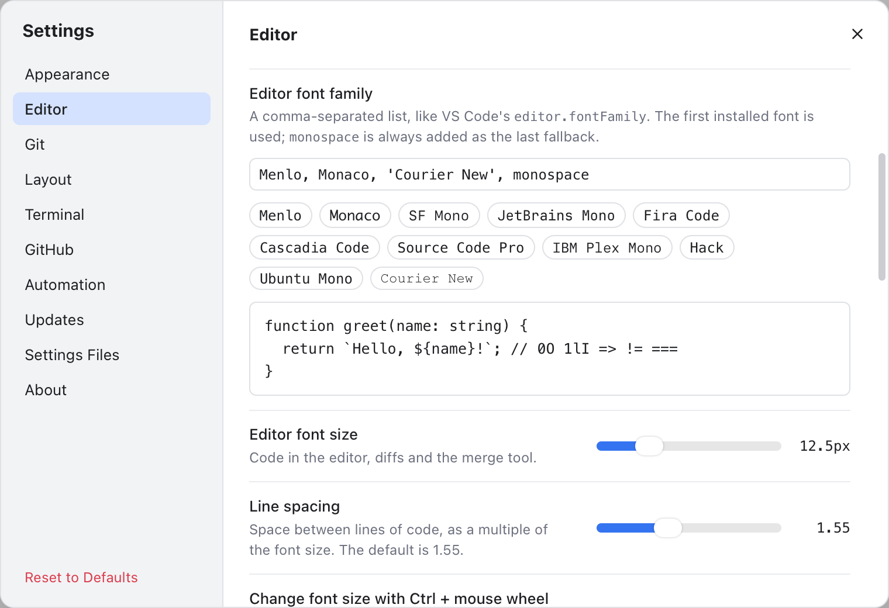
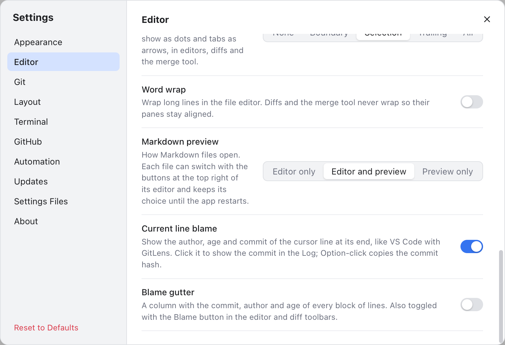
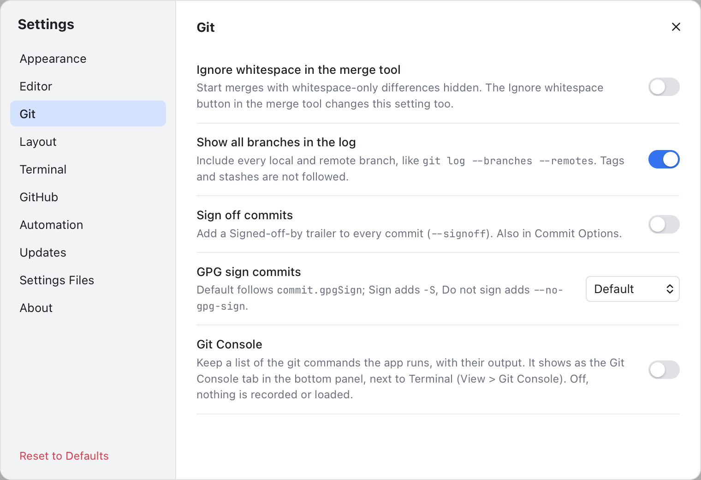
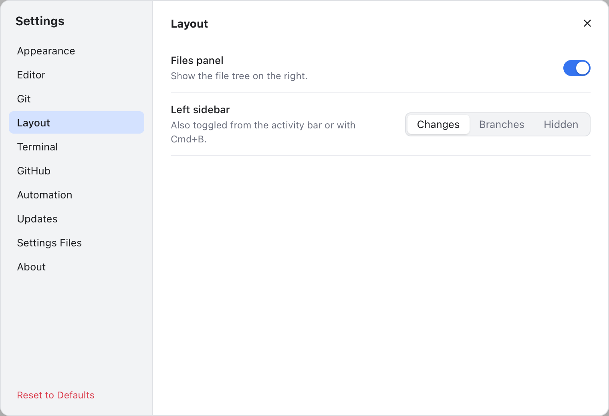
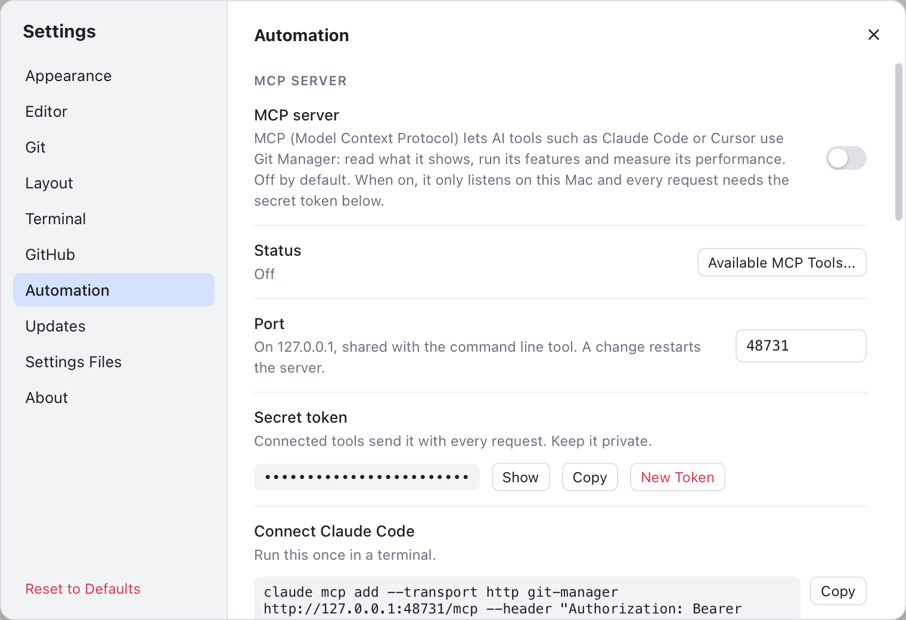
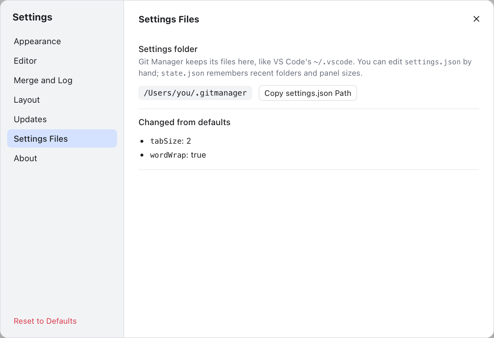

# Settings

Settings change how Git Manager looks and behaves. Every change applies right away and is saved for next time.

## Open Settings

- Click the gear at the top right of the header (**Settings (Cmd+,)**).
- Or press Cmd+,, or choose **Git Manager > Settings...** in the menu bar (**File > Settings...** on Windows and Linux).
- Or click **Settings** on the welcome screen.

Settings opens on **Appearance**. A few places open another section: the **Spaces** item in the status bar opens **Editor**, **Default Shell...** in the terminal panel opens **Terminal**, and **Git Manager > About Git Manager** opens **About**.

The sections are on the left: **Appearance**, **Editor**, **Git**, **Layout**, **Terminal**, **GitHub**, **Automation**, **Updates**, **Settings Files** and **About**. Press Esc or click the x to close. Drag the dialog by its title to move it; double-click the title to center it again.

**Reset to Defaults** at the bottom left puts every setting in `settings.json` back to its default, after asking (**Reset Settings**). The panel choices and sizes are kept, because they live in `state.json`.

## Appearance

*Theme and interface font size.*

| Setting | What it does | Default |
| --- | --- | --- |
| Theme | **System** follows the macOS appearance, or pick **Light** or **Dark**. The colors themselves are picked in **Editor**. | System |
| Interface font size | Size of menus, lists and buttons, 11 to 16 px in half steps. | 13 px |

The same choices are in **View > Appearance**. The sun button in the header (**Toggle light/dark theme**) switches between Light and Dark in one click, so the theme stops following macOS until you pick **System** again.

*Git Manager in the dark theme.*

## Editor

*The top of the Editor section: the color theme pickers.*

**Color theme** has two lists, **Light theme** and **Dark theme**: the one in use depends on the Appearance. See [Color Themes](Color-Themes.md).

*Font family with a live preview, font size and line spacing.*

| Setting | What it does | Default |
| --- | --- | --- |
| Editor font family | A comma-separated list, like VS Code's `editor.fontFamily`. The first installed font is used; `monospace` is always added last. | 'JetBrains Mono', Menlo, Monaco, 'Courier New', monospace |
| Editor font size | Code in the editor, diffs and the merge tool, 10 to 20 px in half steps. | 13 px |
| Line spacing | Space between lines of code, 1.0 to 2.5 times the font size in 0.05 steps. Double-click the slider to reset it. | 1.25 |
| Change font size with Ctrl + mouse wheel | Hold Control (or Command) and scroll over an editor, diff or merge pane to zoom, or pinch. | Off |
| Font ligatures | Draws `=>`, `!=` and `===` as single symbols, with fonts that have them (Fira Code, JetBrains Mono, Cascadia Code). | Off |
| Tab size | Spaces per indent level: 2, 4 or 8. Applies to files opened afterwards. | 4 |
| Render whitespace | Draws spaces as dots and tabs as arrows: **None**, **Boundary**, **Selection**, **Trailing** or **All**. See [Render whitespace](Editing-Code.md#render-whitespace). | Selection |
| Word wrap | Wraps long lines in the file editor, also with View > Word Wrap (Option+Z). Diffs and the merge tool never wrap. | Off |
| Cursor style, width, blinking, smooth caret, caret extra top and bottom | The shape, thickness, blinking and size of the cursor, like VS Code and Sublime Text. See [The cursor](Editing-Code.md#the-cursor). | Line, 2 px, Blink, Off, 0, 0 |
| Editing features | Auto-close brackets, completion, fold arrows, indent guides, word highlight, scroll past the end, column selection, a margin line. Off frees memory. See [IDE features](Editing-Code.md#ide-features). | On; margin line off |
| Markdown preview | How Markdown files open: **Editor only**, **Editor and preview** or **Preview only**. See [Markdown Editor](Markdown-Editor.md). | Editor and preview |
| Current line blame | Author, age and commit at the end of the cursor line. Click it to open the commit in the Log; Option-click copies the hash. See [Blame](Blame.md). | On |
| Blame gutter | A blame column beside the line numbers. Also the **Blame** button in the editor path bar and the diff toolbar. | Off |

*The lower part of the Editor section: render whitespace, word wrap, Markdown preview and blame.*

Type a font list and press Enter (or click outside the box), or click a font name below it. **Reset** goes back to the default font. **View > Zoom In** (Cmd+=), **Zoom Out** (Cmd+-) and **Reset Zoom** (Cmd+0) change the editor font size too.

## Git

*Defaults for the merge tool, the Log, commits and the Git Console.*

| Setting | What it does | Default |
| --- | --- | --- |
| Ignore whitespace in the merge tool | Starts merges with whitespace-only differences hidden. The **Ignore whitespace** button in the [Merge Tool](Merge-Tool.md) changes this setting too. | Off |
| Show all branches in the log | Includes every local and remote branch in the [Log](History-and-Log.md). | On |
| Sign off commits | Adds a `Signed-off-by` line to every commit (`--signoff`). Also in Commit Options. | Off |
| GPG sign commits | **Default** follows git's `commit.gpgSign`, **Sign** adds `-S`, **Do not sign** adds `--no-gpg-sign`. | Default |
| Git Console | Keeps a list of the git commands the app runs, in a **Git Console** tab next to Terminal. While it is off, nothing is recorded. See [Git Console](Git-Console.md). | Off |

See [Commit Options](Commit-Options.md) for signing and the other per-commit choices.

**Git > Update Project...** also saves its last choice, merge or rebase, in `settings.json` (`updateMethod`, default merge). There is no switch for it here; see [Git Dialogs](Git-Dialogs.md#update-project).

## Layout

*Which sidebars are shown.*

| Setting | What it does | Default |
| --- | --- | --- |
| Files panel | Shows the file tree on the right (also Option+Cmd+B). | On |
| Confirm drag and drop | Asks before a drag in the Files panel moves files (see [File Operations](File-Operations.md)). | On |
| Left sidebar | **Changes**, **Branches** or **Hidden** (also Cmd+B and the activity bar). | Changes |

The two header buttons left of the sun and the gear show or hide the **activity bars**, the icon strips at the window edges (also **View > Left Activity Bar** and **Right Activity Bar**). Drag a panel's edge to resize it; double-click the edge to reset it. All of this is saved in `state.json`, except **Confirm drag and drop**, which is in `settings.json`.

## Terminal, GitHub and Automation

*Automation: the MCP server, the command line tool and the memory log, all off by default.*

- **Terminal**: the default shell, the terminal font, cursor, scrollback and copy on selection.
- **GitHub**: sign in to GitHub for Share Project, Sync Fork and Create Gist.
- **Automation**: the MCP server for AI tools, the `git-manager cli` command line tool and the debug memory log.

Every option is described in [Terminal, GitHub and Automation Settings](Settings-Terminal-and-Automation.md).

## Updates and About

**Updates** controls the update check and the release channel; see [Updates](Updates.md). **About** has the version and the links to star the project, report a bug or request a feature; see [Status Bar and Help](Status-Bar-and-Help.md).

## Settings Files

*The settings folder and the list of settings changed from their defaults.*

This section shows where your settings are saved and which ones you changed. If a settings file cannot be read, a banner says so:

*The state.json banner: Try Again rereads the file, Reset replaces it with a fresh one.*

[Settings Files](Settings-Files.md) explains both files, every key and the banners.

## Related

- [Color Themes](Color-Themes.md)
- [Settings Files](Settings-Files.md)
- [Terminal, GitHub and Automation Settings](Settings-Terminal-and-Automation.md)
- [Editor and Tabs](Editor-and-Tabs.md)
- [How settings work (developer)](../developer/How-Settings-Work.md)
