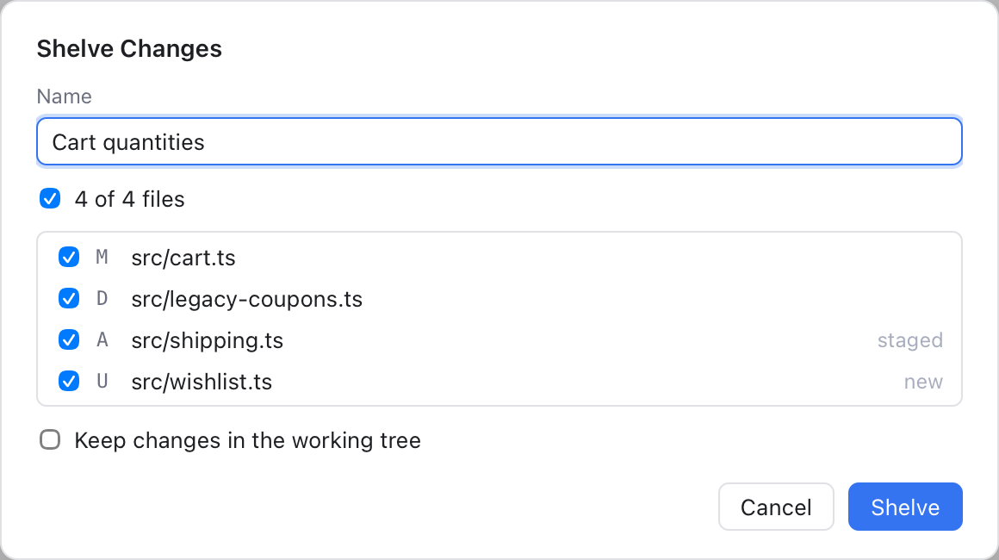
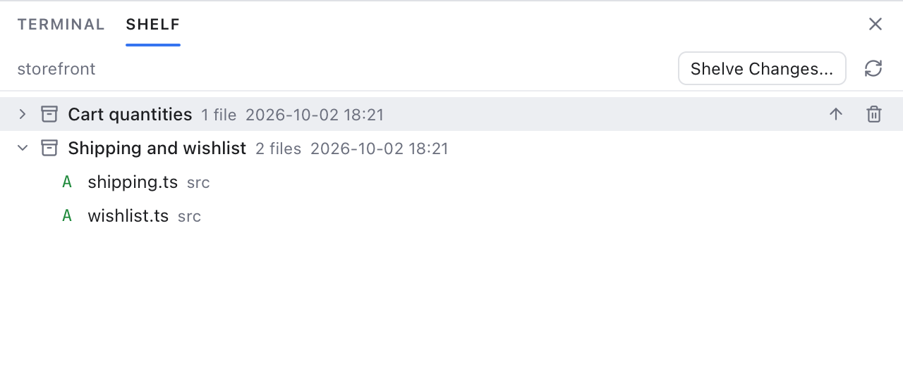

# Shelf

The shelf puts uncommitted changes aside without committing them, like the Shelf in JetBrains IDEs. You pick the files, give the change a name, and Git Manager saves it as a patch and takes it out of your files. Later you bring it back, all of it or only some files.

## Shelf or stash?

Both put work aside. A **stash** is git's own feature (see [Stashes](Stashes.md)): git saves your changes as special commits and you get them back with apply or pop. The **shelf** is Git Manager's: each shelved change is a patch file (a text file that lists the changed lines) kept inside your repository's `.git` folder.

Use the shelf when you want to:

- put aside **only some files**, not everything;
- **keep the changes in your files** and just save a copy;
- give each change a **name** and see its files and diffs in a list;
- bring back **only some files** of a shelved change.

Like a stash, the shelf is local to your computer: it is never committed or pushed. Linked worktrees of the same repository share one shelf (see [Worktrees](Worktrees.md)).

## Shelve changes

Open the **Shelve Changes** dialog in any of these ways:

- **Git > Uncommitted Changes > Shelve Changes...** in the menu bar;
- the repository's **...** menu in the Changes sidebar: **Stash > Shelve Changes...**;
- right-click a changed file in Changes and choose **Shelve Changes...** (only that file starts ticked);
- the **Shelve Changes...** button on the Shelf tab.

In the dialog:

1. **Name** starts as "Changes from main 2026-10-01 14:03" (the branch and the time). Change it to something you will recognise.
2. Tick the files to shelve. Each row shows a letter (M modified, A added, D deleted, R renamed, U new and not yet tracked) and a hint like **staged** or **new**. The top check box ticks all of them.
3. Tick **Keep changes in the working tree** to save a copy without touching your files. (The working tree is your project folder as you see it on disk.)
4. Click **Shelve**.

A note says, for example, **Shelved 3 files**, and the changes leave your files (unless you kept them). Files with conflicts are left out of the list until you resolve them, and the dialog says how many. Submodules and nested repositories are not offered either: they are not changes of this repository.

## See the shelf

Choose **Git > Uncommitted Changes > Show Shelf**, or **Stash > Show Shelf** in the repository's **...** menu. The bottom panel opens on the **Shelf** tab, next to **Terminal**.

The tab shows the shelf of the **active repository** (its name is at the top left). Each shelved change shows its name, how many files it has and when it was shelved, newest first. Click it to fold or unfold its files. Hover it for two quick buttons: **Unshelve...** (up arrow) and **Delete...** (trash). The refresh button reads the list again.

## Look at a shelved file

Double-click a file, or select it and press Enter, to open its diff in a read-only editor tab named **Shelved: file name**. The left side is **Base** (the file as it was when you shelved), the right side is **Shelved** (with your changes). If the original version is gone from the repository, a note says only the changed lines can show.

Right-click a shelved change and choose **Show Diff** to open its first file.

## Unshelve

Right-click a shelved change and choose **Unshelve...**, or use the hover button. To bring back only some files, select them (Cmd-click adds files of the same change), right-click and choose **Unshelve Selected Files...** (with several files selected it reads, for example, **Unshelve 3 files...**). **Unshelve All...** in the same menu brings back the whole change.

You then choose:

- **Unshelve**: apply the changes, then remove the applied files from the shelf. When every file is applied, the shelved change goes away.
- **Unshelve and Keep on Shelf**: apply the changes and keep them shelved, for example to apply them on another branch too.

The changes come back into your files, unstaged: stage them again if you need to. New files show as untracked again. If the files changed since you shelved, Git Manager tries a three-way merge: it compares your file and the shelved one with the version they both came from. When the same lines changed on both sides, you get conflicts: the Conflicts dialog opens and the shelved change stays on the shelf, so nothing is lost. See [Resolving Conflicts](Resolving-Conflicts.md).

## Rename and delete

Right-click a shelved change:

- **Rename...** changes its name.
- **Delete...** removes it from the shelf. You are asked first, because this cannot be undone.

## Example

You are changing the cart in `storefront` and also fixed a typo in the README. You want to commit the typo now and keep the cart work for later.

1. Right-click `src/cart.ts` in Changes and choose **Shelve Changes...**.
2. Name it "Cart quantities" and click **Shelve**.
3. Commit the README fix.
4. Open **Git > Uncommitted Changes > Show Shelf**, hover "Cart quantities" and click **Unshelve...**, then **Unshelve**.

## Related

- [Stashes](Stashes.md)
- [Changes and Commits](Changes-and-Commits.md)
- [Git Menu](Git-Menu.md)
- [How the shelf works (developer)](../developer/How-the-Shelf-Works.md)
