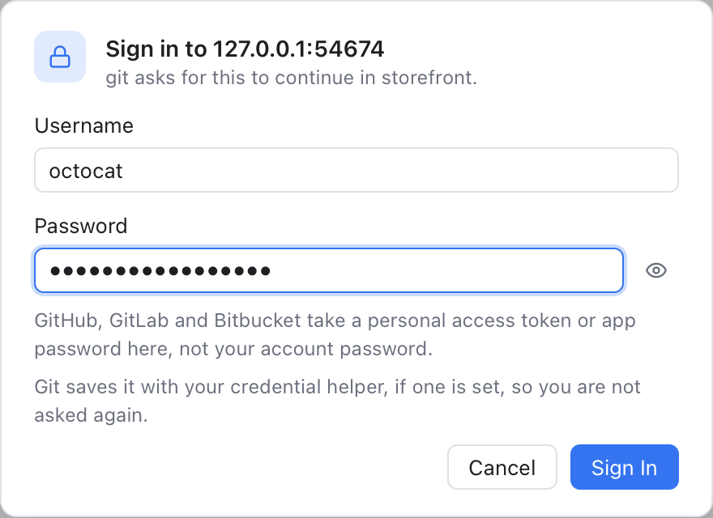

# Sign-In Prompts

Some remotes (the servers you push to and pull from) want you to sign in. In a terminal, git asks for a **username** and **password** right there. Git Manager has no terminal for git, so it shows a dialog instead and passes your answer to git.



*A remote over HTTPS asks for a login: the username and the password (or token) in one dialog.*

## When it shows up

The dialog appears when a command you start needs an answer:

- **Push**, **Pull**, **Fetch**, **Update Project**, **Clone** and the other commands that talk to a remote, from the menus, the Changes view, the Branches popup or a dialog.
- Remotes over **HTTPS** that ask for a username and password.
- **SSH** keys protected by a passphrase: the dialog asks for the passphrase.
- An **SSH** server you have never connected to: the dialog shows its key fingerprint and asks whether to connect. Click **Connect** to trust it, like typing yes in a terminal.

[Auto fetch](Remotes.md) in the background never asks. If a remote needs a login, it waits until you push, pull or fetch yourself.

## Signing in

For a username and password, the dialog asks for both at once: **Sign in to github.com**, with **Username** and **Password**. Click **Sign In** or press Enter. Git asks for the two one after the other, and Git Manager answers both from this one dialog.

- **GitHub, GitLab and Bitbucket** do not take your account password here. Use a personal access token (or an app password on Bitbucket) as the password. The dialog reminds you.
- The eye button shows what you typed, to check it.
- **Cancel** (or Esc) stops: the command fails with git's own message, as it did before.

Git Manager does not store what you type. Git hands it to your **credential helper**, a small program that remembers logins, when one is set. On macOS that is usually the keychain (`osxkeychain`), so you sign in once and git asks no more. If you are asked every time, set a helper in a terminal:

```sh
git config --global credential.helper osxkeychain
```

On Windows, Git for Windows comes with Git Credential Manager, which shows its own sign-in window instead.

## Several windows

The dialog appears in the window showing the repository. When no window shows it (for example during a clone), every window shows it, and answering in one closes it in the others. A dialog nobody answers gives up after five minutes, and the command fails.

## Related

- [Remotes](Remotes.md)
- [Repository Actions](Repository-Actions.md)
- [Troubleshooting Git](Troubleshooting-Git.md)
