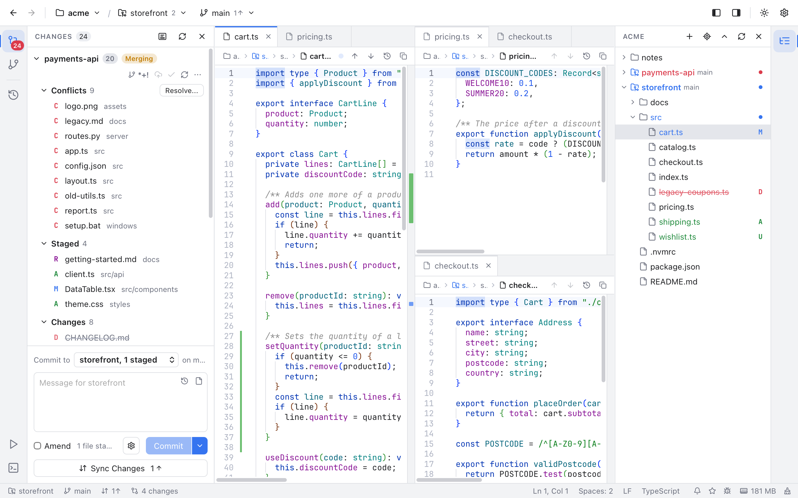

# Split Editor

The split editor shows several files at once, like the editor splits in JetBrains IDEs. Each part of the split is an **editor group**: its own row of tabs with its own file on screen. Split a group to the right or down, and split the new parts again, to build a grid such as one tall file on the left and two files stacked on the right.

*Three editor groups: cart.ts on the left, pricing.ts above and checkout.ts below on the right.*

## Split a group

- **Window > Split Right** (Cmd+\\) puts a new group to the right of the group you are in.
- **Window > Split Down** puts a new group below it.
- Right-click any file tab and choose **Split Right** or **Split Down** to split with that file. The group you clicked in keeps the file it shows, and the file you clicked opens in the new group.

The new group starts with the file you split, and the keyboard goes to it. The group you split from keeps half of its room, and you can split it, or the new group, again. A window holds up to eight groups.

A file open in two groups is still one file: what you type in one group shows in the other, and saving saves it once. A commit, terminal or Git tab can only be in one group, so splitting one of those moves it to the new group.

## Move between groups

- Click in a group to work in it. The tab strips of the other groups are dimmed.
- **Window > Focus First Group** (Cmd+1) and **Focus Second Group** (Cmd+2) jump to the first and second group, counted left to right and then top to bottom. Cmd+2 with one group splits it to the right.
- **Window > Focus Next Group** and **Focus Previous Group** go round every group. They have no keys at first: give them some in **Settings > Keyboard Shortcuts**.

## Move a tab to another group

Right-click a tab and choose the move item. With two groups it names the other one, such as **Move to Right Group** or **Move to Bottom Group**. With more groups it is **Move to Next Group**, and with one group it makes a group to the right. **Window > Move Tab to Next Group** does the same for the tab on screen.

To open a file straight into another group, use **Open to the Side** in the Files panel, or press Cmd+Enter instead of Enter in Go to File, [Recent Files](Recent-Files.md) and the [Navigation Bar](Navigation-Bar.md).

## Resize and close groups

Drag the line between two groups to share the room differently. Double-click the line to give both sides the same size again. Each side always keeps a little room.

A group closes when its last tab closes, and the group next to it in the split takes its room. **Window > Close Group** and **Close Group** in the tab menu close a group with all its tabs. If one of them has unsaved changes that no other group shows, Git Manager asks first.

The first group, top left, also shows the **Diff** tab and the Log, so it stays open while one of those is on screen.

## Your layout comes back

With **Reopen tabs on start** on (Settings > Editor), Git Manager remembers each folder's groups: which tabs each one has, where they sit and how big they are. The next time you open the folder, the same grid comes back. A group whose files are all gone is left out.

## Turn it off

**Settings > Editor > Split editor** is on by default. Turn it off to keep one group: every tab of the other groups moves into the first group, the split items in the Window menu are grayed out and the tab menu leaves them out.

On Windows, use Ctrl instead of Cmd. With [Rounded panels](Rounded-Panels.md), every group is its own rounded panel.
