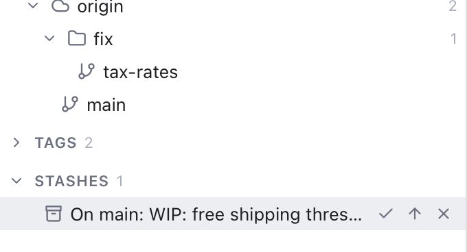

# Stashes

A stash is a shelf for unfinished work. It takes your uncommitted changes, puts them aside and leaves your files clean, so you can switch branches or pull. Later you bring the changes back.

## Stash your changes

1. Click **Stash changes** in the header (the box icon, right of Push).
2. In the **Stash Changes** dialog, type a **Message** so you can recognise it later. It starts as `WIP` ("work in progress").
3. Leave **Include untracked files** ticked to also put new files that git does not track yet on the shelf. Untick it to stash only changes to tracked files.
4. Click **Stash**.

Your files go back to how they were at the last commit, a note says **Changes stashed**, and the stash appears in the sidebar. If there is nothing to stash, a note says **No local changes to stash** instead. When only new files changed and **Include untracked files** is off, it tells you to turn that on.

The stash button works on the **active repository**. With several repositories, switch first (see [Workspaces](Workspaces.md)).

## See your stashes

Open the **Branches and Stashes** sidebar (Shift+Cmd+E). Stashes are the last section.

*A stash under the mouse: its message and the Apply, Pop and Drop buttons.*

Each row shows the message and a name like `stash@{0}`. Git puts the branch in front of your message, so `WIP: free shipping threshold` stashed on `main` shows as **On main: WIP: free shipping threshold**. Hover a long message to read all of it. The newest stash is always `stash@{0}`; older ones count up. The **Stashes** heading shows how many there are, and the filter box at the top also searches stash messages.

If git cannot read the stash list, the section stays empty and a note says **Could not read stashes** with git's message. It shows once, not on every refresh.

## Bring changes back

Hover a stash to see three buttons in place of its `stash@{0}` name, or right-click it for the same actions:

- **Apply** (check mark) puts the changes back into your files and keeps the stash, so you can apply it again elsewhere.
- **Pop** (up arrow) puts the changes back and removes the stash ("apply and drop"). This is the usual choice.
- **Drop** (x, or **Drop...** in the menu) deletes the stash without applying it. You are asked first (**Drop Stash**), because this cannot be undone.

A note confirms each one, for example **Popped stash@{0}**. The buttons wait while another operation runs.
If the stashed changes clash with changes in your files, git stops with conflicts (a conflict is a spot where both versions changed the same lines). Git Manager opens the Conflicts dialog. See [Resolving Conflicts](Resolving-Conflicts.md). After a pop that stopped on conflicts, git keeps the stash, so nothing is lost; drop it yourself once you are done.

## Example

You are halfway through a free shipping change on `main` in the `storefront` repository when a bug report comes in.

1. Click **Stash changes**, type `WIP: free shipping threshold`, and click **Stash**.
2. Switch to `fix/tax-rates`, fix the bug, commit and push.
3. Switch back to `main`.
4. Hover **On main: WIP: free shipping threshold** in the sidebar and click **Pop**. Your half-done change is back.

## Tips

- Give stashes clear messages. `WIP` is fine for a minute, but after a week you will not remember what it was.
- A stash is local to your computer. It is not pushed to the server.
- You can apply a stash on a different branch from the one you stashed on.

## Related

- [Changes and Commits](Changes-and-Commits.md)
- [Branches and Tags](Branches-and-Tags.md)
- [Resolving Conflicts](Resolving-Conflicts.md)
- [How stashes work (developer)](../developer/How-Stashes-Work.md)
