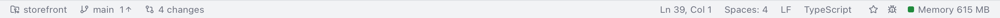
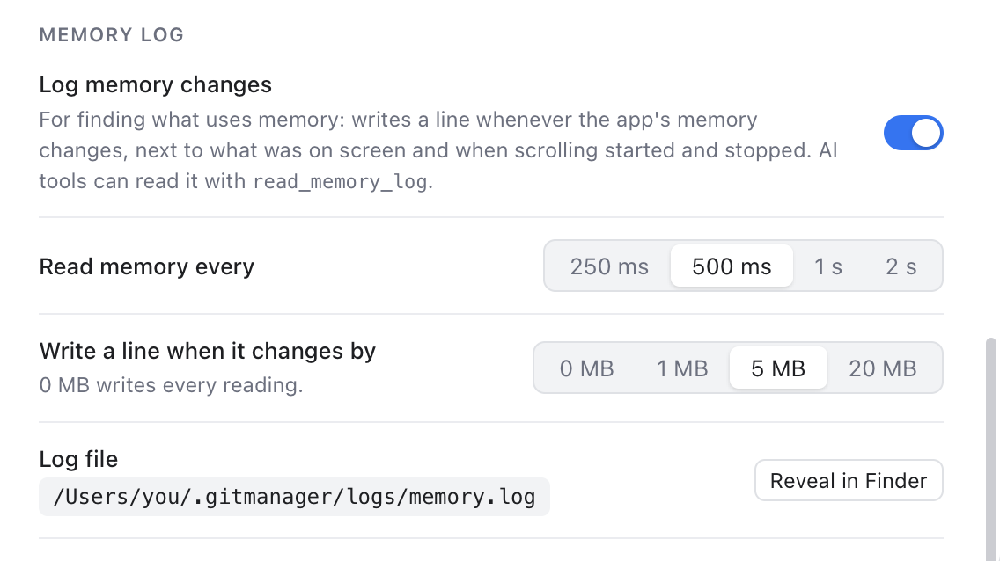
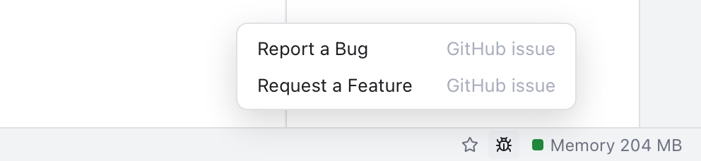
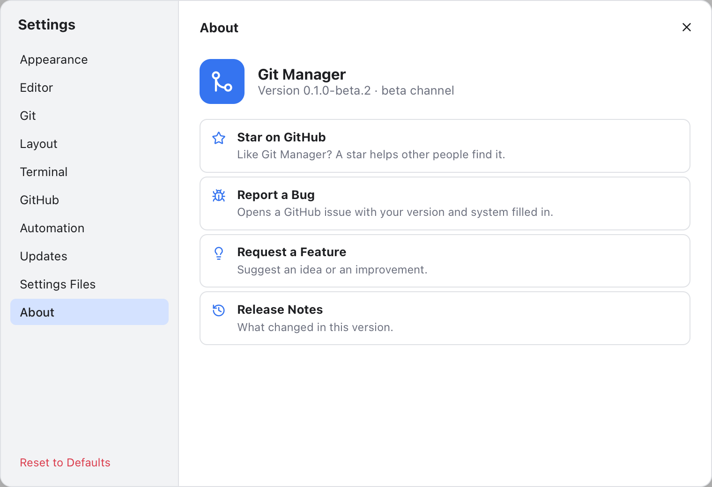

# Status Bar and Help

The status bar is the thin line at the bottom of the window. It tells you where you are (repository, branch, cursor) and how the app is doing, and it has quick links for giving feedback.

*Repository, branch and changes on the left; cursor, file details, the star, the bug icon and memory on the right.*

## The left side: where you are

Like in VS Code, the left side follows what is on screen. When a file tab or a diff is showing, it describes that file's repository. A commit, branch or history tab describes its repository, and a terminal tab the repository of its folder. Otherwise it describes the active repository.

- **Repository name**. Hover it for the full path. Click it to make that repository the active one and open the Branches sidebar.
- **Branch**, with numbers for commits to pull (down arrow) and to push (up arrow), such as **main 1** and an up arrow. A checked-out commit shows as "detached" and its short hash. Click it to open the [Branches popup](Branches-Popup.md) for that repository and check out another branch, like in JetBrains.
- **4 changes**: the number of changed files, hidden when there are none. Click it to open Changes.
- **2 conflicts**, in red, while files are in conflict. Click it to open the Conflicts dialog. See [Resolving Conflicts](Resolving-Conflicts.md).
- A note such as **Merging feature into main** while a merge, rebase, cherry-pick or revert is in progress. See [Resolving Conflicts](Resolving-Conflicts.md).

For a file tab that is outside any repository it says **No repository**. In a folder without git it shows the folder name.

## The right side: the file and the app

While a file is shown in the editor:

- **Ln 42, Col 7**: the cursor position. With a selection it adds, for example, "(18 selected, 2 lines)".
- **Spaces: 4**: the indentation. Click it to open Settings on the **Editor** section, where the tab size is.
- **LF** or **CRLF**: the file's line endings. Git Manager keeps them as they are when saving.
- The language, such as **TypeScript**.

Always on the right:

- **Update available: 1.2.0**, when a new version is out (with **(beta)** for a beta). Click it for the notes and the download. A version you skipped is not shown. See [Updates](Updates.md).
- A spinner with the running operation, such as **Push...** or **Commit...**.
- **Reading changes 2 of 5** with a spinner, right after a folder opens, while the changes of each repository load. You can already work. See [Workspaces](Workspaces.md).
- A star: opens the project on GitHub, where you can star it.
- A bug icon: the feedback menu (below).
- **Memory**, such as **Memory 597 MB**: how much memory Git Manager uses right now.

## Memory use

Git Manager is built to stay light, and the memory readout lets you see that for yourself. It shows physical memory as Activity Monitor counts it. That includes the helper processes macOS runs for the app's web view, which draws the interface.

Click **Memory** for a breakdown: **Git Manager (app)**, **Web content (UI)**, **Graphics** and **Networking**, each with its size and a bar. Below them, **GPU acceleration** answers two questions. **Terminals use the GPU** says yes (and in how many terminals) or no with the reason: turned off in Settings, font ligatures on, or the GPU failed and the terminal fell back to normal drawing. **WebGL support** says whether the web view can use the GPU for that at all, and names the graphics chip. The window itself always draws with the GPU through macOS; that is the Graphics row. GPU drawing in terminals is smoother and lighter on the CPU with a lot of output, at a few MB of GPU memory per terminal; turn it off in Settings, Terminal if you see drawing glitches or want font ligatures. Opening it measures again at once. Press Esc or click elsewhere to close it.

The number updates every few seconds while the window is visible, and stops while it is hidden. When the app was started from a Terminal, the helpers are matched by their start time, and the breakdown says so.

### The memory log

To find out what makes memory grow, turn on **Settings, Automation, Memory log, Log memory changes**. While it is on, Git Manager reads its memory every **Read memory every** (250 ms, 500 ms, 1 s or 2 s; 500 ms by default) and writes a line whenever the total changed by **Write a line when it changes by** (0, 1, 5 or 20 MB; 5 MB by default; 0 writes every reading). It also notes what was on screen and when scrolling started and stopped.

*Settings, Automation, Memory log, with the path of the log file.*

The file is `~/.gitmanager/logs/memory.log`. **Reveal in Finder** shows it. A line looks like `2026-10-02T04:20:31.512Z total 400.0 MB (+50.0) | Web content 300.0 | ...`, with times in UTC. Past 5 MB the log starts over and keeps the previous one as `memory.log.1`. AI tools can read it with the `read_memory_log` tool (see [MCP Server and Command Line Tool](MCP-and-CLI.md)). Turn it off when you are done: off, nothing runs.

## The Help menu

*Help > Keyboard Shortcuts: every shortcut of the app, with a filter.*

The **Help** menu in the menu bar has:

- **Git Manager Help**: this wiki, in your browser.
- **Keyboard Shortcuts**: a window inside the app with every shortcut, grouped by menu, and a filter box. **Open Online Version** opens [Keyboard Shortcuts](Keyboard-Shortcuts.md).
- **What's New** and **Release Notes** (see [Updates](Updates.md)).
- **Available MCP Tools...**: which tools AI agents may use (see [MCP Server and Command Line Tool](MCP-and-CLI.md)).
- **Report a Bug...**, **Request a Feature...** and **Star on GitHub**, as below.

## Report a bug or request a feature

*Report a Bug and Request a Feature, from the bug icon in the status bar.*

Click the bug icon at the right of the status bar:

- **Report a Bug** opens a new GitHub issue with a bug form. Your Git Manager version and your macOS version (for example macOS 15.4.1) are filled in for you.
- **Request a Feature** opens a new GitHub issue with the feature form.

Both open in your browser. You need a GitHub account to send them.

A good bug report says what you did, what you expected and what happened. A screenshot or the text of an error note helps a lot.

## About

*Settings, About: the version, the channel and the project links.*

**Settings, About** shows your version and update channel, and has the same links in one place:

- **Star on GitHub**: like Git Manager? A star helps other people find it.
- **Report a Bug** and **Request a Feature**, as above.
- **Release Notes**: what changed in this version.

The welcome screen has these links too.

## Notes and errors

Short notes appear at the bottom right for a few seconds when something finishes, such as "Pushed". When something fails, the note shows what went wrong, usually git's own message. Error notes stay nine seconds, you can copy their text, and the x closes any note early. The [Troubleshooting](Troubleshooting.md) page covers the common ones.

## Related

- [Updates](Updates.md)
- [Settings](Settings.md)
- [Troubleshooting](Troubleshooting.md)
- [Workspaces](Workspaces.md)
- [How the status bar works (developer)](../developer/How-the-Status-Bar-Works.md)
