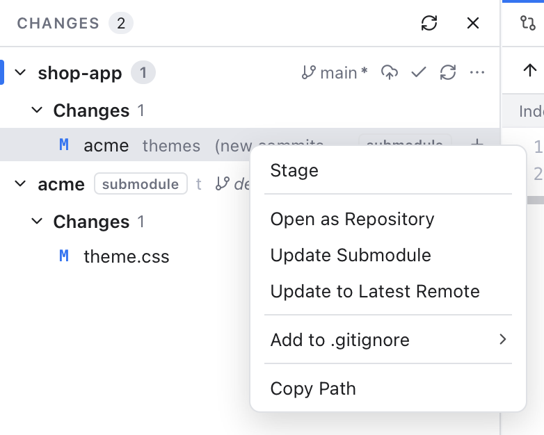
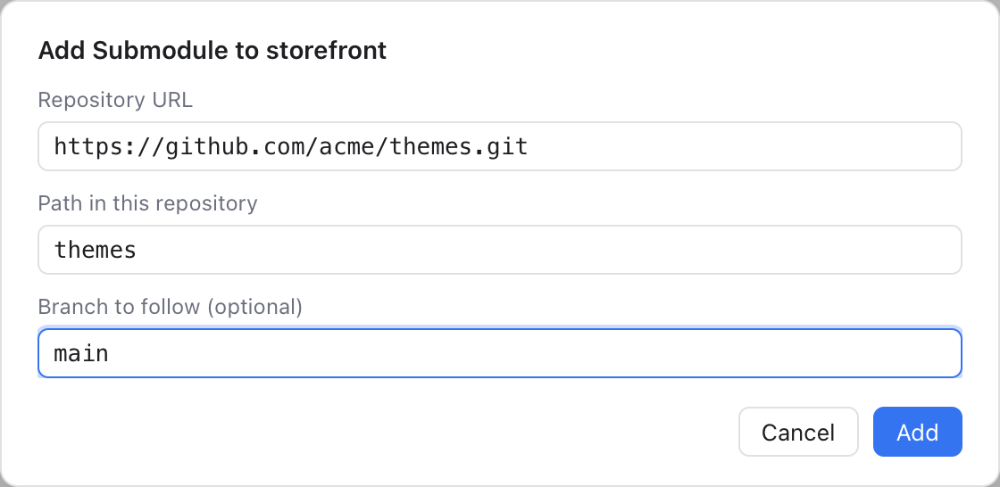

# Submodules

A submodule is a git repository inside another git repository. The outer one (the **parent**) does not store the submodule's files. It records only which commit of the submodule it uses, plus the submodule's URL in a file called `.gitmodules`. Projects use submodules to include a shared library or theme at an exact version.

Because the parent records a commit, not files, working with submodules has its own steps: after cloning, the submodule folders are empty until you **init** and **update** them, and when someone moves the parent to a newer submodule commit, you update again.

## Where submodules show up

**As their own repositories.** Once a submodule is checked out, Git Manager finds it like any nested repository. It appears in the Changes sidebar with a **submodule** tag next to its name, and you commit, branch and push in it as usual. See [Workspaces](Workspaces.md).

**As one entry in the parent.** In the parent's changes, a submodule is a single row tagged **submodule**, like `git status` shows it. The row says what changed:

- **new commits**: the submodule has a different commit checked out than the one the parent records;
- **modified content**: files inside the submodule are changed;
- **untracked content**: the submodule has new files.

A submodule entry has only a **Stage** button: staging it records the submodule's current commit in the parent. There is no discard, because the change lives inside the other repository; use **Update Submodule** to go back to the recorded commit. Right-click the entry for:

- **Open as Repository**: make the submodule the active repository (it is added to the workspace if needed).
- **Update Submodule**: check out the commit the parent records.
- **Update to Latest Remote**: move it to the newest commit of the branch it follows.

Opening the entry's diff shows "Subproject commit" and a commit id on each side, like `git diff`.

Git Manager respects a submodule's `ignore` setting (in `.gitmodules` or your repository config), just like `git status`.

## The Submodules menus

All submodule commands work on the parent repository. You find them in two places:

- **Git > Submodules** in the menu bar, for the active repository.
- The parent's **...** menu in the Changes sidebar, under **Submodules**.

| Item | What it does |
| --- | --- |
| **Init Submodules** (**Init**) | Registers the submodules from `.gitmodules` in your repository config. |
| **Update Submodules** (**Update**) | Clones missing submodules and checks out the recorded commits, also inside nested submodules. |
| **Update to Latest Remote** | Like Update, but moves each submodule to the latest commit of the branch it follows. |
| **Sync URLs** | Copies changed URLs from `.gitmodules` into your config, after someone moved a submodule to a new server. |
| **Add Submodule...** | Adds a new submodule (see below). |
| **Remove Submodule...** | Removes one (see below). |
| **Open Submodule as Repository...** (**Open as Repository**) | Makes a checked-out submodule the active repository. |

When the repository has several submodules, Remove and Open ask which one. Update shows git's progress in the status bar.

## Get the submodules after a clone

1. Open the parent repository.
2. Choose **Git > Submodules > Update Submodules**.

That runs init and update in one step. The submodules then appear as repositories in the Changes sidebar.

## Add a submodule

Choose **Git > Submodules > Add Submodule...**.

1. **Repository URL**: where the submodule comes from, for example `https://github.com/owner/library.git`.
2. **Path in this repository**: the folder it goes into. It starts from the URL's name, and must be a relative path inside the repository that no other submodule uses.
3. **Branch to follow (optional)**: the branch that Update to Latest Remote uses.
4. Click **Add**.

Git clones it and stages `.gitmodules` and the new submodule. A note reminds you to commit them, so the parent records the submodule.

## Remove a submodule

Choose **Git > Submodules > Remove Submodule...** and confirm. Git Manager deinitializes the submodule (git stops treating it as checked out). It deletes its folder and its cloned repository inside `.git/modules`, where git keeps submodule copies, and stages the removal. Commit to finish. Unpushed work inside the submodule is lost, which is why it asks first.

## Example

The `storefront` repository uses a `themes/acme` submodule. A teammate updated it and you pulled.

1. The parent's changes show `themes/acme` with **new commits**: your checkout is still on the old commit.
2. Right-click it and choose **Update Submodule**. The entry disappears, because the submodule now matches what the parent records.

## Related

- [Workspaces](Workspaces.md)
- [Changes and Commits](Changes-and-Commits.md)
- [Git Menu](Git-Menu.md)
- [How submodules work (developer)](../developer/How-Submodules-Work.md)
